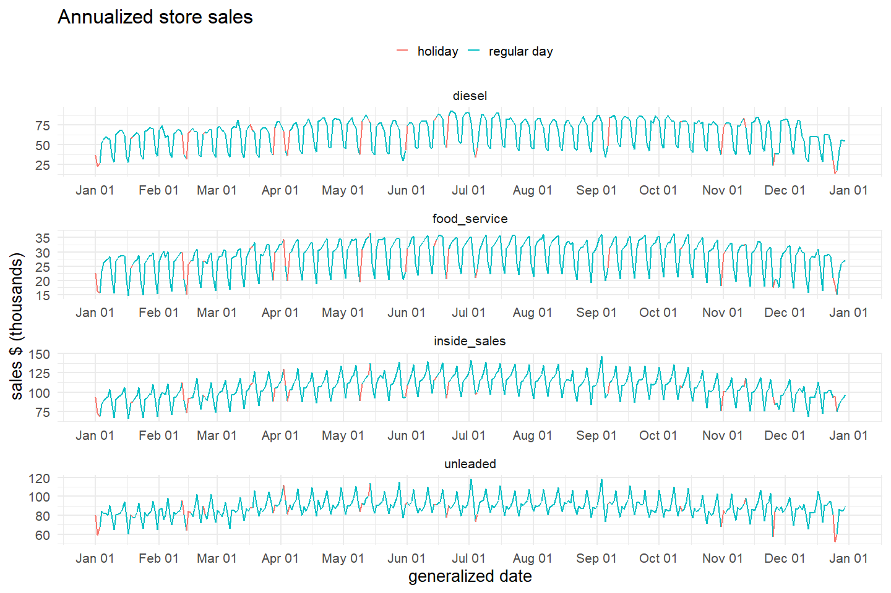
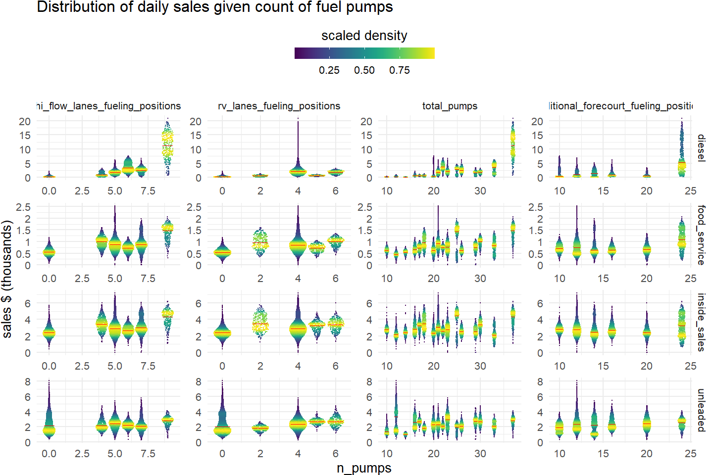

<style type="text/css">
.main-container {
  max-width: 1100px;
  margin-left: auto;
  margin-right: auto;
}
</style>


# Introduction
## Business problem 

Maverik is interested in producing more accurate financial plans and initial ROI documents for future convenience store locations. Considerable uncertainty is associated with deploying new locations in their network and being able to properly allocate resources and accurately predict profitability is crucial to the prosperity of their business. To this end, this project aims to augment veracity of financial plans and ROI documents by leveraging the store-level time series and qualitative data collected by Maverik. This will be done by employing an ensemble of forecasting and supervised regression models designed to provide daily store level sales forecasts of multiple key product categories. Success of this project will be benchmarked against Maverik's existing Naive forecasting solution and the proposed model will be tuned to minimize:\

-   Akaike Information Criterion (AIC)\
-   Root Mean Squared Error (RMSE)\
-   Mean Absolute Percentage Error (MAPE)\

Key abilities of the final must include:\

-   Calculation of daily level, seasonally sensitive forecast for each of the sales metrics defined by Maverik.\
-   Functionality to create updated forecasts given new data.\

The ability to accurately forecast store sales will enable Maverik to optimize the expenditure of scarce resources by pursuing the most profitable locations and minimizing misallocation of said resources when opening a new store. This will lead to better investment, decreased waste, and more reliable financial evaluations.

## EDA Objectives

As well as gaining a greater holistic understanding of the provided data, this EDA aims to answer the following questions:\

-   What preprocessing/cleaning is required?\
    -   What is the scale of missing values? How should they be handled?\
    -   Do erroneously encoded categorical variables need to be corrected?\
    -   How do date attributes need to be standardized or formatted to ensure accurate seasonality calculations?\
    -   Is the existing data "tidy"?\
        -   Each variable has its own column\
        -   Each observation has its own row\
        -   Each value has its own cell\
-   Which features are most correlated with each of the target sales metrics?\
-   What explanatory variables are collinear and how should that be handled?\
-   What affect does seasonality have on the target variables?\


# Loading packages and data 


```r
# Load packages 
library(lemon)
library(skimr)
library(lubridate)
library(magrittr)
library(zoo)
library(tidyverse)
library(readxl)
library(scales)
library(GGally)
library(ggrepel)
library(ggforce)
library(caret)
library(ggTimeSeries)
library(ggpointdensity)
library(fpp3)
library(patchwork)
library(plotly)

# Load data 
mvts <- read_csv("../../../data/time_series_data_msba.csv") %>%
  # removing unnamed row index column
  select(-1) %>% 
  # simplifying column names
  rename_with(~str_split_1(paste0("open_date,date,week_id,day_name,holiday,",
                                  "day_type,inside_sales,food_service,diesel,",
                                  "unleaded,site_id"), ",")) %>% 
  # set site_id as first column
  relocate(site_id) %>%
  arrange(site_id, date)

mvq <- read_csv("../../../data/qualitative_data_msba.csv") %>%
  # removing unnamed row index column
  # `RV Lanes Fueling Positions` and `Hi-Flow Lanes Fueling Positions` are duplicated columns
  select(-c(1, `RV Lanes Fueling Positions`, `Hi-Flow Lanes Fueling Positions`)) %>%
  # set site_id as first column
  select(site_id = site_id_msba, colnames(.)) %>% 
  # simplify column names
  rename_with(\(x){
    # replace spaces, slashes, and hyphens with underscores
    gsub(" +|-|/", "_", tolower(x)) %>%
      # remove single quotes and apostrophes
      gsub("'|’", "", .) %>%
      # validate variables beginning with numbers
      gsub("^(\\d)", "x\\1", .)
  }) %>%
  # distinguish from variable found in time series data
  rename(has_diesel = diesel)
```

# Initial inspection

## Time series data


```r
# First look
mvts %>%
  head(5)
```

<div data-pagedtable="false">
  <script data-pagedtable-source type="application/json">
{"columns":[{"label":["site_id"],"name":[1],"type":["dbl"],"align":["right"]},{"label":["open_date"],"name":[2],"type":["date"],"align":["right"]},{"label":["date"],"name":[3],"type":["date"],"align":["right"]},{"label":["week_id"],"name":[4],"type":["dbl"],"align":["right"]},{"label":["day_name"],"name":[5],"type":["chr"],"align":["left"]},{"label":["holiday"],"name":[6],"type":["chr"],"align":["left"]},{"label":["day_type"],"name":[7],"type":["chr"],"align":["left"]},{"label":["inside_sales"],"name":[8],"type":["dbl"],"align":["right"]},{"label":["food_service"],"name":[9],"type":["dbl"],"align":["right"]},{"label":["diesel"],"name":[10],"type":["dbl"],"align":["right"]},{"label":["unleaded"],"name":[11],"type":["dbl"],"align":["right"]}],"data":[{"1":"21560","2":"2021-01-12","3":"2021-01-12","4":"2","5":"Tuesday","6":"NONE","7":"WEEKDAY","8":"2036.268","9":"762.8530","10":"1424.1850","11":"1522.003"},{"1":"21560","2":"2021-01-12","3":"2021-01-13","4":"2","5":"Wednesday","6":"NONE","7":"WEEKDAY","8":"2379.888","9":"1003.7930","10":"1303.8445","11":"1853.772"},{"1":"21560","2":"2021-01-12","3":"2021-01-14","4":"2","5":"Thursday","6":"NONE","7":"WEEKDAY","8":"2435.860","9":"974.2250","10":"1375.6785","11":"2122.407"},{"1":"21560","2":"2021-01-12","3":"2021-01-15","4":"3","5":"Friday","6":"NONE","7":"WEEKDAY","8":"2805.978","9":"911.0115","10":"1334.9175","11":"2267.993"},{"1":"21560","2":"2021-01-12","3":"2021-01-16","4":"3","5":"Saturday","6":"NONE","7":"WEEKEND","8":"2314.764","9":"715.7535","10":"831.1625","11":"1819.639"}],"options":{"columns":{"min":{},"max":[10]},"rows":{"min":[10],"max":[10]},"pages":{}}}
  </script>
</div>


```r
# Skim
mvts %>%
  mutate(site_id = as.character(site_id)) %>%
  skim() 
```

```
## ── Data Summary ────────────────────────
##                            Values    
## Name                       Piped data
## Number of rows             13908     
## Number of columns          11        
## _______________________              
## Column type frequency:               
##   character                4         
##   Date                     2         
##   numeric                  5         
## ________________________             
## Group variables            None      
## 
## ── Variable type: character ──────────────────────────────────────────────────────────────────────────────────────────────────────────────────────────
##   skim_variable n_missing complete_rate min max empty n_unique whitespace
## 1 site_id               0             1   5   5     0       38          0
## 2 day_name              0             1   6   9     0        7          0
## 3 holiday               0             1   4  22     0       26          0
## 4 day_type              0             1   7   7     0        2          0
## 
## ── Variable type: Date ───────────────────────────────────────────────────────────────────────────────────────────────────────────────────────────────
##   skim_variable n_missing complete_rate min        max        median     n_unique
## 1 open_date             0             1 2021-01-12 2022-08-16 2021-10-08       32
## 2 date                  0             1 2021-01-12 2023-08-16 2022-04-18      947
## 
## ── Variable type: numeric ────────────────────────────────────────────────────────────────────────────────────────────────────────────────────────────
##   skim_variable n_missing complete_rate   mean     sd   p0   p25   p50   p75   p100 hist 
## 1 week_id               0             1   26.5   15.0   1    14    26    39     52  ▇▇▇▇▇
## 2 inside_sales          0             1 2847.   981.    0  2181. 2694. 3325.  7172. ▁▇▅▁▁
## 3 food_service          0             1  760.   342.    0   521.  697.  924.  2532. ▃▇▂▁▁
## 4 diesel                0             1 1703.  2161.    0   383. 1019. 2283. 20854. ▇▁▁▁▁
## 5 unleaded              0             1 2382.  1026.  240. 1654. 2257. 2928.  8077. ▅▇▂▁▁
```


The time series data contains the daily, store level sales of the four target variables: `inside_sales`, `food_service`, `diesel`, and `unleaded`. Other data pertaining to dates are provided herein, including:\

-   `week_id`: Fiscal week number\
-   `day_name`: Day of the week name\
-   `open_date`: Date the store opened\
-   `holiday`: What holiday (if any) occured on that day\
-   `day_type`: Either "WEEKDAY" or "WEEKEND"\

None of the variables have any missing values that will have to be dealt with.

## Qualitative data


```r
# First look
mvq %>%
  head(5)
```

<div data-pagedtable="false">
  <script data-pagedtable-source type="application/json">
{"columns":[{"label":["site_id"],"name":[1],"type":["dbl"],"align":["right"]},{"label":["open_year"],"name":[2],"type":["dbl"],"align":["right"]},{"label":["square_feet"],"name":[3],"type":["dbl"],"align":["right"]},{"label":["front_door_count"],"name":[4],"type":["dbl"],"align":["right"]},{"label":["years_since_last_project"],"name":[5],"type":["dbl"],"align":["right"]},{"label":["parking_spaces"],"name":[6],"type":["dbl"],"align":["right"]},{"label":["lottery"],"name":[7],"type":["chr"],"align":["left"]},{"label":["freal"],"name":[8],"type":["chr"],"align":["left"]},{"label":["bonfire_grill"],"name":[9],"type":["chr"],"align":["left"]},{"label":["pizza"],"name":[10],"type":["chr"],"align":["left"]},{"label":["cinnabon"],"name":[11],"type":["chr"],"align":["left"]},{"label":["godfathers_pizza"],"name":[12],"type":["chr"],"align":["left"]},{"label":["ethanol_free"],"name":[13],"type":["chr"],"align":["left"]},{"label":["has_diesel"],"name":[14],"type":["chr"],"align":["left"]},{"label":["hi_flow_lanes"],"name":[15],"type":["chr"],"align":["left"]},{"label":["rv_lanes"],"name":[16],"type":["chr"],"align":["left"]},{"label":["hi_flow_rv_lanes"],"name":[17],"type":["chr"],"align":["left"]},{"label":["def"],"name":[18],"type":["chr"],"align":["left"]},{"label":["cat_scales"],"name":[19],"type":["chr"],"align":["left"]},{"label":["car_wash"],"name":[20],"type":["chr"],"align":["left"]},{"label":["ev_charging"],"name":[21],"type":["chr"],"align":["left"]},{"label":["rv_dumps"],"name":[22],"type":["chr"],"align":["left"]},{"label":["propane"],"name":[23],"type":["chr"],"align":["left"]},{"label":["x1_mile_pop"],"name":[24],"type":["dbl"],"align":["right"]},{"label":["x1_mile_emp"],"name":[25],"type":["dbl"],"align":["right"]},{"label":["x1_mile_income"],"name":[26],"type":["dbl"],"align":["right"]},{"label":["x1_2_mile_pop"],"name":[27],"type":["dbl"],"align":["right"]},{"label":["x1_2_mile_emp"],"name":[28],"type":["dbl"],"align":["right"]},{"label":["x1_2_mile_income"],"name":[29],"type":["dbl"],"align":["right"]},{"label":["x5_min_pop"],"name":[30],"type":["dbl"],"align":["right"]},{"label":["x5_min_emp"],"name":[31],"type":["dbl"],"align":["right"]},{"label":["x5_min_inc"],"name":[32],"type":["dbl"],"align":["right"]},{"label":["x7_min_pop"],"name":[33],"type":["dbl"],"align":["right"]},{"label":["x7_min_emp"],"name":[34],"type":["dbl"],"align":["right"]},{"label":["x7_min_inc"],"name":[35],"type":["dbl"],"align":["right"]},{"label":["traditional_forecourt_fueling_positions"],"name":[36],"type":["dbl"],"align":["right"]},{"label":["traditional_forecourt_layout"],"name":[37],"type":["chr"],"align":["left"]},{"label":["traditional_forecourt_stack_type"],"name":[38],"type":["chr"],"align":["left"]},{"label":["rv_lanes_layout"],"name":[39],"type":["chr"],"align":["left"]},{"label":["rv_lanes_stack_type"],"name":[40],"type":["chr"],"align":["left"]},{"label":["hi_flow_lanes_layout"],"name":[41],"type":["chr"],"align":["left"]},{"label":["hi_flow_lanes_stack_type"],"name":[42],"type":["chr"],"align":["left"]},{"label":["hi_flow_lanes_fueling_positions"],"name":[43],"type":["dbl"],"align":["right"]},{"label":["rv_lanes_fueling_positions"],"name":[44],"type":["dbl"],"align":["right"]},{"label":["hi_flow_rv_lanes_layout"],"name":[45],"type":["chr"],"align":["left"]},{"label":["hi_flow_rv_lanes_stack_type"],"name":[46],"type":["chr"],"align":["left"]},{"label":["non_24_hour"],"name":[47],"type":["chr"],"align":["left"]},{"label":["self_check_out"],"name":[48],"type":["chr"],"align":["left"]},{"label":["mens_toilet_count"],"name":[49],"type":["dbl"],"align":["right"]},{"label":["mens_urinal_count"],"name":[50],"type":["dbl"],"align":["right"]},{"label":["womens_toilet_count"],"name":[51],"type":["dbl"],"align":["right"]},{"label":["womens_sink_count"],"name":[52],"type":["dbl"],"align":["right"]}],"data":[{"1":"21560","2":"2021","3":"5046","4":"2","5":"2","6":"38","7":"Yes","8":"Yes","9":"Yes","10":"No","11":"No","12":"No","13":"Yes","14":"Yes","15":"Yes","16":"Yes","17":"Yes","18":"Yes","19":"No","20":"No","21":"No","22":"Yes","23":"Yes","24":"4046","25":"3648","26":"43435","27":"556","28":"642","29":"45678","30":"4776","31":"5364","32":"41725","33":"13895","34":"7906","35":"46043","36":"20","37":"Stack","38":"Large","39":"Stack","40":"HF/RV","41":"Stack","42":"HF/RV","43":"4","44":"6","45":"Stack","46":"HF/RV","47":"No","48":"Yes","49":"2","50":"2","51":"6","52":"2"},{"1":"21980","2":"2021","3":"5046","4":"2","5":"2","6":"39","7":"No","8":"Yes","9":"Yes","10":"Yes","11":"No","12":"No","13":"No","14":"Yes","15":"Yes","16":"Yes","17":"Yes","18":"Yes","19":"Yes","20":"No","21":"No","22":"Yes","23":"No","24":"101","25":"665","26":"39638","27":"0","28":"158","29":"0","30":"222","31":"2286","32":"42426","33":"13058","34":"10235","35":"51342","36":"24","37":"Stack","38":"Large","39":"Stack","40":"HF/RV","41":"Combo","42":"HF/RV","43":"9","44":"4","45":"Combo","46":"HF/RV","47":"No","48":"Yes","49":"5","50":"5","51":"10","52":"4"},{"1":"22015","2":"2021","3":"5046","4":"2","5":"2","6":"35","7":"Yes","8":"Yes","9":"Yes","10":"Yes","11":"No","12":"No","13":"Yes","14":"Yes","15":"No","16":"Yes","17":"No","18":"Yes","19":"No","20":"No","21":"No","22":"No","23":"Yes","24":"7676","25":"2858","26":"61175","27":"1462","28":"675","29":"61401","30":"18475","31":"7113","32":"54560","33":"31821","34":"10437","35":"54037","36":"12","37":"In-Line","38":"None","39":"In-Line","40":"None","41":"N/A","42":"N/A","43":"0","44":"5","45":"In-Line","46":"None","47":"No","48":"Yes","49":"3","50":"2","51":"4","52":"1"},{"1":"22085","2":"2021","3":"5046","4":"2","5":"2","6":"36","7":"No","8":"Yes","9":"Yes","10":"Yes","11":"No","12":"No","13":"Yes","14":"Yes","15":"Yes","16":"Yes","17":"Yes","18":"Yes","19":"No","20":"No","21":"No","22":"No","23":"Yes","24":"0","25":"3868","26":"0","27":"0","28":"1330","29":"0","30":"0","31":"6320","32":"0","33":"688","34":"9600","35":"48170","36":"12","37":"In-Line","38":"None","39":"Stack","40":"HF/RV","41":"Combo","42":"HF/RV","43":"5","44":"4","45":"Combo","46":"HF/RV","47":"No","48":"Yes","49":"3","50":"3","51":"6","52":"2"},{"1":"22120","2":"2021","3":"5046","4":"2","5":"2","6":"25","7":"Yes","8":"Yes","9":"Yes","10":"No","11":"No","12":"No","13":"No","14":"Yes","15":"No","16":"No","17":"No","18":"No","19":"No","20":"No","21":"No","22":"No","23":"Yes","24":"7693","25":"5427","26":"46356","27":"2367","28":"1169","29":"47021","30":"17379","31":"24297","32":"63425","33":"33146","34":"37271","35":"64854","36":"20","37":"Stack","38":"Large","39":"N/A","40":"N/A","41":"N/A","42":"N/A","43":"0","44":"0","45":"N/A","46":"N/A","47":"No","48":"Yes","49":"0","50":"0","51":"0","52":"0"}],"options":{"columns":{"min":{},"max":[10]},"rows":{"min":[10],"max":[10]},"pages":{}}}
  </script>
</div>


```r
# Skim
mvq %>%
  mutate(site_id = as.character(site_id)) %>%
  skim() 
```

```
## ── Data Summary ────────────────────────
##                            Values    
## Name                       Piped data
## Number of rows             37        
## Number of columns          52        
## _______________________              
## Column type frequency:               
##   character                28        
##   numeric                  24        
## ________________________             
## Group variables            None      
## 
## ── Variable type: character ──────────────────────────────────────────────────────────────────────────────────────────────────────────────────────────
##    skim_variable                    n_missing complete_rate min max empty n_unique whitespace
##  1 site_id                                  0             1   5   5     0       37          0
##  2 lottery                                  0             1   2   3     0        2          0
##  3 freal                                    0             1   2   3     0        2          0
##  4 bonfire_grill                            0             1   2   3     0        2          0
##  5 pizza                                    0             1   2   3     0        2          0
##  6 cinnabon                                 0             1   2   3     0        2          0
##  7 godfathers_pizza                         0             1   2   2     0        1          0
##  8 ethanol_free                             0             1   2   3     0        2          0
##  9 has_diesel                               0             1   3   3     0        1          0
## 10 hi_flow_lanes                            0             1   2   3     0        2          0
## 11 rv_lanes                                 0             1   2   3     0        2          0
## 12 hi_flow_rv_lanes                         0             1   2   3     0        2          0
## 13 def                                      0             1   2   3     0        2          0
## 14 cat_scales                               0             1   2   3     0        2          0
## 15 car_wash                                 0             1   2   2     0        1          0
## 16 ev_charging                              0             1   2   2     0        1          0
## 17 rv_dumps                                 0             1   2   3     0        2          0
## 18 propane                                  0             1   2   3     0        2          0
## 19 traditional_forecourt_layout             0             1   5   7     0        2          0
## 20 traditional_forecourt_stack_type         0             1   4  11     0        3          0
## 21 rv_lanes_layout                          0             1   3   7     0        3          0
## 22 rv_lanes_stack_type                      0             1   3   5     0        3          0
## 23 hi_flow_lanes_layout                     0             1   3   5     0        3          0
## 24 hi_flow_lanes_stack_type                 0             1   3   5     0        2          0
## 25 hi_flow_rv_lanes_layout                  0             1   3   7     0        4          0
## 26 hi_flow_rv_lanes_stack_type              0             1   3   5     0        3          0
## 27 non_24_hour                              0             1   2   2     0        1          0
## 28 self_check_out                           0             1   3   3     0        1          0
## 
## ── Variable type: numeric ────────────────────────────────────────────────────────────────────────────────────────────────────────────────────────────
##    skim_variable                           n_missing complete_rate     mean        sd    p0   p25   p50   p75   p100 hist 
##  1 open_year                                       0             1  2021.       0.475  2021  2021  2021  2022   2022 ▇▁▁▁▃
##  2 square_feet                                     0             1  4970.     576.     2933  5046  5046  5046   6134 ▁▁▁▇▁
##  3 front_door_count                                0             1     2        0         2     2     2     2      2 ▁▁▇▁▁
##  4 years_since_last_project                        0             1     1.65     0.484     1     1     2     2      2 ▅▁▁▁▇
##  5 parking_spaces                                  0             1    37.4      5.92     23    34    38    41     49 ▂▂▇▆▃
##  6 x1_mile_pop                                     0             1  6704.    5694.        0  1984  5574 11269  18692 ▇▃▃▃▂
##  7 x1_mile_emp                                     0             1  4758.    4697.       56  1771  3895  6002  26077 ▇▃▁▁▁
##  8 x1_mile_income                                  0             1 53300.   24333.        0 39538 46356 73519 110957 ▁▇▅▅▂
##  9 x1_2_mile_pop                                   0             1  1833.    1915.        0   262  1003  2686   5923 ▇▃▁▁▂
## 10 x1_2_mile_emp                                   0             1  1514.    2489.       31   386  1037  1616  15403 ▇▁▁▁▁
## 11 x1_2_mile_income                                0             1 47012.   28092.        0 28185 44706 69253 104730 ▃▇▅▆▂
## 12 x5_min_pop                                      0             1 14529.   13419.        0  4725 12789 20792  55385 ▇▅▂▁▁
## 13 x5_min_emp                                      0             1  9122.    8657.      456  3131  6348 11479  34199 ▇▂▂▁▁
## 14 x5_min_inc                                      0             1 55292.   24372.        0 41009 50232 74911 114281 ▁▇▇▅▂
## 15 x7_min_pop                                      0             1 32304.   30875.      688 10672 24597 44247 137979 ▇▂▂▁▁
## 16 x7_min_emp                                      0             1 19224.   20477.      615  6870 11584 26238  83985 ▇▂▁▁▁
## 17 x7_min_inc                                      0             1 59850.   18967.    31540 48170 53805 77818 108534 ▅▇▁▃▁
## 18 traditional_forecourt_fueling_positions         0             1    14.3      3.95     10    12    12    16     24 ▇▂▁▂▁
## 19 hi_flow_lanes_fueling_positions                 0             1     3.32     2.93      0     0     5     5      9 ▇▁▇▃▁
## 20 rv_lanes_fueling_positions                      0             1     2.51     2.05      0     0     4     4      6 ▆▁▁▇▁
## 21 mens_toilet_count                               0             1     2.38     0.924     0     2     2     3      5 ▂▇▇▁▁
## 22 mens_urinal_count                               0             1     2.35     0.857     0     2     2     3      5 ▂▇▇▁▁
## 23 womens_toilet_count                             0             1     4.65     1.75      0     4     4     6     10 ▂▇▇▁▁
## 24 womens_sink_count                               0             1     1.70     0.740     0     1     2     2      4 ▁▅▇▁▁
```

The qualitative data set offers a mix of 52 categorical and numerical variables describing site attributes and demographic/socioeconomic statistics of the surrounding area. Interestingly, site #23065 is missing from this data set and will have to be removed from the time series data set.


```r
symdiff(mvts$site_id, mvq$site_id)
```

```
## [1] 23065
```

`mvq` does not have any explicitly `NA` values, but does utilize character string to indicate such. Maverik has indicated that "N/A", "None", or any analogous value indicates the absence of that attribute at the store rather than missing data. In this case, it would be best to apply a single value for these cases instead of using explicit `NA` and removing.


```r
mvq %>%
  # select columns containing "N/A" or "none"
  select(where(~any(grepl("^N/?A$|^none$", ., ignore.case = TRUE)))) %>%
  # for each column, calculate proportion of observations containing "N/A" or "none"
  summarise(
    across(
      everything(), 
      ~sum(grepl("^N/?A$|^none$", ., ignore.case = TRUE)) / n()
    )
  ) %>%
  # Covert to long-form
  pivot_longer(everything(),
               names_to = "col",
               values_to = "prop_na")
```

```
## # A tibble: 7 × 2
##   col                              prop_na
##   <chr>                              <dbl>
## 1 traditional_forecourt_stack_type   0.730
## 2 rv_lanes_layout                    0.378
## 3 rv_lanes_stack_type                0.405
## 4 hi_flow_lanes_layout               0.405
## 5 hi_flow_lanes_stack_type           0.405
## 6 hi_flow_rv_lanes_layout            0.378
## 7 hi_flow_rv_lanes_stack_type        0.405
```

This can be achieved with the following:


```r
mvq1 <- mvq %>%
  mutate(
    across(
      where(~any(grepl("^N/?A$", ., ignore.case = TRUE))),
      ~replace(., grepl("^N/?A$", ., ignore.case = TRUE), "None")
    )
  )

# Confirm same proportions as before
mvq1 %>% 
  # select columns containing missing values
  select(where(~any(. == "None"))) %>%
  # for each column, calculate proportion of missing values
  summarise(
    across(
      everything(),
    ~sum(. == "None") / n()
    )
  ) %>%
  #convert to long-form
  pivot_longer(everything(),
               names_to = "col",
               values_to = "prop_na")
```

```
## # A tibble: 7 × 2
##   col                              prop_na
##   <chr>                              <dbl>
## 1 traditional_forecourt_stack_type   0.730
## 2 rv_lanes_layout                    0.378
## 3 rv_lanes_stack_type                0.405
## 4 hi_flow_lanes_layout               0.405
## 5 hi_flow_lanes_stack_type           0.405
## 6 hi_flow_rv_lanes_layout            0.378
## 7 hi_flow_rv_lanes_stack_type        0.405
```

`mvq` also contains some zero-variance variables which would not contribute to any model and should be taken out.


```r
mvq1 %>%
  summarise(
    across(
      everything(),
      list(
        # for each column, calculate number of distinct values
        ndistinct = ~n_distinct(., na.rm = TRUE),
        # for each column, calculate variance
        var = ~var(., na.rm = TRUE) %>% round(4),
        # for each column, concatenate up to three unique values
        samp = ~paste0(na.omit(unique(.)[1:3]), collapse = ", ")
      )
    )
  ) %>%
  #convert to long form
  pivot_longer(everything(),
               names_to = c("col", ".value"),
               names_pattern = "(.*)_(.*)") %>%
  arrange(ndistinct)
```

<div data-pagedtable="false">
  <script data-pagedtable-source type="application/json">
{"columns":[{"label":["col"],"name":[1],"type":["chr"],"align":["left"]},{"label":["ndistinct"],"name":[2],"type":["int"],"align":["right"]},{"label":["var"],"name":[3],"type":["dbl"],"align":["right"]},{"label":["samp"],"name":[4],"type":["chr"],"align":["left"]}],"data":[{"1":"front_door_count","2":"1","3":"0.0000","4":"2"},{"1":"godfathers_pizza","2":"1","3":"NA","4":"No"},{"1":"has_diesel","2":"1","3":"NA","4":"Yes"},{"1":"car_wash","2":"1","3":"NA","4":"No"},{"1":"ev_charging","2":"1","3":"NA","4":"No"},{"1":"non_24_hour","2":"1","3":"NA","4":"No"},{"1":"self_check_out","2":"1","3":"NA","4":"Yes"},{"1":"open_year","2":"2","3":"0.2252","4":"2021, 2022"},{"1":"years_since_last_project","2":"2","3":"0.2342","4":"2, 1"},{"1":"lottery","2":"2","3":"NA","4":"Yes, No"},{"1":"freal","2":"2","3":"NA","4":"Yes, No"},{"1":"bonfire_grill","2":"2","3":"NA","4":"Yes, No"},{"1":"pizza","2":"2","3":"NA","4":"No, Yes"},{"1":"cinnabon","2":"2","3":"NA","4":"No, Yes"},{"1":"ethanol_free","2":"2","3":"NA","4":"Yes, No"},{"1":"hi_flow_lanes","2":"2","3":"NA","4":"Yes, No"},{"1":"rv_lanes","2":"2","3":"NA","4":"Yes, No"},{"1":"hi_flow_rv_lanes","2":"2","3":"NA","4":"Yes, No"},{"1":"def","2":"2","3":"NA","4":"Yes, No"},{"1":"cat_scales","2":"2","3":"NA","4":"No, Yes"},{"1":"rv_dumps","2":"2","3":"NA","4":"Yes, No"},{"1":"propane","2":"2","3":"NA","4":"Yes, No"},{"1":"traditional_forecourt_layout","2":"2","3":"NA","4":"Stack, In-Line"},{"1":"rv_lanes_stack_type","2":"2","3":"NA","4":"HF/RV, None"},{"1":"hi_flow_lanes_stack_type","2":"2","3":"NA","4":"HF/RV, None"},{"1":"hi_flow_rv_lanes_stack_type","2":"2","3":"NA","4":"HF/RV, None"},{"1":"traditional_forecourt_stack_type","2":"3","3":"NA","4":"Large, None, Extra-Large"},{"1":"rv_lanes_layout","2":"3","3":"NA","4":"Stack, In-Line, None"},{"1":"hi_flow_lanes_layout","2":"3","3":"NA","4":"Stack, Combo, None"},{"1":"hi_flow_rv_lanes_layout","2":"4","3":"NA","4":"Stack, Combo, In-Line"},{"1":"rv_lanes_fueling_positions","2":"5","3":"4.2012","4":"6, 4, 5"},{"1":"mens_urinal_count","2":"5","3":"0.7342","4":"2, 5, 3"},{"1":"womens_sink_count","2":"5","3":"0.5480","4":"2, 4, 1"},{"1":"traditional_forecourt_fueling_positions","2":"6","3":"15.5916","4":"20, 24, 12"},{"1":"hi_flow_lanes_fueling_positions","2":"6","3":"8.5586","4":"4, 9, 0"},{"1":"mens_toilet_count","2":"6","3":"0.8529","4":"2, 5, 3"},{"1":"womens_toilet_count","2":"6","3":"3.0676","4":"6, 10, 4"},{"1":"square_feet","2":"9","3":"331696.7583","4":"5046, 6134, 2940"},{"1":"parking_spaces","2":"21","3":"35.0255","4":"38, 39, 35"},{"1":"x1_2_mile_income","2":"33","3":"789147369.9144","4":"45678, 0, 61401"},{"1":"x1_2_mile_pop","2":"35","3":"3667763.0435","4":"556, 0, 1462"},{"1":"x1_mile_income","2":"36","3":"592096215.3529","4":"43435, 39638, 61175"},{"1":"x5_min_inc","2":"36","3":"594003045.1757","4":"41725, 42426, 54560"},{"1":"site_id","2":"37","3":"533001.9144","4":"21560, 21980, 22015"},{"1":"x1_mile_pop","2":"37","3":"32421765.2523","4":"4046, 101, 7676"},{"1":"x1_mile_emp","2":"37","3":"22063389.9565","4":"3648, 665, 2858"},{"1":"x1_2_mile_emp","2":"37","3":"6197227.3423","4":"642, 158, 675"},{"1":"x5_min_pop","2":"37","3":"180081583.7703","4":"4776, 222, 18475"},{"1":"x5_min_emp","2":"37","3":"74947757.8604","4":"5364, 2286, 7113"},{"1":"x7_min_pop","2":"37","3":"953253922.7973","4":"13895, 13058, 31821"},{"1":"x7_min_emp","2":"37","3":"419312789.2192","4":"7906, 10235, 10437"},{"1":"x7_min_inc","2":"37","3":"359765717.5841","4":"46043, 51342, 54037"}],"options":{"columns":{"min":{},"max":[10]},"rows":{"min":[10],"max":[10]},"pages":{}}}
  </script>
</div>

It also appears some of the fuel lane data is contradictory and/or redundant. Site 22015 has no high-flow RV lanes as indicated by `hi_flow_rv_lanes` but somehow their high-flow RV lane layout is "In-Line". While a single observation can easily be handled, this instance further brings into question the pervasiveness of such errors, detectable or otherwise.


```r
# Show seemingly contradictory combination
mvq1 %>%
  filter(hi_flow_rv_lanes == "No",
         hi_flow_rv_lanes_layout == "In-Line") %>%
  select(site_id, hi_flow_rv_lanes, hi_flow_rv_lanes_layout)
```

<div data-pagedtable="false">
  <script data-pagedtable-source type="application/json">
{"columns":[{"label":["site_id"],"name":[1],"type":["dbl"],"align":["right"]},{"label":["hi_flow_rv_lanes"],"name":[2],"type":["chr"],"align":["left"]},{"label":["hi_flow_rv_lanes_layout"],"name":[3],"type":["chr"],"align":["left"]}],"data":[{"1":"22015","2":"No","3":"In-Line"}],"options":{"columns":{"min":{},"max":[10]},"rows":{"min":[10],"max":[10]},"pages":{}}}
  </script>
</div>

```r
# Create list of desired lane variable combinations
sk_list <- list(
  c(
    "hi_flow_lanes",
    "hi_flow_lanes_layout"
  ),
  c(
    "hi_flow_lanes_layout",
    "rv_lanes"
  ),
  c(
    "rv_lanes",
    "rv_lanes_layout"
  ),
  c(
    "rv_lanes_layout",
    "hi_flow_rv_lanes"
  ),
  c(
    "hi_flow_rv_lanes",
    "hi_flow_rv_lanes_layout"
  ),
  c(
    "hi_flow_rv_lanes_layout",
    "rv_lanes_fueling_positions"
  ),
  c(
    "rv_lanes_fueling_positions",
    "hi_flow_lanes_fueling_positions"
  )
)

# Take each value of list and perform transformations within a data frame
sk <- lapply(sk_list,
             \(x){
               mvq1 %>%
                 # ensure compatibility across variables when changing to long form
                 mutate(across(everything(), as.character)) %>%
                 # count instances of value combinations
                 count(
                   pick(all_of(x))
                 ) %>%
                 # shorten column names for cleaner output
                 rename_with(~gsub("_lanes|_fueling", "", .)) %>%
                 # create row ids
                 mutate(id = row_number(),
                        .before = 1) %>%
                 # convert to long form
                 pivot_longer(-c(n, id)) %>%
                 # combine variable name and variable value into single column
                 unite("name",
                       name:value,
                       sep = ":\n") %>%
                 group_by(id) %>%
                 # place corresponding pair into different column
                 mutate(name2 = name[2]) %>%
                 ungroup() %>%
                 # remove duplicates
                 filter(name != name2)
             }) %>%
  # combine list output into singe data frame
  list_rbind() %>%
  # create required positional ids for sankey plot
  mutate(from_id = match(name, unique(c(name, name2))) - 1,
         to_id = match(name2, unique(c(name, name2))) - 1)

# create sankey plot
plot_ly(
  type = "sankey",
  # ensure plot covers entire space
  domain = list(
    x = c(0,1),
    y = c(0,1)
  ),
  orientation = "h",
  node = list(
    # set spacing between nodes
    pad = 15,
    thickness = 20,
    line = list(
      color = "black",
      width = 0.5
    ),
    label = unique(c(sk$name, sk$name2))
  ),
  # Define paths
  link = list(
    source = sk$from_id,
    target = sk$to_id,
    value = sk$n,
    # color concerning combinations
    color = c(rep("#bbbbbbaa", 13), "#ff8888", rep("#bbbbbbaa", 16))
  )
) %>% 
  layout(
    title = "Distribution of fuel lane descriptions",
    font = list(
      size = 10
    )
  )
```

```{=html}
<div class="plotly html-widget html-fill-item-overflow-hidden html-fill-item" id="htmlwidget-9e8abbc5e7679c64f352" style="width:100%;height:150%;"></div>
<script type="application/json" data-for="htmlwidget-9e8abbc5e7679c64f352">{"x":{"visdat":{"4ea8023c71967":["function () ","plotlyVisDat"]},"cur_data":"4ea8023c71967","attrs":{"4ea8023c71967":{"domain":{"x":[0,1],"y":[0,1]},"orientation":"h","node":{"pad":15,"thickness":20,"line":{"color":"black","width":0.5},"label":["hi_flow:<br />No","hi_flow:<br />Yes","hi_flow_layout:<br />Combo","hi_flow_layout:<br />None","hi_flow_layout:<br />Stack","rv:<br />No","rv:<br />Yes","rv_layout:<br />In-Line","rv_layout:<br />None","rv_layout:<br />Stack","hi_flow_rv:<br />No","hi_flow_rv:<br />Yes","hi_flow_rv_layout:<br />Combo","hi_flow_rv_layout:<br />In-Line","hi_flow_rv_layout:<br />None","hi_flow_rv_layout:<br />Stack","rv_positions:<br />0","rv_positions:<br />2","rv_positions:<br />4","rv_positions:<br />5","rv_positions:<br />6","hi_flow_positions:<br />0","hi_flow_positions:<br />4","hi_flow_positions:<br />5","hi_flow_positions:<br />6","hi_flow_positions:<br />7","hi_flow_positions:<br />9"]},"link":{"source":[0,1,1,2,3,3,4,5,6,6,7,8,9,10,10,11,11,12,12,13,14,15,16,17,18,18,18,18,19,20],"target":[3,2,4,6,5,6,6,8,7,9,10,10,11,13,14,12,15,17,18,19,16,20,21,22,23,24,25,26,21,22],"value":[15,21,1,21,14,1,1,14,1,22,1,14,22,1,14,21,1,1,20,1,14,1,14,1,12,3,4,1,1,1],"color":["#bbbbbbaa","#bbbbbbaa","#bbbbbbaa","#bbbbbbaa","#bbbbbbaa","#bbbbbbaa","#bbbbbbaa","#bbbbbbaa","#bbbbbbaa","#bbbbbbaa","#bbbbbbaa","#bbbbbbaa","#bbbbbbaa","#ff8888","#bbbbbbaa","#bbbbbbaa","#bbbbbbaa","#bbbbbbaa","#bbbbbbaa","#bbbbbbaa","#bbbbbbaa","#bbbbbbaa","#bbbbbbaa","#bbbbbbaa","#bbbbbbaa","#bbbbbbaa","#bbbbbbaa","#bbbbbbaa","#bbbbbbaa","#bbbbbbaa"]},"alpha_stroke":1,"sizes":[10,100],"spans":[1,20],"type":"sankey"}},"layout":{"margin":{"b":40,"l":60,"t":25,"r":10},"title":"Distribution of fuel lane descriptions","font":{"size":10},"hovermode":"closest","showlegend":false},"source":"A","config":{"modeBarButtonsToAdd":["hoverclosest","hovercompare"],"showSendToCloud":false},"data":[{"domain":{"x":[0,1],"y":[0,1]},"orientation":"h","node":{"pad":15,"thickness":20,"line":{"color":"black","width":0.5},"label":["hi_flow:<br />No","hi_flow:<br />Yes","hi_flow_layout:<br />Combo","hi_flow_layout:<br />None","hi_flow_layout:<br />Stack","rv:<br />No","rv:<br />Yes","rv_layout:<br />In-Line","rv_layout:<br />None","rv_layout:<br />Stack","hi_flow_rv:<br />No","hi_flow_rv:<br />Yes","hi_flow_rv_layout:<br />Combo","hi_flow_rv_layout:<br />In-Line","hi_flow_rv_layout:<br />None","hi_flow_rv_layout:<br />Stack","rv_positions:<br />0","rv_positions:<br />2","rv_positions:<br />4","rv_positions:<br />5","rv_positions:<br />6","hi_flow_positions:<br />0","hi_flow_positions:<br />4","hi_flow_positions:<br />5","hi_flow_positions:<br />6","hi_flow_positions:<br />7","hi_flow_positions:<br />9"]},"link":{"source":[0,1,1,2,3,3,4,5,6,6,7,8,9,10,10,11,11,12,12,13,14,15,16,17,18,18,18,18,19,20],"target":[3,2,4,6,5,6,6,8,7,9,10,10,11,13,14,12,15,17,18,19,16,20,21,22,23,24,25,26,21,22],"value":[15,21,1,21,14,1,1,14,1,22,1,14,22,1,14,21,1,1,20,1,14,1,14,1,12,3,4,1,1,1],"color":["#bbbbbbaa","#bbbbbbaa","#bbbbbbaa","#bbbbbbaa","#bbbbbbaa","#bbbbbbaa","#bbbbbbaa","#bbbbbbaa","#bbbbbbaa","#bbbbbbaa","#bbbbbbaa","#bbbbbbaa","#bbbbbbaa","#ff8888","#bbbbbbaa","#bbbbbbaa","#bbbbbbaa","#bbbbbbaa","#bbbbbbaa","#bbbbbbaa","#bbbbbbaa","#bbbbbbaa","#bbbbbbaa","#bbbbbbaa","#bbbbbbaa","#bbbbbbaa","#bbbbbbaa","#bbbbbbaa","#bbbbbbaa","#bbbbbbaa"]},"type":"sankey","frame":null}],"highlight":{"on":"plotly_click","persistent":false,"dynamic":false,"selectize":false,"opacityDim":0.2,"selected":{"opacity":1},"debounce":0},"shinyEvents":["plotly_hover","plotly_click","plotly_selected","plotly_relayout","plotly_brushed","plotly_brushing","plotly_clickannotation","plotly_doubleclick","plotly_deselect","plotly_afterplot","plotly_sunburstclick"],"base_url":"https://plot.ly"},"evals":[],"jsHooks":[]}</script>
```

Furthermore, there are only two unique combinations of `rv_lanes_stack_type` and `hi_flow_rv_lanes_stack_type`: either both "None" or both "HF/RV". It seems extremely likely to me that "HF/RV" stands for "Hi(gh) Flow / Recreational Vehicle". 

If all of the following are true:

-   "HF/RV" stands for "Hi(gh) Flow / Recreational Vehicle"\
-   "N/A" and "None" mean the absence of the attribute and not the absence of the data\
-   The absence of any "layout" or "stack type" is equivalent to the absence of the lanes/pumps entirely\

then it is necessarily true that all RV lanes in this data set are hi-flow. Site 22015 is the only observation which violates this condition. With so few sites to begin with, I'm hesitant to remove site 22015 from the data and instead would prefer to manually correct the data. A final decision will be made before modeling. In any case, the lane/pump data can be simplified to remove redundant data. This will also occur at a later time before modeling.


```r
mvq1 %>%
  count(rv_lanes,
        hi_flow_lanes,
        rv_lanes_stack_type,
        hi_flow_rv_lanes_stack_type)
```

<div data-pagedtable="false">
  <script data-pagedtable-source type="application/json">
{"columns":[{"label":["rv_lanes"],"name":[1],"type":["chr"],"align":["left"]},{"label":["hi_flow_lanes"],"name":[2],"type":["chr"],"align":["left"]},{"label":["rv_lanes_stack_type"],"name":[3],"type":["chr"],"align":["left"]},{"label":["hi_flow_rv_lanes_stack_type"],"name":[4],"type":["chr"],"align":["left"]},{"label":["n"],"name":[5],"type":["int"],"align":["right"]}],"data":[{"1":"No","2":"No","3":"None","4":"None","5":"14"},{"1":"Yes","2":"No","3":"None","4":"None","5":"1"},{"1":"Yes","2":"Yes","3":"HF/RV","4":"HF/RV","5":"22"}],"options":{"columns":{"min":{},"max":[10]},"rows":{"min":[10],"max":[10]},"pages":{}}}
  </script>
</div>


```r
# Applying all basic cleaning steps and assigning to original object name
mvts <- read_csv("../../../data/time_series_data_msba.csv") %>%
  # removing unnamed row index column
  select(-1) %>% 
  # simplifying column names
  rename_with(~str_split_1(paste0("open_date,date,week_id,day_name,holiday,",
                                  "day_type,inside_sales,food_service,diesel,",
                                  "unleaded,site_id"), ",")) %>% 
  # set site_id as first column
  relocate(site_id) %>%
  arrange(site_id, date) %>%
  # removing store not found in `mvq`
  filter(site_id != 23065)

mvq <- read_csv("../../../data/qualitative_data_msba.csv") %>%
  # removing unnamed row index column
  # `RV Lanes Fueling Positions` and `Hi-Flow Lanes Fueling Positions` are duplicated columns
  select(-c(1, `RV Lanes Fueling Positions`, `Hi-Flow Lanes Fueling Positions`)) %>%
  # set site_id as first column
  select(site_id = site_id_msba, colnames(.)) %>% 
  # simplify column names
  rename_with(\(x){
    # replace spaces, slashes, and hyphens with underscores
    gsub(" +|-|/", "_", tolower(x)) %>%
      # remove single quotes and apostrophes
      gsub("'|’", "", .) %>%
      # validate variables beginning with numbers
      gsub("^(\\d)", "x\\1", .)
  }) %>%
  # distinguish from variable found in time series data
  rename(has_diesel = diesel) %>%
  # creating explicit NA's
  mutate(
    across(
      where(~any(grepl("^N/?A$", ., ignore.case = TRUE))),
      ~replace(., grepl("^N/?A$", ., ignore.case = TRUE), "None")
    )
  ) %>%
  # removing zero-variance variables
  select(-c(c(front_door_count, godfathers_pizza, has_diesel,
  car_wash, ev_charging, non_24_hour, self_check_out)))
```


# Dates

The entire data set spans from 2021-01-12 to 2023-08-16 and all 38 stores are present for one year and one day. Is the extra day of any analytical significance or simply an artifact of the fiscal calendar? Given that every store exists for the same length of time, it will be helpful to know the distribution of stores across dates.


```r
# mvts %>%
#   group_by(date) %>%
#   # count of stores for each date
#   summarise(n = n()) %>%
#   ggplot() +
#   geom_col(aes(date, n),
#            fill = "darkred", color = "darkred") +
#   # Fix date axis labels
#   scale_x_date(breaks = seq(as_date("2021-01-01"), as_date("2023-09-01"), "3 months"),
#                labels = ~ifelse(month(.) == 1, format(., "%Y"), format(., "%b"))) +
#   scale_y_continuous(breaks = seq(0, 30, 5)) +
#   theme_minimal(20) +
#   labs(title = "Count of stores for each date")

# Bar plot
{
  mvts %>%
  # count of stores for each date
  count(date) %>%
  ggplot() +
  geom_col(aes(date, n),
           fill = "darkred", alpha = 0.7, width = 1) +
  # Fix date axis labels
  scale_x_date(breaks = seq(as_date("2021-01-01"), as_date("2023-09-01"), "3 months"),
               labels = ~ifelse(month(.) == 1, format(., "%Y"), format(., "%b"))) +
  scale_y_continuous(breaks = seq(0, 30, 5)) +
  theme_minimal(20) +
  labs(title = "Count of stores vs date")
} / # vertically combining plots with `patchwork` package
  # Line plot
  {
    mvts %>%
      arrange(open_date, site_id, date) %>% 
      # rescale site_id for plot
      mutate(site_id = consecutive_id(site_id)) %>%
      ggplot() +
      geom_line(aes(date, site_id, group = site_id),
                color = "steelblue", linewidth = 2, show.legend = FALSE) +
      # Fix date axis labels
      scale_x_date(breaks = seq(as_date("2021-01-01"), as_date("2023-09-01"), "3 months"),
                   labels = ~ifelse(month(.) == 1, format(., "%Y"), format(., "%b"))) +
      scale_y_continuous(breaks = seq(0, 38, 4),
                         minor_breaks = NULL) +
      theme_minimal(20) +
      labs(title = "Store-wise date range",
           y = "Cumulative store count")
  }
```

<!-- -->

Given that `open_date` is not uniformly distributed, network-wide seasonality will have to be calculated either on a sales per store basis or by standardizing the date by attributing a day ID similar to `week_id`. Maverik expressed the importance of aligning days in a standardized manner, which is why `week_id` is included. I'll begin dissecting the fiscal calendar structure by determining if a singular day of the week begins each week.


```r
mvts %>%
  distinct(date, .keep_all = TRUE) %>%
  # since week_id resets each year, values are not unique to distinct weeks
  group_by(unique_week_id = consecutive_id(week_id)) %>%
  # remove incomplete weeks
  mutate(unique_week_len = n()) %>%
  filter(unique_week_len == 7) %>%
  # subset first day of fiscal week
  summarise_all(first) %>%
  # determine variety 
  count(day_name)
```

```
## # A tibble: 1 × 2
##   day_name     n
##   <chr>    <int>
## 1 Friday     134
```

Now that we know each (complete) week begins on Friday, we can begin constructing a standardized day_id.


```r
# Begin with completed date range found in data
day_id_df <- tibble(date = seq(as_date("2021-01-01"), as_date("2023-12-31"), "1 day")) %>%
  # Calculate week_id
  mutate(week_id = yearweek(date, week_start = 5) %>% format("%V") %>% as.numeric(),
         # since the first day of fiscal year 2022 is actually in 2021, special logic must be 
         # applied to identify the beginning of the year
         x = case_when(lag(week_id, default = 52) == 52 & week_id == 1 ~ 1),
         year = 2020 + rollapplyr(x, width = n(), FUN = sum, na.rm = TRUE, partial = TRUE)) %>%
  group_by(year) %>%
  mutate(day_id = row_number()) %>%
  select(-x) %>%
  ungroup()

day_id_df
```

<div data-pagedtable="false">
  <script data-pagedtable-source type="application/json">
{"columns":[{"label":["date"],"name":[1],"type":["date"],"align":["right"]},{"label":["week_id"],"name":[2],"type":["dbl"],"align":["right"]},{"label":["year"],"name":[3],"type":["dbl"],"align":["right"]},{"label":["day_id"],"name":[4],"type":["int"],"align":["right"]}],"data":[{"1":"2021-01-01","2":"1","3":"2021","4":"1"},{"1":"2021-01-02","2":"1","3":"2021","4":"2"},{"1":"2021-01-03","2":"1","3":"2021","4":"3"},{"1":"2021-01-04","2":"1","3":"2021","4":"4"},{"1":"2021-01-05","2":"1","3":"2021","4":"5"},{"1":"2021-01-06","2":"1","3":"2021","4":"6"},{"1":"2021-01-07","2":"1","3":"2021","4":"7"},{"1":"2021-01-08","2":"2","3":"2021","4":"8"},{"1":"2021-01-09","2":"2","3":"2021","4":"9"},{"1":"2021-01-10","2":"2","3":"2021","4":"10"},{"1":"2021-01-11","2":"2","3":"2021","4":"11"},{"1":"2021-01-12","2":"2","3":"2021","4":"12"},{"1":"2021-01-13","2":"2","3":"2021","4":"13"},{"1":"2021-01-14","2":"2","3":"2021","4":"14"},{"1":"2021-01-15","2":"3","3":"2021","4":"15"},{"1":"2021-01-16","2":"3","3":"2021","4":"16"},{"1":"2021-01-17","2":"3","3":"2021","4":"17"},{"1":"2021-01-18","2":"3","3":"2021","4":"18"},{"1":"2021-01-19","2":"3","3":"2021","4":"19"},{"1":"2021-01-20","2":"3","3":"2021","4":"20"},{"1":"2021-01-21","2":"3","3":"2021","4":"21"},{"1":"2021-01-22","2":"4","3":"2021","4":"22"},{"1":"2021-01-23","2":"4","3":"2021","4":"23"},{"1":"2021-01-24","2":"4","3":"2021","4":"24"},{"1":"2021-01-25","2":"4","3":"2021","4":"25"},{"1":"2021-01-26","2":"4","3":"2021","4":"26"},{"1":"2021-01-27","2":"4","3":"2021","4":"27"},{"1":"2021-01-28","2":"4","3":"2021","4":"28"},{"1":"2021-01-29","2":"5","3":"2021","4":"29"},{"1":"2021-01-30","2":"5","3":"2021","4":"30"},{"1":"2021-01-31","2":"5","3":"2021","4":"31"},{"1":"2021-02-01","2":"5","3":"2021","4":"32"},{"1":"2021-02-02","2":"5","3":"2021","4":"33"},{"1":"2021-02-03","2":"5","3":"2021","4":"34"},{"1":"2021-02-04","2":"5","3":"2021","4":"35"},{"1":"2021-02-05","2":"6","3":"2021","4":"36"},{"1":"2021-02-06","2":"6","3":"2021","4":"37"},{"1":"2021-02-07","2":"6","3":"2021","4":"38"},{"1":"2021-02-08","2":"6","3":"2021","4":"39"},{"1":"2021-02-09","2":"6","3":"2021","4":"40"},{"1":"2021-02-10","2":"6","3":"2021","4":"41"},{"1":"2021-02-11","2":"6","3":"2021","4":"42"},{"1":"2021-02-12","2":"7","3":"2021","4":"43"},{"1":"2021-02-13","2":"7","3":"2021","4":"44"},{"1":"2021-02-14","2":"7","3":"2021","4":"45"},{"1":"2021-02-15","2":"7","3":"2021","4":"46"},{"1":"2021-02-16","2":"7","3":"2021","4":"47"},{"1":"2021-02-17","2":"7","3":"2021","4":"48"},{"1":"2021-02-18","2":"7","3":"2021","4":"49"},{"1":"2021-02-19","2":"8","3":"2021","4":"50"},{"1":"2021-02-20","2":"8","3":"2021","4":"51"},{"1":"2021-02-21","2":"8","3":"2021","4":"52"},{"1":"2021-02-22","2":"8","3":"2021","4":"53"},{"1":"2021-02-23","2":"8","3":"2021","4":"54"},{"1":"2021-02-24","2":"8","3":"2021","4":"55"},{"1":"2021-02-25","2":"8","3":"2021","4":"56"},{"1":"2021-02-26","2":"9","3":"2021","4":"57"},{"1":"2021-02-27","2":"9","3":"2021","4":"58"},{"1":"2021-02-28","2":"9","3":"2021","4":"59"},{"1":"2021-03-01","2":"9","3":"2021","4":"60"},{"1":"2021-03-02","2":"9","3":"2021","4":"61"},{"1":"2021-03-03","2":"9","3":"2021","4":"62"},{"1":"2021-03-04","2":"9","3":"2021","4":"63"},{"1":"2021-03-05","2":"10","3":"2021","4":"64"},{"1":"2021-03-06","2":"10","3":"2021","4":"65"},{"1":"2021-03-07","2":"10","3":"2021","4":"66"},{"1":"2021-03-08","2":"10","3":"2021","4":"67"},{"1":"2021-03-09","2":"10","3":"2021","4":"68"},{"1":"2021-03-10","2":"10","3":"2021","4":"69"},{"1":"2021-03-11","2":"10","3":"2021","4":"70"},{"1":"2021-03-12","2":"11","3":"2021","4":"71"},{"1":"2021-03-13","2":"11","3":"2021","4":"72"},{"1":"2021-03-14","2":"11","3":"2021","4":"73"},{"1":"2021-03-15","2":"11","3":"2021","4":"74"},{"1":"2021-03-16","2":"11","3":"2021","4":"75"},{"1":"2021-03-17","2":"11","3":"2021","4":"76"},{"1":"2021-03-18","2":"11","3":"2021","4":"77"},{"1":"2021-03-19","2":"12","3":"2021","4":"78"},{"1":"2021-03-20","2":"12","3":"2021","4":"79"},{"1":"2021-03-21","2":"12","3":"2021","4":"80"},{"1":"2021-03-22","2":"12","3":"2021","4":"81"},{"1":"2021-03-23","2":"12","3":"2021","4":"82"},{"1":"2021-03-24","2":"12","3":"2021","4":"83"},{"1":"2021-03-25","2":"12","3":"2021","4":"84"},{"1":"2021-03-26","2":"13","3":"2021","4":"85"},{"1":"2021-03-27","2":"13","3":"2021","4":"86"},{"1":"2021-03-28","2":"13","3":"2021","4":"87"},{"1":"2021-03-29","2":"13","3":"2021","4":"88"},{"1":"2021-03-30","2":"13","3":"2021","4":"89"},{"1":"2021-03-31","2":"13","3":"2021","4":"90"},{"1":"2021-04-01","2":"13","3":"2021","4":"91"},{"1":"2021-04-02","2":"14","3":"2021","4":"92"},{"1":"2021-04-03","2":"14","3":"2021","4":"93"},{"1":"2021-04-04","2":"14","3":"2021","4":"94"},{"1":"2021-04-05","2":"14","3":"2021","4":"95"},{"1":"2021-04-06","2":"14","3":"2021","4":"96"},{"1":"2021-04-07","2":"14","3":"2021","4":"97"},{"1":"2021-04-08","2":"14","3":"2021","4":"98"},{"1":"2021-04-09","2":"15","3":"2021","4":"99"},{"1":"2021-04-10","2":"15","3":"2021","4":"100"},{"1":"2021-04-11","2":"15","3":"2021","4":"101"},{"1":"2021-04-12","2":"15","3":"2021","4":"102"},{"1":"2021-04-13","2":"15","3":"2021","4":"103"},{"1":"2021-04-14","2":"15","3":"2021","4":"104"},{"1":"2021-04-15","2":"15","3":"2021","4":"105"},{"1":"2021-04-16","2":"16","3":"2021","4":"106"},{"1":"2021-04-17","2":"16","3":"2021","4":"107"},{"1":"2021-04-18","2":"16","3":"2021","4":"108"},{"1":"2021-04-19","2":"16","3":"2021","4":"109"},{"1":"2021-04-20","2":"16","3":"2021","4":"110"},{"1":"2021-04-21","2":"16","3":"2021","4":"111"},{"1":"2021-04-22","2":"16","3":"2021","4":"112"},{"1":"2021-04-23","2":"17","3":"2021","4":"113"},{"1":"2021-04-24","2":"17","3":"2021","4":"114"},{"1":"2021-04-25","2":"17","3":"2021","4":"115"},{"1":"2021-04-26","2":"17","3":"2021","4":"116"},{"1":"2021-04-27","2":"17","3":"2021","4":"117"},{"1":"2021-04-28","2":"17","3":"2021","4":"118"},{"1":"2021-04-29","2":"17","3":"2021","4":"119"},{"1":"2021-04-30","2":"18","3":"2021","4":"120"},{"1":"2021-05-01","2":"18","3":"2021","4":"121"},{"1":"2021-05-02","2":"18","3":"2021","4":"122"},{"1":"2021-05-03","2":"18","3":"2021","4":"123"},{"1":"2021-05-04","2":"18","3":"2021","4":"124"},{"1":"2021-05-05","2":"18","3":"2021","4":"125"},{"1":"2021-05-06","2":"18","3":"2021","4":"126"},{"1":"2021-05-07","2":"19","3":"2021","4":"127"},{"1":"2021-05-08","2":"19","3":"2021","4":"128"},{"1":"2021-05-09","2":"19","3":"2021","4":"129"},{"1":"2021-05-10","2":"19","3":"2021","4":"130"},{"1":"2021-05-11","2":"19","3":"2021","4":"131"},{"1":"2021-05-12","2":"19","3":"2021","4":"132"},{"1":"2021-05-13","2":"19","3":"2021","4":"133"},{"1":"2021-05-14","2":"20","3":"2021","4":"134"},{"1":"2021-05-15","2":"20","3":"2021","4":"135"},{"1":"2021-05-16","2":"20","3":"2021","4":"136"},{"1":"2021-05-17","2":"20","3":"2021","4":"137"},{"1":"2021-05-18","2":"20","3":"2021","4":"138"},{"1":"2021-05-19","2":"20","3":"2021","4":"139"},{"1":"2021-05-20","2":"20","3":"2021","4":"140"},{"1":"2021-05-21","2":"21","3":"2021","4":"141"},{"1":"2021-05-22","2":"21","3":"2021","4":"142"},{"1":"2021-05-23","2":"21","3":"2021","4":"143"},{"1":"2021-05-24","2":"21","3":"2021","4":"144"},{"1":"2021-05-25","2":"21","3":"2021","4":"145"},{"1":"2021-05-26","2":"21","3":"2021","4":"146"},{"1":"2021-05-27","2":"21","3":"2021","4":"147"},{"1":"2021-05-28","2":"22","3":"2021","4":"148"},{"1":"2021-05-29","2":"22","3":"2021","4":"149"},{"1":"2021-05-30","2":"22","3":"2021","4":"150"},{"1":"2021-05-31","2":"22","3":"2021","4":"151"},{"1":"2021-06-01","2":"22","3":"2021","4":"152"},{"1":"2021-06-02","2":"22","3":"2021","4":"153"},{"1":"2021-06-03","2":"22","3":"2021","4":"154"},{"1":"2021-06-04","2":"23","3":"2021","4":"155"},{"1":"2021-06-05","2":"23","3":"2021","4":"156"},{"1":"2021-06-06","2":"23","3":"2021","4":"157"},{"1":"2021-06-07","2":"23","3":"2021","4":"158"},{"1":"2021-06-08","2":"23","3":"2021","4":"159"},{"1":"2021-06-09","2":"23","3":"2021","4":"160"},{"1":"2021-06-10","2":"23","3":"2021","4":"161"},{"1":"2021-06-11","2":"24","3":"2021","4":"162"},{"1":"2021-06-12","2":"24","3":"2021","4":"163"},{"1":"2021-06-13","2":"24","3":"2021","4":"164"},{"1":"2021-06-14","2":"24","3":"2021","4":"165"},{"1":"2021-06-15","2":"24","3":"2021","4":"166"},{"1":"2021-06-16","2":"24","3":"2021","4":"167"},{"1":"2021-06-17","2":"24","3":"2021","4":"168"},{"1":"2021-06-18","2":"25","3":"2021","4":"169"},{"1":"2021-06-19","2":"25","3":"2021","4":"170"},{"1":"2021-06-20","2":"25","3":"2021","4":"171"},{"1":"2021-06-21","2":"25","3":"2021","4":"172"},{"1":"2021-06-22","2":"25","3":"2021","4":"173"},{"1":"2021-06-23","2":"25","3":"2021","4":"174"},{"1":"2021-06-24","2":"25","3":"2021","4":"175"},{"1":"2021-06-25","2":"26","3":"2021","4":"176"},{"1":"2021-06-26","2":"26","3":"2021","4":"177"},{"1":"2021-06-27","2":"26","3":"2021","4":"178"},{"1":"2021-06-28","2":"26","3":"2021","4":"179"},{"1":"2021-06-29","2":"26","3":"2021","4":"180"},{"1":"2021-06-30","2":"26","3":"2021","4":"181"},{"1":"2021-07-01","2":"26","3":"2021","4":"182"},{"1":"2021-07-02","2":"27","3":"2021","4":"183"},{"1":"2021-07-03","2":"27","3":"2021","4":"184"},{"1":"2021-07-04","2":"27","3":"2021","4":"185"},{"1":"2021-07-05","2":"27","3":"2021","4":"186"},{"1":"2021-07-06","2":"27","3":"2021","4":"187"},{"1":"2021-07-07","2":"27","3":"2021","4":"188"},{"1":"2021-07-08","2":"27","3":"2021","4":"189"},{"1":"2021-07-09","2":"28","3":"2021","4":"190"},{"1":"2021-07-10","2":"28","3":"2021","4":"191"},{"1":"2021-07-11","2":"28","3":"2021","4":"192"},{"1":"2021-07-12","2":"28","3":"2021","4":"193"},{"1":"2021-07-13","2":"28","3":"2021","4":"194"},{"1":"2021-07-14","2":"28","3":"2021","4":"195"},{"1":"2021-07-15","2":"28","3":"2021","4":"196"},{"1":"2021-07-16","2":"29","3":"2021","4":"197"},{"1":"2021-07-17","2":"29","3":"2021","4":"198"},{"1":"2021-07-18","2":"29","3":"2021","4":"199"},{"1":"2021-07-19","2":"29","3":"2021","4":"200"},{"1":"2021-07-20","2":"29","3":"2021","4":"201"},{"1":"2021-07-21","2":"29","3":"2021","4":"202"},{"1":"2021-07-22","2":"29","3":"2021","4":"203"},{"1":"2021-07-23","2":"30","3":"2021","4":"204"},{"1":"2021-07-24","2":"30","3":"2021","4":"205"},{"1":"2021-07-25","2":"30","3":"2021","4":"206"},{"1":"2021-07-26","2":"30","3":"2021","4":"207"},{"1":"2021-07-27","2":"30","3":"2021","4":"208"},{"1":"2021-07-28","2":"30","3":"2021","4":"209"},{"1":"2021-07-29","2":"30","3":"2021","4":"210"},{"1":"2021-07-30","2":"31","3":"2021","4":"211"},{"1":"2021-07-31","2":"31","3":"2021","4":"212"},{"1":"2021-08-01","2":"31","3":"2021","4":"213"},{"1":"2021-08-02","2":"31","3":"2021","4":"214"},{"1":"2021-08-03","2":"31","3":"2021","4":"215"},{"1":"2021-08-04","2":"31","3":"2021","4":"216"},{"1":"2021-08-05","2":"31","3":"2021","4":"217"},{"1":"2021-08-06","2":"32","3":"2021","4":"218"},{"1":"2021-08-07","2":"32","3":"2021","4":"219"},{"1":"2021-08-08","2":"32","3":"2021","4":"220"},{"1":"2021-08-09","2":"32","3":"2021","4":"221"},{"1":"2021-08-10","2":"32","3":"2021","4":"222"},{"1":"2021-08-11","2":"32","3":"2021","4":"223"},{"1":"2021-08-12","2":"32","3":"2021","4":"224"},{"1":"2021-08-13","2":"33","3":"2021","4":"225"},{"1":"2021-08-14","2":"33","3":"2021","4":"226"},{"1":"2021-08-15","2":"33","3":"2021","4":"227"},{"1":"2021-08-16","2":"33","3":"2021","4":"228"},{"1":"2021-08-17","2":"33","3":"2021","4":"229"},{"1":"2021-08-18","2":"33","3":"2021","4":"230"},{"1":"2021-08-19","2":"33","3":"2021","4":"231"},{"1":"2021-08-20","2":"34","3":"2021","4":"232"},{"1":"2021-08-21","2":"34","3":"2021","4":"233"},{"1":"2021-08-22","2":"34","3":"2021","4":"234"},{"1":"2021-08-23","2":"34","3":"2021","4":"235"},{"1":"2021-08-24","2":"34","3":"2021","4":"236"},{"1":"2021-08-25","2":"34","3":"2021","4":"237"},{"1":"2021-08-26","2":"34","3":"2021","4":"238"},{"1":"2021-08-27","2":"35","3":"2021","4":"239"},{"1":"2021-08-28","2":"35","3":"2021","4":"240"},{"1":"2021-08-29","2":"35","3":"2021","4":"241"},{"1":"2021-08-30","2":"35","3":"2021","4":"242"},{"1":"2021-08-31","2":"35","3":"2021","4":"243"},{"1":"2021-09-01","2":"35","3":"2021","4":"244"},{"1":"2021-09-02","2":"35","3":"2021","4":"245"},{"1":"2021-09-03","2":"36","3":"2021","4":"246"},{"1":"2021-09-04","2":"36","3":"2021","4":"247"},{"1":"2021-09-05","2":"36","3":"2021","4":"248"},{"1":"2021-09-06","2":"36","3":"2021","4":"249"},{"1":"2021-09-07","2":"36","3":"2021","4":"250"},{"1":"2021-09-08","2":"36","3":"2021","4":"251"},{"1":"2021-09-09","2":"36","3":"2021","4":"252"},{"1":"2021-09-10","2":"37","3":"2021","4":"253"},{"1":"2021-09-11","2":"37","3":"2021","4":"254"},{"1":"2021-09-12","2":"37","3":"2021","4":"255"},{"1":"2021-09-13","2":"37","3":"2021","4":"256"},{"1":"2021-09-14","2":"37","3":"2021","4":"257"},{"1":"2021-09-15","2":"37","3":"2021","4":"258"},{"1":"2021-09-16","2":"37","3":"2021","4":"259"},{"1":"2021-09-17","2":"38","3":"2021","4":"260"},{"1":"2021-09-18","2":"38","3":"2021","4":"261"},{"1":"2021-09-19","2":"38","3":"2021","4":"262"},{"1":"2021-09-20","2":"38","3":"2021","4":"263"},{"1":"2021-09-21","2":"38","3":"2021","4":"264"},{"1":"2021-09-22","2":"38","3":"2021","4":"265"},{"1":"2021-09-23","2":"38","3":"2021","4":"266"},{"1":"2021-09-24","2":"39","3":"2021","4":"267"},{"1":"2021-09-25","2":"39","3":"2021","4":"268"},{"1":"2021-09-26","2":"39","3":"2021","4":"269"},{"1":"2021-09-27","2":"39","3":"2021","4":"270"},{"1":"2021-09-28","2":"39","3":"2021","4":"271"},{"1":"2021-09-29","2":"39","3":"2021","4":"272"},{"1":"2021-09-30","2":"39","3":"2021","4":"273"},{"1":"2021-10-01","2":"40","3":"2021","4":"274"},{"1":"2021-10-02","2":"40","3":"2021","4":"275"},{"1":"2021-10-03","2":"40","3":"2021","4":"276"},{"1":"2021-10-04","2":"40","3":"2021","4":"277"},{"1":"2021-10-05","2":"40","3":"2021","4":"278"},{"1":"2021-10-06","2":"40","3":"2021","4":"279"},{"1":"2021-10-07","2":"40","3":"2021","4":"280"},{"1":"2021-10-08","2":"41","3":"2021","4":"281"},{"1":"2021-10-09","2":"41","3":"2021","4":"282"},{"1":"2021-10-10","2":"41","3":"2021","4":"283"},{"1":"2021-10-11","2":"41","3":"2021","4":"284"},{"1":"2021-10-12","2":"41","3":"2021","4":"285"},{"1":"2021-10-13","2":"41","3":"2021","4":"286"},{"1":"2021-10-14","2":"41","3":"2021","4":"287"},{"1":"2021-10-15","2":"42","3":"2021","4":"288"},{"1":"2021-10-16","2":"42","3":"2021","4":"289"},{"1":"2021-10-17","2":"42","3":"2021","4":"290"},{"1":"2021-10-18","2":"42","3":"2021","4":"291"},{"1":"2021-10-19","2":"42","3":"2021","4":"292"},{"1":"2021-10-20","2":"42","3":"2021","4":"293"},{"1":"2021-10-21","2":"42","3":"2021","4":"294"},{"1":"2021-10-22","2":"43","3":"2021","4":"295"},{"1":"2021-10-23","2":"43","3":"2021","4":"296"},{"1":"2021-10-24","2":"43","3":"2021","4":"297"},{"1":"2021-10-25","2":"43","3":"2021","4":"298"},{"1":"2021-10-26","2":"43","3":"2021","4":"299"},{"1":"2021-10-27","2":"43","3":"2021","4":"300"},{"1":"2021-10-28","2":"43","3":"2021","4":"301"},{"1":"2021-10-29","2":"44","3":"2021","4":"302"},{"1":"2021-10-30","2":"44","3":"2021","4":"303"},{"1":"2021-10-31","2":"44","3":"2021","4":"304"},{"1":"2021-11-01","2":"44","3":"2021","4":"305"},{"1":"2021-11-02","2":"44","3":"2021","4":"306"},{"1":"2021-11-03","2":"44","3":"2021","4":"307"},{"1":"2021-11-04","2":"44","3":"2021","4":"308"},{"1":"2021-11-05","2":"45","3":"2021","4":"309"},{"1":"2021-11-06","2":"45","3":"2021","4":"310"},{"1":"2021-11-07","2":"45","3":"2021","4":"311"},{"1":"2021-11-08","2":"45","3":"2021","4":"312"},{"1":"2021-11-09","2":"45","3":"2021","4":"313"},{"1":"2021-11-10","2":"45","3":"2021","4":"314"},{"1":"2021-11-11","2":"45","3":"2021","4":"315"},{"1":"2021-11-12","2":"46","3":"2021","4":"316"},{"1":"2021-11-13","2":"46","3":"2021","4":"317"},{"1":"2021-11-14","2":"46","3":"2021","4":"318"},{"1":"2021-11-15","2":"46","3":"2021","4":"319"},{"1":"2021-11-16","2":"46","3":"2021","4":"320"},{"1":"2021-11-17","2":"46","3":"2021","4":"321"},{"1":"2021-11-18","2":"46","3":"2021","4":"322"},{"1":"2021-11-19","2":"47","3":"2021","4":"323"},{"1":"2021-11-20","2":"47","3":"2021","4":"324"},{"1":"2021-11-21","2":"47","3":"2021","4":"325"},{"1":"2021-11-22","2":"47","3":"2021","4":"326"},{"1":"2021-11-23","2":"47","3":"2021","4":"327"},{"1":"2021-11-24","2":"47","3":"2021","4":"328"},{"1":"2021-11-25","2":"47","3":"2021","4":"329"},{"1":"2021-11-26","2":"48","3":"2021","4":"330"},{"1":"2021-11-27","2":"48","3":"2021","4":"331"},{"1":"2021-11-28","2":"48","3":"2021","4":"332"},{"1":"2021-11-29","2":"48","3":"2021","4":"333"},{"1":"2021-11-30","2":"48","3":"2021","4":"334"},{"1":"2021-12-01","2":"48","3":"2021","4":"335"},{"1":"2021-12-02","2":"48","3":"2021","4":"336"},{"1":"2021-12-03","2":"49","3":"2021","4":"337"},{"1":"2021-12-04","2":"49","3":"2021","4":"338"},{"1":"2021-12-05","2":"49","3":"2021","4":"339"},{"1":"2021-12-06","2":"49","3":"2021","4":"340"},{"1":"2021-12-07","2":"49","3":"2021","4":"341"},{"1":"2021-12-08","2":"49","3":"2021","4":"342"},{"1":"2021-12-09","2":"49","3":"2021","4":"343"},{"1":"2021-12-10","2":"50","3":"2021","4":"344"},{"1":"2021-12-11","2":"50","3":"2021","4":"345"},{"1":"2021-12-12","2":"50","3":"2021","4":"346"},{"1":"2021-12-13","2":"50","3":"2021","4":"347"},{"1":"2021-12-14","2":"50","3":"2021","4":"348"},{"1":"2021-12-15","2":"50","3":"2021","4":"349"},{"1":"2021-12-16","2":"50","3":"2021","4":"350"},{"1":"2021-12-17","2":"51","3":"2021","4":"351"},{"1":"2021-12-18","2":"51","3":"2021","4":"352"},{"1":"2021-12-19","2":"51","3":"2021","4":"353"},{"1":"2021-12-20","2":"51","3":"2021","4":"354"},{"1":"2021-12-21","2":"51","3":"2021","4":"355"},{"1":"2021-12-22","2":"51","3":"2021","4":"356"},{"1":"2021-12-23","2":"51","3":"2021","4":"357"},{"1":"2021-12-24","2":"52","3":"2021","4":"358"},{"1":"2021-12-25","2":"52","3":"2021","4":"359"},{"1":"2021-12-26","2":"52","3":"2021","4":"360"},{"1":"2021-12-27","2":"52","3":"2021","4":"361"},{"1":"2021-12-28","2":"52","3":"2021","4":"362"},{"1":"2021-12-29","2":"52","3":"2021","4":"363"},{"1":"2021-12-30","2":"52","3":"2021","4":"364"},{"1":"2021-12-31","2":"1","3":"2022","4":"1"},{"1":"2022-01-01","2":"1","3":"2022","4":"2"},{"1":"2022-01-02","2":"1","3":"2022","4":"3"},{"1":"2022-01-03","2":"1","3":"2022","4":"4"},{"1":"2022-01-04","2":"1","3":"2022","4":"5"},{"1":"2022-01-05","2":"1","3":"2022","4":"6"},{"1":"2022-01-06","2":"1","3":"2022","4":"7"},{"1":"2022-01-07","2":"2","3":"2022","4":"8"},{"1":"2022-01-08","2":"2","3":"2022","4":"9"},{"1":"2022-01-09","2":"2","3":"2022","4":"10"},{"1":"2022-01-10","2":"2","3":"2022","4":"11"},{"1":"2022-01-11","2":"2","3":"2022","4":"12"},{"1":"2022-01-12","2":"2","3":"2022","4":"13"},{"1":"2022-01-13","2":"2","3":"2022","4":"14"},{"1":"2022-01-14","2":"3","3":"2022","4":"15"},{"1":"2022-01-15","2":"3","3":"2022","4":"16"},{"1":"2022-01-16","2":"3","3":"2022","4":"17"},{"1":"2022-01-17","2":"3","3":"2022","4":"18"},{"1":"2022-01-18","2":"3","3":"2022","4":"19"},{"1":"2022-01-19","2":"3","3":"2022","4":"20"},{"1":"2022-01-20","2":"3","3":"2022","4":"21"},{"1":"2022-01-21","2":"4","3":"2022","4":"22"},{"1":"2022-01-22","2":"4","3":"2022","4":"23"},{"1":"2022-01-23","2":"4","3":"2022","4":"24"},{"1":"2022-01-24","2":"4","3":"2022","4":"25"},{"1":"2022-01-25","2":"4","3":"2022","4":"26"},{"1":"2022-01-26","2":"4","3":"2022","4":"27"},{"1":"2022-01-27","2":"4","3":"2022","4":"28"},{"1":"2022-01-28","2":"5","3":"2022","4":"29"},{"1":"2022-01-29","2":"5","3":"2022","4":"30"},{"1":"2022-01-30","2":"5","3":"2022","4":"31"},{"1":"2022-01-31","2":"5","3":"2022","4":"32"},{"1":"2022-02-01","2":"5","3":"2022","4":"33"},{"1":"2022-02-02","2":"5","3":"2022","4":"34"},{"1":"2022-02-03","2":"5","3":"2022","4":"35"},{"1":"2022-02-04","2":"6","3":"2022","4":"36"},{"1":"2022-02-05","2":"6","3":"2022","4":"37"},{"1":"2022-02-06","2":"6","3":"2022","4":"38"},{"1":"2022-02-07","2":"6","3":"2022","4":"39"},{"1":"2022-02-08","2":"6","3":"2022","4":"40"},{"1":"2022-02-09","2":"6","3":"2022","4":"41"},{"1":"2022-02-10","2":"6","3":"2022","4":"42"},{"1":"2022-02-11","2":"7","3":"2022","4":"43"},{"1":"2022-02-12","2":"7","3":"2022","4":"44"},{"1":"2022-02-13","2":"7","3":"2022","4":"45"},{"1":"2022-02-14","2":"7","3":"2022","4":"46"},{"1":"2022-02-15","2":"7","3":"2022","4":"47"},{"1":"2022-02-16","2":"7","3":"2022","4":"48"},{"1":"2022-02-17","2":"7","3":"2022","4":"49"},{"1":"2022-02-18","2":"8","3":"2022","4":"50"},{"1":"2022-02-19","2":"8","3":"2022","4":"51"},{"1":"2022-02-20","2":"8","3":"2022","4":"52"},{"1":"2022-02-21","2":"8","3":"2022","4":"53"},{"1":"2022-02-22","2":"8","3":"2022","4":"54"},{"1":"2022-02-23","2":"8","3":"2022","4":"55"},{"1":"2022-02-24","2":"8","3":"2022","4":"56"},{"1":"2022-02-25","2":"9","3":"2022","4":"57"},{"1":"2022-02-26","2":"9","3":"2022","4":"58"},{"1":"2022-02-27","2":"9","3":"2022","4":"59"},{"1":"2022-02-28","2":"9","3":"2022","4":"60"},{"1":"2022-03-01","2":"9","3":"2022","4":"61"},{"1":"2022-03-02","2":"9","3":"2022","4":"62"},{"1":"2022-03-03","2":"9","3":"2022","4":"63"},{"1":"2022-03-04","2":"10","3":"2022","4":"64"},{"1":"2022-03-05","2":"10","3":"2022","4":"65"},{"1":"2022-03-06","2":"10","3":"2022","4":"66"},{"1":"2022-03-07","2":"10","3":"2022","4":"67"},{"1":"2022-03-08","2":"10","3":"2022","4":"68"},{"1":"2022-03-09","2":"10","3":"2022","4":"69"},{"1":"2022-03-10","2":"10","3":"2022","4":"70"},{"1":"2022-03-11","2":"11","3":"2022","4":"71"},{"1":"2022-03-12","2":"11","3":"2022","4":"72"},{"1":"2022-03-13","2":"11","3":"2022","4":"73"},{"1":"2022-03-14","2":"11","3":"2022","4":"74"},{"1":"2022-03-15","2":"11","3":"2022","4":"75"},{"1":"2022-03-16","2":"11","3":"2022","4":"76"},{"1":"2022-03-17","2":"11","3":"2022","4":"77"},{"1":"2022-03-18","2":"12","3":"2022","4":"78"},{"1":"2022-03-19","2":"12","3":"2022","4":"79"},{"1":"2022-03-20","2":"12","3":"2022","4":"80"},{"1":"2022-03-21","2":"12","3":"2022","4":"81"},{"1":"2022-03-22","2":"12","3":"2022","4":"82"},{"1":"2022-03-23","2":"12","3":"2022","4":"83"},{"1":"2022-03-24","2":"12","3":"2022","4":"84"},{"1":"2022-03-25","2":"13","3":"2022","4":"85"},{"1":"2022-03-26","2":"13","3":"2022","4":"86"},{"1":"2022-03-27","2":"13","3":"2022","4":"87"},{"1":"2022-03-28","2":"13","3":"2022","4":"88"},{"1":"2022-03-29","2":"13","3":"2022","4":"89"},{"1":"2022-03-30","2":"13","3":"2022","4":"90"},{"1":"2022-03-31","2":"13","3":"2022","4":"91"},{"1":"2022-04-01","2":"14","3":"2022","4":"92"},{"1":"2022-04-02","2":"14","3":"2022","4":"93"},{"1":"2022-04-03","2":"14","3":"2022","4":"94"},{"1":"2022-04-04","2":"14","3":"2022","4":"95"},{"1":"2022-04-05","2":"14","3":"2022","4":"96"},{"1":"2022-04-06","2":"14","3":"2022","4":"97"},{"1":"2022-04-07","2":"14","3":"2022","4":"98"},{"1":"2022-04-08","2":"15","3":"2022","4":"99"},{"1":"2022-04-09","2":"15","3":"2022","4":"100"},{"1":"2022-04-10","2":"15","3":"2022","4":"101"},{"1":"2022-04-11","2":"15","3":"2022","4":"102"},{"1":"2022-04-12","2":"15","3":"2022","4":"103"},{"1":"2022-04-13","2":"15","3":"2022","4":"104"},{"1":"2022-04-14","2":"15","3":"2022","4":"105"},{"1":"2022-04-15","2":"16","3":"2022","4":"106"},{"1":"2022-04-16","2":"16","3":"2022","4":"107"},{"1":"2022-04-17","2":"16","3":"2022","4":"108"},{"1":"2022-04-18","2":"16","3":"2022","4":"109"},{"1":"2022-04-19","2":"16","3":"2022","4":"110"},{"1":"2022-04-20","2":"16","3":"2022","4":"111"},{"1":"2022-04-21","2":"16","3":"2022","4":"112"},{"1":"2022-04-22","2":"17","3":"2022","4":"113"},{"1":"2022-04-23","2":"17","3":"2022","4":"114"},{"1":"2022-04-24","2":"17","3":"2022","4":"115"},{"1":"2022-04-25","2":"17","3":"2022","4":"116"},{"1":"2022-04-26","2":"17","3":"2022","4":"117"},{"1":"2022-04-27","2":"17","3":"2022","4":"118"},{"1":"2022-04-28","2":"17","3":"2022","4":"119"},{"1":"2022-04-29","2":"18","3":"2022","4":"120"},{"1":"2022-04-30","2":"18","3":"2022","4":"121"},{"1":"2022-05-01","2":"18","3":"2022","4":"122"},{"1":"2022-05-02","2":"18","3":"2022","4":"123"},{"1":"2022-05-03","2":"18","3":"2022","4":"124"},{"1":"2022-05-04","2":"18","3":"2022","4":"125"},{"1":"2022-05-05","2":"18","3":"2022","4":"126"},{"1":"2022-05-06","2":"19","3":"2022","4":"127"},{"1":"2022-05-07","2":"19","3":"2022","4":"128"},{"1":"2022-05-08","2":"19","3":"2022","4":"129"},{"1":"2022-05-09","2":"19","3":"2022","4":"130"},{"1":"2022-05-10","2":"19","3":"2022","4":"131"},{"1":"2022-05-11","2":"19","3":"2022","4":"132"},{"1":"2022-05-12","2":"19","3":"2022","4":"133"},{"1":"2022-05-13","2":"20","3":"2022","4":"134"},{"1":"2022-05-14","2":"20","3":"2022","4":"135"},{"1":"2022-05-15","2":"20","3":"2022","4":"136"},{"1":"2022-05-16","2":"20","3":"2022","4":"137"},{"1":"2022-05-17","2":"20","3":"2022","4":"138"},{"1":"2022-05-18","2":"20","3":"2022","4":"139"},{"1":"2022-05-19","2":"20","3":"2022","4":"140"},{"1":"2022-05-20","2":"21","3":"2022","4":"141"},{"1":"2022-05-21","2":"21","3":"2022","4":"142"},{"1":"2022-05-22","2":"21","3":"2022","4":"143"},{"1":"2022-05-23","2":"21","3":"2022","4":"144"},{"1":"2022-05-24","2":"21","3":"2022","4":"145"},{"1":"2022-05-25","2":"21","3":"2022","4":"146"},{"1":"2022-05-26","2":"21","3":"2022","4":"147"},{"1":"2022-05-27","2":"22","3":"2022","4":"148"},{"1":"2022-05-28","2":"22","3":"2022","4":"149"},{"1":"2022-05-29","2":"22","3":"2022","4":"150"},{"1":"2022-05-30","2":"22","3":"2022","4":"151"},{"1":"2022-05-31","2":"22","3":"2022","4":"152"},{"1":"2022-06-01","2":"22","3":"2022","4":"153"},{"1":"2022-06-02","2":"22","3":"2022","4":"154"},{"1":"2022-06-03","2":"23","3":"2022","4":"155"},{"1":"2022-06-04","2":"23","3":"2022","4":"156"},{"1":"2022-06-05","2":"23","3":"2022","4":"157"},{"1":"2022-06-06","2":"23","3":"2022","4":"158"},{"1":"2022-06-07","2":"23","3":"2022","4":"159"},{"1":"2022-06-08","2":"23","3":"2022","4":"160"},{"1":"2022-06-09","2":"23","3":"2022","4":"161"},{"1":"2022-06-10","2":"24","3":"2022","4":"162"},{"1":"2022-06-11","2":"24","3":"2022","4":"163"},{"1":"2022-06-12","2":"24","3":"2022","4":"164"},{"1":"2022-06-13","2":"24","3":"2022","4":"165"},{"1":"2022-06-14","2":"24","3":"2022","4":"166"},{"1":"2022-06-15","2":"24","3":"2022","4":"167"},{"1":"2022-06-16","2":"24","3":"2022","4":"168"},{"1":"2022-06-17","2":"25","3":"2022","4":"169"},{"1":"2022-06-18","2":"25","3":"2022","4":"170"},{"1":"2022-06-19","2":"25","3":"2022","4":"171"},{"1":"2022-06-20","2":"25","3":"2022","4":"172"},{"1":"2022-06-21","2":"25","3":"2022","4":"173"},{"1":"2022-06-22","2":"25","3":"2022","4":"174"},{"1":"2022-06-23","2":"25","3":"2022","4":"175"},{"1":"2022-06-24","2":"26","3":"2022","4":"176"},{"1":"2022-06-25","2":"26","3":"2022","4":"177"},{"1":"2022-06-26","2":"26","3":"2022","4":"178"},{"1":"2022-06-27","2":"26","3":"2022","4":"179"},{"1":"2022-06-28","2":"26","3":"2022","4":"180"},{"1":"2022-06-29","2":"26","3":"2022","4":"181"},{"1":"2022-06-30","2":"26","3":"2022","4":"182"},{"1":"2022-07-01","2":"27","3":"2022","4":"183"},{"1":"2022-07-02","2":"27","3":"2022","4":"184"},{"1":"2022-07-03","2":"27","3":"2022","4":"185"},{"1":"2022-07-04","2":"27","3":"2022","4":"186"},{"1":"2022-07-05","2":"27","3":"2022","4":"187"},{"1":"2022-07-06","2":"27","3":"2022","4":"188"},{"1":"2022-07-07","2":"27","3":"2022","4":"189"},{"1":"2022-07-08","2":"28","3":"2022","4":"190"},{"1":"2022-07-09","2":"28","3":"2022","4":"191"},{"1":"2022-07-10","2":"28","3":"2022","4":"192"},{"1":"2022-07-11","2":"28","3":"2022","4":"193"},{"1":"2022-07-12","2":"28","3":"2022","4":"194"},{"1":"2022-07-13","2":"28","3":"2022","4":"195"},{"1":"2022-07-14","2":"28","3":"2022","4":"196"},{"1":"2022-07-15","2":"29","3":"2022","4":"197"},{"1":"2022-07-16","2":"29","3":"2022","4":"198"},{"1":"2022-07-17","2":"29","3":"2022","4":"199"},{"1":"2022-07-18","2":"29","3":"2022","4":"200"},{"1":"2022-07-19","2":"29","3":"2022","4":"201"},{"1":"2022-07-20","2":"29","3":"2022","4":"202"},{"1":"2022-07-21","2":"29","3":"2022","4":"203"},{"1":"2022-07-22","2":"30","3":"2022","4":"204"},{"1":"2022-07-23","2":"30","3":"2022","4":"205"},{"1":"2022-07-24","2":"30","3":"2022","4":"206"},{"1":"2022-07-25","2":"30","3":"2022","4":"207"},{"1":"2022-07-26","2":"30","3":"2022","4":"208"},{"1":"2022-07-27","2":"30","3":"2022","4":"209"},{"1":"2022-07-28","2":"30","3":"2022","4":"210"},{"1":"2022-07-29","2":"31","3":"2022","4":"211"},{"1":"2022-07-30","2":"31","3":"2022","4":"212"},{"1":"2022-07-31","2":"31","3":"2022","4":"213"},{"1":"2022-08-01","2":"31","3":"2022","4":"214"},{"1":"2022-08-02","2":"31","3":"2022","4":"215"},{"1":"2022-08-03","2":"31","3":"2022","4":"216"},{"1":"2022-08-04","2":"31","3":"2022","4":"217"},{"1":"2022-08-05","2":"32","3":"2022","4":"218"},{"1":"2022-08-06","2":"32","3":"2022","4":"219"},{"1":"2022-08-07","2":"32","3":"2022","4":"220"},{"1":"2022-08-08","2":"32","3":"2022","4":"221"},{"1":"2022-08-09","2":"32","3":"2022","4":"222"},{"1":"2022-08-10","2":"32","3":"2022","4":"223"},{"1":"2022-08-11","2":"32","3":"2022","4":"224"},{"1":"2022-08-12","2":"33","3":"2022","4":"225"},{"1":"2022-08-13","2":"33","3":"2022","4":"226"},{"1":"2022-08-14","2":"33","3":"2022","4":"227"},{"1":"2022-08-15","2":"33","3":"2022","4":"228"},{"1":"2022-08-16","2":"33","3":"2022","4":"229"},{"1":"2022-08-17","2":"33","3":"2022","4":"230"},{"1":"2022-08-18","2":"33","3":"2022","4":"231"},{"1":"2022-08-19","2":"34","3":"2022","4":"232"},{"1":"2022-08-20","2":"34","3":"2022","4":"233"},{"1":"2022-08-21","2":"34","3":"2022","4":"234"},{"1":"2022-08-22","2":"34","3":"2022","4":"235"},{"1":"2022-08-23","2":"34","3":"2022","4":"236"},{"1":"2022-08-24","2":"34","3":"2022","4":"237"},{"1":"2022-08-25","2":"34","3":"2022","4":"238"},{"1":"2022-08-26","2":"35","3":"2022","4":"239"},{"1":"2022-08-27","2":"35","3":"2022","4":"240"},{"1":"2022-08-28","2":"35","3":"2022","4":"241"},{"1":"2022-08-29","2":"35","3":"2022","4":"242"},{"1":"2022-08-30","2":"35","3":"2022","4":"243"},{"1":"2022-08-31","2":"35","3":"2022","4":"244"},{"1":"2022-09-01","2":"35","3":"2022","4":"245"},{"1":"2022-09-02","2":"36","3":"2022","4":"246"},{"1":"2022-09-03","2":"36","3":"2022","4":"247"},{"1":"2022-09-04","2":"36","3":"2022","4":"248"},{"1":"2022-09-05","2":"36","3":"2022","4":"249"},{"1":"2022-09-06","2":"36","3":"2022","4":"250"},{"1":"2022-09-07","2":"36","3":"2022","4":"251"},{"1":"2022-09-08","2":"36","3":"2022","4":"252"},{"1":"2022-09-09","2":"37","3":"2022","4":"253"},{"1":"2022-09-10","2":"37","3":"2022","4":"254"},{"1":"2022-09-11","2":"37","3":"2022","4":"255"},{"1":"2022-09-12","2":"37","3":"2022","4":"256"},{"1":"2022-09-13","2":"37","3":"2022","4":"257"},{"1":"2022-09-14","2":"37","3":"2022","4":"258"},{"1":"2022-09-15","2":"37","3":"2022","4":"259"},{"1":"2022-09-16","2":"38","3":"2022","4":"260"},{"1":"2022-09-17","2":"38","3":"2022","4":"261"},{"1":"2022-09-18","2":"38","3":"2022","4":"262"},{"1":"2022-09-19","2":"38","3":"2022","4":"263"},{"1":"2022-09-20","2":"38","3":"2022","4":"264"},{"1":"2022-09-21","2":"38","3":"2022","4":"265"},{"1":"2022-09-22","2":"38","3":"2022","4":"266"},{"1":"2022-09-23","2":"39","3":"2022","4":"267"},{"1":"2022-09-24","2":"39","3":"2022","4":"268"},{"1":"2022-09-25","2":"39","3":"2022","4":"269"},{"1":"2022-09-26","2":"39","3":"2022","4":"270"},{"1":"2022-09-27","2":"39","3":"2022","4":"271"},{"1":"2022-09-28","2":"39","3":"2022","4":"272"},{"1":"2022-09-29","2":"39","3":"2022","4":"273"},{"1":"2022-09-30","2":"40","3":"2022","4":"274"},{"1":"2022-10-01","2":"40","3":"2022","4":"275"},{"1":"2022-10-02","2":"40","3":"2022","4":"276"},{"1":"2022-10-03","2":"40","3":"2022","4":"277"},{"1":"2022-10-04","2":"40","3":"2022","4":"278"},{"1":"2022-10-05","2":"40","3":"2022","4":"279"},{"1":"2022-10-06","2":"40","3":"2022","4":"280"},{"1":"2022-10-07","2":"41","3":"2022","4":"281"},{"1":"2022-10-08","2":"41","3":"2022","4":"282"},{"1":"2022-10-09","2":"41","3":"2022","4":"283"},{"1":"2022-10-10","2":"41","3":"2022","4":"284"},{"1":"2022-10-11","2":"41","3":"2022","4":"285"},{"1":"2022-10-12","2":"41","3":"2022","4":"286"},{"1":"2022-10-13","2":"41","3":"2022","4":"287"},{"1":"2022-10-14","2":"42","3":"2022","4":"288"},{"1":"2022-10-15","2":"42","3":"2022","4":"289"},{"1":"2022-10-16","2":"42","3":"2022","4":"290"},{"1":"2022-10-17","2":"42","3":"2022","4":"291"},{"1":"2022-10-18","2":"42","3":"2022","4":"292"},{"1":"2022-10-19","2":"42","3":"2022","4":"293"},{"1":"2022-10-20","2":"42","3":"2022","4":"294"},{"1":"2022-10-21","2":"43","3":"2022","4":"295"},{"1":"2022-10-22","2":"43","3":"2022","4":"296"},{"1":"2022-10-23","2":"43","3":"2022","4":"297"},{"1":"2022-10-24","2":"43","3":"2022","4":"298"},{"1":"2022-10-25","2":"43","3":"2022","4":"299"},{"1":"2022-10-26","2":"43","3":"2022","4":"300"},{"1":"2022-10-27","2":"43","3":"2022","4":"301"},{"1":"2022-10-28","2":"44","3":"2022","4":"302"},{"1":"2022-10-29","2":"44","3":"2022","4":"303"},{"1":"2022-10-30","2":"44","3":"2022","4":"304"},{"1":"2022-10-31","2":"44","3":"2022","4":"305"},{"1":"2022-11-01","2":"44","3":"2022","4":"306"},{"1":"2022-11-02","2":"44","3":"2022","4":"307"},{"1":"2022-11-03","2":"44","3":"2022","4":"308"},{"1":"2022-11-04","2":"45","3":"2022","4":"309"},{"1":"2022-11-05","2":"45","3":"2022","4":"310"},{"1":"2022-11-06","2":"45","3":"2022","4":"311"},{"1":"2022-11-07","2":"45","3":"2022","4":"312"},{"1":"2022-11-08","2":"45","3":"2022","4":"313"},{"1":"2022-11-09","2":"45","3":"2022","4":"314"},{"1":"2022-11-10","2":"45","3":"2022","4":"315"},{"1":"2022-11-11","2":"46","3":"2022","4":"316"},{"1":"2022-11-12","2":"46","3":"2022","4":"317"},{"1":"2022-11-13","2":"46","3":"2022","4":"318"},{"1":"2022-11-14","2":"46","3":"2022","4":"319"},{"1":"2022-11-15","2":"46","3":"2022","4":"320"},{"1":"2022-11-16","2":"46","3":"2022","4":"321"},{"1":"2022-11-17","2":"46","3":"2022","4":"322"},{"1":"2022-11-18","2":"47","3":"2022","4":"323"},{"1":"2022-11-19","2":"47","3":"2022","4":"324"},{"1":"2022-11-20","2":"47","3":"2022","4":"325"},{"1":"2022-11-21","2":"47","3":"2022","4":"326"},{"1":"2022-11-22","2":"47","3":"2022","4":"327"},{"1":"2022-11-23","2":"47","3":"2022","4":"328"},{"1":"2022-11-24","2":"47","3":"2022","4":"329"},{"1":"2022-11-25","2":"48","3":"2022","4":"330"},{"1":"2022-11-26","2":"48","3":"2022","4":"331"},{"1":"2022-11-27","2":"48","3":"2022","4":"332"},{"1":"2022-11-28","2":"48","3":"2022","4":"333"},{"1":"2022-11-29","2":"48","3":"2022","4":"334"},{"1":"2022-11-30","2":"48","3":"2022","4":"335"},{"1":"2022-12-01","2":"48","3":"2022","4":"336"},{"1":"2022-12-02","2":"49","3":"2022","4":"337"},{"1":"2022-12-03","2":"49","3":"2022","4":"338"},{"1":"2022-12-04","2":"49","3":"2022","4":"339"},{"1":"2022-12-05","2":"49","3":"2022","4":"340"},{"1":"2022-12-06","2":"49","3":"2022","4":"341"},{"1":"2022-12-07","2":"49","3":"2022","4":"342"},{"1":"2022-12-08","2":"49","3":"2022","4":"343"},{"1":"2022-12-09","2":"50","3":"2022","4":"344"},{"1":"2022-12-10","2":"50","3":"2022","4":"345"},{"1":"2022-12-11","2":"50","3":"2022","4":"346"},{"1":"2022-12-12","2":"50","3":"2022","4":"347"},{"1":"2022-12-13","2":"50","3":"2022","4":"348"},{"1":"2022-12-14","2":"50","3":"2022","4":"349"},{"1":"2022-12-15","2":"50","3":"2022","4":"350"},{"1":"2022-12-16","2":"51","3":"2022","4":"351"},{"1":"2022-12-17","2":"51","3":"2022","4":"352"},{"1":"2022-12-18","2":"51","3":"2022","4":"353"},{"1":"2022-12-19","2":"51","3":"2022","4":"354"},{"1":"2022-12-20","2":"51","3":"2022","4":"355"},{"1":"2022-12-21","2":"51","3":"2022","4":"356"},{"1":"2022-12-22","2":"51","3":"2022","4":"357"},{"1":"2022-12-23","2":"52","3":"2022","4":"358"},{"1":"2022-12-24","2":"52","3":"2022","4":"359"},{"1":"2022-12-25","2":"52","3":"2022","4":"360"},{"1":"2022-12-26","2":"52","3":"2022","4":"361"},{"1":"2022-12-27","2":"52","3":"2022","4":"362"},{"1":"2022-12-28","2":"52","3":"2022","4":"363"},{"1":"2022-12-29","2":"52","3":"2022","4":"364"},{"1":"2022-12-30","2":"1","3":"2023","4":"1"},{"1":"2022-12-31","2":"1","3":"2023","4":"2"},{"1":"2023-01-01","2":"1","3":"2023","4":"3"},{"1":"2023-01-02","2":"1","3":"2023","4":"4"},{"1":"2023-01-03","2":"1","3":"2023","4":"5"},{"1":"2023-01-04","2":"1","3":"2023","4":"6"},{"1":"2023-01-05","2":"1","3":"2023","4":"7"},{"1":"2023-01-06","2":"2","3":"2023","4":"8"},{"1":"2023-01-07","2":"2","3":"2023","4":"9"},{"1":"2023-01-08","2":"2","3":"2023","4":"10"},{"1":"2023-01-09","2":"2","3":"2023","4":"11"},{"1":"2023-01-10","2":"2","3":"2023","4":"12"},{"1":"2023-01-11","2":"2","3":"2023","4":"13"},{"1":"2023-01-12","2":"2","3":"2023","4":"14"},{"1":"2023-01-13","2":"3","3":"2023","4":"15"},{"1":"2023-01-14","2":"3","3":"2023","4":"16"},{"1":"2023-01-15","2":"3","3":"2023","4":"17"},{"1":"2023-01-16","2":"3","3":"2023","4":"18"},{"1":"2023-01-17","2":"3","3":"2023","4":"19"},{"1":"2023-01-18","2":"3","3":"2023","4":"20"},{"1":"2023-01-19","2":"3","3":"2023","4":"21"},{"1":"2023-01-20","2":"4","3":"2023","4":"22"},{"1":"2023-01-21","2":"4","3":"2023","4":"23"},{"1":"2023-01-22","2":"4","3":"2023","4":"24"},{"1":"2023-01-23","2":"4","3":"2023","4":"25"},{"1":"2023-01-24","2":"4","3":"2023","4":"26"},{"1":"2023-01-25","2":"4","3":"2023","4":"27"},{"1":"2023-01-26","2":"4","3":"2023","4":"28"},{"1":"2023-01-27","2":"5","3":"2023","4":"29"},{"1":"2023-01-28","2":"5","3":"2023","4":"30"},{"1":"2023-01-29","2":"5","3":"2023","4":"31"},{"1":"2023-01-30","2":"5","3":"2023","4":"32"},{"1":"2023-01-31","2":"5","3":"2023","4":"33"},{"1":"2023-02-01","2":"5","3":"2023","4":"34"},{"1":"2023-02-02","2":"5","3":"2023","4":"35"},{"1":"2023-02-03","2":"6","3":"2023","4":"36"},{"1":"2023-02-04","2":"6","3":"2023","4":"37"},{"1":"2023-02-05","2":"6","3":"2023","4":"38"},{"1":"2023-02-06","2":"6","3":"2023","4":"39"},{"1":"2023-02-07","2":"6","3":"2023","4":"40"},{"1":"2023-02-08","2":"6","3":"2023","4":"41"},{"1":"2023-02-09","2":"6","3":"2023","4":"42"},{"1":"2023-02-10","2":"7","3":"2023","4":"43"},{"1":"2023-02-11","2":"7","3":"2023","4":"44"},{"1":"2023-02-12","2":"7","3":"2023","4":"45"},{"1":"2023-02-13","2":"7","3":"2023","4":"46"},{"1":"2023-02-14","2":"7","3":"2023","4":"47"},{"1":"2023-02-15","2":"7","3":"2023","4":"48"},{"1":"2023-02-16","2":"7","3":"2023","4":"49"},{"1":"2023-02-17","2":"8","3":"2023","4":"50"},{"1":"2023-02-18","2":"8","3":"2023","4":"51"},{"1":"2023-02-19","2":"8","3":"2023","4":"52"},{"1":"2023-02-20","2":"8","3":"2023","4":"53"},{"1":"2023-02-21","2":"8","3":"2023","4":"54"},{"1":"2023-02-22","2":"8","3":"2023","4":"55"},{"1":"2023-02-23","2":"8","3":"2023","4":"56"},{"1":"2023-02-24","2":"9","3":"2023","4":"57"},{"1":"2023-02-25","2":"9","3":"2023","4":"58"},{"1":"2023-02-26","2":"9","3":"2023","4":"59"},{"1":"2023-02-27","2":"9","3":"2023","4":"60"},{"1":"2023-02-28","2":"9","3":"2023","4":"61"},{"1":"2023-03-01","2":"9","3":"2023","4":"62"},{"1":"2023-03-02","2":"9","3":"2023","4":"63"},{"1":"2023-03-03","2":"10","3":"2023","4":"64"},{"1":"2023-03-04","2":"10","3":"2023","4":"65"},{"1":"2023-03-05","2":"10","3":"2023","4":"66"},{"1":"2023-03-06","2":"10","3":"2023","4":"67"},{"1":"2023-03-07","2":"10","3":"2023","4":"68"},{"1":"2023-03-08","2":"10","3":"2023","4":"69"},{"1":"2023-03-09","2":"10","3":"2023","4":"70"},{"1":"2023-03-10","2":"11","3":"2023","4":"71"},{"1":"2023-03-11","2":"11","3":"2023","4":"72"},{"1":"2023-03-12","2":"11","3":"2023","4":"73"},{"1":"2023-03-13","2":"11","3":"2023","4":"74"},{"1":"2023-03-14","2":"11","3":"2023","4":"75"},{"1":"2023-03-15","2":"11","3":"2023","4":"76"},{"1":"2023-03-16","2":"11","3":"2023","4":"77"},{"1":"2023-03-17","2":"12","3":"2023","4":"78"},{"1":"2023-03-18","2":"12","3":"2023","4":"79"},{"1":"2023-03-19","2":"12","3":"2023","4":"80"},{"1":"2023-03-20","2":"12","3":"2023","4":"81"},{"1":"2023-03-21","2":"12","3":"2023","4":"82"},{"1":"2023-03-22","2":"12","3":"2023","4":"83"},{"1":"2023-03-23","2":"12","3":"2023","4":"84"},{"1":"2023-03-24","2":"13","3":"2023","4":"85"},{"1":"2023-03-25","2":"13","3":"2023","4":"86"},{"1":"2023-03-26","2":"13","3":"2023","4":"87"},{"1":"2023-03-27","2":"13","3":"2023","4":"88"},{"1":"2023-03-28","2":"13","3":"2023","4":"89"},{"1":"2023-03-29","2":"13","3":"2023","4":"90"},{"1":"2023-03-30","2":"13","3":"2023","4":"91"},{"1":"2023-03-31","2":"14","3":"2023","4":"92"},{"1":"2023-04-01","2":"14","3":"2023","4":"93"},{"1":"2023-04-02","2":"14","3":"2023","4":"94"},{"1":"2023-04-03","2":"14","3":"2023","4":"95"},{"1":"2023-04-04","2":"14","3":"2023","4":"96"},{"1":"2023-04-05","2":"14","3":"2023","4":"97"},{"1":"2023-04-06","2":"14","3":"2023","4":"98"},{"1":"2023-04-07","2":"15","3":"2023","4":"99"},{"1":"2023-04-08","2":"15","3":"2023","4":"100"},{"1":"2023-04-09","2":"15","3":"2023","4":"101"},{"1":"2023-04-10","2":"15","3":"2023","4":"102"},{"1":"2023-04-11","2":"15","3":"2023","4":"103"},{"1":"2023-04-12","2":"15","3":"2023","4":"104"},{"1":"2023-04-13","2":"15","3":"2023","4":"105"},{"1":"2023-04-14","2":"16","3":"2023","4":"106"},{"1":"2023-04-15","2":"16","3":"2023","4":"107"},{"1":"2023-04-16","2":"16","3":"2023","4":"108"},{"1":"2023-04-17","2":"16","3":"2023","4":"109"},{"1":"2023-04-18","2":"16","3":"2023","4":"110"},{"1":"2023-04-19","2":"16","3":"2023","4":"111"},{"1":"2023-04-20","2":"16","3":"2023","4":"112"},{"1":"2023-04-21","2":"17","3":"2023","4":"113"},{"1":"2023-04-22","2":"17","3":"2023","4":"114"},{"1":"2023-04-23","2":"17","3":"2023","4":"115"},{"1":"2023-04-24","2":"17","3":"2023","4":"116"},{"1":"2023-04-25","2":"17","3":"2023","4":"117"},{"1":"2023-04-26","2":"17","3":"2023","4":"118"},{"1":"2023-04-27","2":"17","3":"2023","4":"119"},{"1":"2023-04-28","2":"18","3":"2023","4":"120"},{"1":"2023-04-29","2":"18","3":"2023","4":"121"},{"1":"2023-04-30","2":"18","3":"2023","4":"122"},{"1":"2023-05-01","2":"18","3":"2023","4":"123"},{"1":"2023-05-02","2":"18","3":"2023","4":"124"},{"1":"2023-05-03","2":"18","3":"2023","4":"125"},{"1":"2023-05-04","2":"18","3":"2023","4":"126"},{"1":"2023-05-05","2":"19","3":"2023","4":"127"},{"1":"2023-05-06","2":"19","3":"2023","4":"128"},{"1":"2023-05-07","2":"19","3":"2023","4":"129"},{"1":"2023-05-08","2":"19","3":"2023","4":"130"},{"1":"2023-05-09","2":"19","3":"2023","4":"131"},{"1":"2023-05-10","2":"19","3":"2023","4":"132"},{"1":"2023-05-11","2":"19","3":"2023","4":"133"},{"1":"2023-05-12","2":"20","3":"2023","4":"134"},{"1":"2023-05-13","2":"20","3":"2023","4":"135"},{"1":"2023-05-14","2":"20","3":"2023","4":"136"},{"1":"2023-05-15","2":"20","3":"2023","4":"137"},{"1":"2023-05-16","2":"20","3":"2023","4":"138"},{"1":"2023-05-17","2":"20","3":"2023","4":"139"},{"1":"2023-05-18","2":"20","3":"2023","4":"140"},{"1":"2023-05-19","2":"21","3":"2023","4":"141"},{"1":"2023-05-20","2":"21","3":"2023","4":"142"},{"1":"2023-05-21","2":"21","3":"2023","4":"143"},{"1":"2023-05-22","2":"21","3":"2023","4":"144"},{"1":"2023-05-23","2":"21","3":"2023","4":"145"},{"1":"2023-05-24","2":"21","3":"2023","4":"146"},{"1":"2023-05-25","2":"21","3":"2023","4":"147"},{"1":"2023-05-26","2":"22","3":"2023","4":"148"},{"1":"2023-05-27","2":"22","3":"2023","4":"149"},{"1":"2023-05-28","2":"22","3":"2023","4":"150"},{"1":"2023-05-29","2":"22","3":"2023","4":"151"},{"1":"2023-05-30","2":"22","3":"2023","4":"152"},{"1":"2023-05-31","2":"22","3":"2023","4":"153"},{"1":"2023-06-01","2":"22","3":"2023","4":"154"},{"1":"2023-06-02","2":"23","3":"2023","4":"155"},{"1":"2023-06-03","2":"23","3":"2023","4":"156"},{"1":"2023-06-04","2":"23","3":"2023","4":"157"},{"1":"2023-06-05","2":"23","3":"2023","4":"158"},{"1":"2023-06-06","2":"23","3":"2023","4":"159"},{"1":"2023-06-07","2":"23","3":"2023","4":"160"},{"1":"2023-06-08","2":"23","3":"2023","4":"161"},{"1":"2023-06-09","2":"24","3":"2023","4":"162"},{"1":"2023-06-10","2":"24","3":"2023","4":"163"},{"1":"2023-06-11","2":"24","3":"2023","4":"164"},{"1":"2023-06-12","2":"24","3":"2023","4":"165"},{"1":"2023-06-13","2":"24","3":"2023","4":"166"},{"1":"2023-06-14","2":"24","3":"2023","4":"167"},{"1":"2023-06-15","2":"24","3":"2023","4":"168"},{"1":"2023-06-16","2":"25","3":"2023","4":"169"},{"1":"2023-06-17","2":"25","3":"2023","4":"170"},{"1":"2023-06-18","2":"25","3":"2023","4":"171"},{"1":"2023-06-19","2":"25","3":"2023","4":"172"},{"1":"2023-06-20","2":"25","3":"2023","4":"173"},{"1":"2023-06-21","2":"25","3":"2023","4":"174"},{"1":"2023-06-22","2":"25","3":"2023","4":"175"},{"1":"2023-06-23","2":"26","3":"2023","4":"176"},{"1":"2023-06-24","2":"26","3":"2023","4":"177"},{"1":"2023-06-25","2":"26","3":"2023","4":"178"},{"1":"2023-06-26","2":"26","3":"2023","4":"179"},{"1":"2023-06-27","2":"26","3":"2023","4":"180"},{"1":"2023-06-28","2":"26","3":"2023","4":"181"},{"1":"2023-06-29","2":"26","3":"2023","4":"182"},{"1":"2023-06-30","2":"27","3":"2023","4":"183"},{"1":"2023-07-01","2":"27","3":"2023","4":"184"},{"1":"2023-07-02","2":"27","3":"2023","4":"185"},{"1":"2023-07-03","2":"27","3":"2023","4":"186"},{"1":"2023-07-04","2":"27","3":"2023","4":"187"},{"1":"2023-07-05","2":"27","3":"2023","4":"188"},{"1":"2023-07-06","2":"27","3":"2023","4":"189"},{"1":"2023-07-07","2":"28","3":"2023","4":"190"},{"1":"2023-07-08","2":"28","3":"2023","4":"191"},{"1":"2023-07-09","2":"28","3":"2023","4":"192"},{"1":"2023-07-10","2":"28","3":"2023","4":"193"},{"1":"2023-07-11","2":"28","3":"2023","4":"194"},{"1":"2023-07-12","2":"28","3":"2023","4":"195"},{"1":"2023-07-13","2":"28","3":"2023","4":"196"},{"1":"2023-07-14","2":"29","3":"2023","4":"197"},{"1":"2023-07-15","2":"29","3":"2023","4":"198"},{"1":"2023-07-16","2":"29","3":"2023","4":"199"},{"1":"2023-07-17","2":"29","3":"2023","4":"200"},{"1":"2023-07-18","2":"29","3":"2023","4":"201"},{"1":"2023-07-19","2":"29","3":"2023","4":"202"},{"1":"2023-07-20","2":"29","3":"2023","4":"203"},{"1":"2023-07-21","2":"30","3":"2023","4":"204"},{"1":"2023-07-22","2":"30","3":"2023","4":"205"},{"1":"2023-07-23","2":"30","3":"2023","4":"206"},{"1":"2023-07-24","2":"30","3":"2023","4":"207"},{"1":"2023-07-25","2":"30","3":"2023","4":"208"},{"1":"2023-07-26","2":"30","3":"2023","4":"209"},{"1":"2023-07-27","2":"30","3":"2023","4":"210"},{"1":"2023-07-28","2":"31","3":"2023","4":"211"},{"1":"2023-07-29","2":"31","3":"2023","4":"212"},{"1":"2023-07-30","2":"31","3":"2023","4":"213"},{"1":"2023-07-31","2":"31","3":"2023","4":"214"},{"1":"2023-08-01","2":"31","3":"2023","4":"215"},{"1":"2023-08-02","2":"31","3":"2023","4":"216"},{"1":"2023-08-03","2":"31","3":"2023","4":"217"},{"1":"2023-08-04","2":"32","3":"2023","4":"218"},{"1":"2023-08-05","2":"32","3":"2023","4":"219"},{"1":"2023-08-06","2":"32","3":"2023","4":"220"},{"1":"2023-08-07","2":"32","3":"2023","4":"221"},{"1":"2023-08-08","2":"32","3":"2023","4":"222"},{"1":"2023-08-09","2":"32","3":"2023","4":"223"},{"1":"2023-08-10","2":"32","3":"2023","4":"224"},{"1":"2023-08-11","2":"33","3":"2023","4":"225"},{"1":"2023-08-12","2":"33","3":"2023","4":"226"},{"1":"2023-08-13","2":"33","3":"2023","4":"227"},{"1":"2023-08-14","2":"33","3":"2023","4":"228"},{"1":"2023-08-15","2":"33","3":"2023","4":"229"},{"1":"2023-08-16","2":"33","3":"2023","4":"230"},{"1":"2023-08-17","2":"33","3":"2023","4":"231"},{"1":"2023-08-18","2":"34","3":"2023","4":"232"},{"1":"2023-08-19","2":"34","3":"2023","4":"233"},{"1":"2023-08-20","2":"34","3":"2023","4":"234"},{"1":"2023-08-21","2":"34","3":"2023","4":"235"},{"1":"2023-08-22","2":"34","3":"2023","4":"236"},{"1":"2023-08-23","2":"34","3":"2023","4":"237"},{"1":"2023-08-24","2":"34","3":"2023","4":"238"},{"1":"2023-08-25","2":"35","3":"2023","4":"239"},{"1":"2023-08-26","2":"35","3":"2023","4":"240"},{"1":"2023-08-27","2":"35","3":"2023","4":"241"},{"1":"2023-08-28","2":"35","3":"2023","4":"242"},{"1":"2023-08-29","2":"35","3":"2023","4":"243"},{"1":"2023-08-30","2":"35","3":"2023","4":"244"},{"1":"2023-08-31","2":"35","3":"2023","4":"245"},{"1":"2023-09-01","2":"36","3":"2023","4":"246"},{"1":"2023-09-02","2":"36","3":"2023","4":"247"},{"1":"2023-09-03","2":"36","3":"2023","4":"248"},{"1":"2023-09-04","2":"36","3":"2023","4":"249"},{"1":"2023-09-05","2":"36","3":"2023","4":"250"},{"1":"2023-09-06","2":"36","3":"2023","4":"251"},{"1":"2023-09-07","2":"36","3":"2023","4":"252"},{"1":"2023-09-08","2":"37","3":"2023","4":"253"},{"1":"2023-09-09","2":"37","3":"2023","4":"254"},{"1":"2023-09-10","2":"37","3":"2023","4":"255"},{"1":"2023-09-11","2":"37","3":"2023","4":"256"},{"1":"2023-09-12","2":"37","3":"2023","4":"257"},{"1":"2023-09-13","2":"37","3":"2023","4":"258"},{"1":"2023-09-14","2":"37","3":"2023","4":"259"},{"1":"2023-09-15","2":"38","3":"2023","4":"260"},{"1":"2023-09-16","2":"38","3":"2023","4":"261"},{"1":"2023-09-17","2":"38","3":"2023","4":"262"},{"1":"2023-09-18","2":"38","3":"2023","4":"263"},{"1":"2023-09-19","2":"38","3":"2023","4":"264"},{"1":"2023-09-20","2":"38","3":"2023","4":"265"},{"1":"2023-09-21","2":"38","3":"2023","4":"266"},{"1":"2023-09-22","2":"39","3":"2023","4":"267"},{"1":"2023-09-23","2":"39","3":"2023","4":"268"},{"1":"2023-09-24","2":"39","3":"2023","4":"269"},{"1":"2023-09-25","2":"39","3":"2023","4":"270"},{"1":"2023-09-26","2":"39","3":"2023","4":"271"},{"1":"2023-09-27","2":"39","3":"2023","4":"272"},{"1":"2023-09-28","2":"39","3":"2023","4":"273"},{"1":"2023-09-29","2":"40","3":"2023","4":"274"},{"1":"2023-09-30","2":"40","3":"2023","4":"275"},{"1":"2023-10-01","2":"40","3":"2023","4":"276"},{"1":"2023-10-02","2":"40","3":"2023","4":"277"},{"1":"2023-10-03","2":"40","3":"2023","4":"278"},{"1":"2023-10-04","2":"40","3":"2023","4":"279"},{"1":"2023-10-05","2":"40","3":"2023","4":"280"},{"1":"2023-10-06","2":"41","3":"2023","4":"281"},{"1":"2023-10-07","2":"41","3":"2023","4":"282"},{"1":"2023-10-08","2":"41","3":"2023","4":"283"},{"1":"2023-10-09","2":"41","3":"2023","4":"284"},{"1":"2023-10-10","2":"41","3":"2023","4":"285"},{"1":"2023-10-11","2":"41","3":"2023","4":"286"},{"1":"2023-10-12","2":"41","3":"2023","4":"287"},{"1":"2023-10-13","2":"42","3":"2023","4":"288"},{"1":"2023-10-14","2":"42","3":"2023","4":"289"},{"1":"2023-10-15","2":"42","3":"2023","4":"290"},{"1":"2023-10-16","2":"42","3":"2023","4":"291"},{"1":"2023-10-17","2":"42","3":"2023","4":"292"},{"1":"2023-10-18","2":"42","3":"2023","4":"293"},{"1":"2023-10-19","2":"42","3":"2023","4":"294"},{"1":"2023-10-20","2":"43","3":"2023","4":"295"},{"1":"2023-10-21","2":"43","3":"2023","4":"296"},{"1":"2023-10-22","2":"43","3":"2023","4":"297"},{"1":"2023-10-23","2":"43","3":"2023","4":"298"},{"1":"2023-10-24","2":"43","3":"2023","4":"299"},{"1":"2023-10-25","2":"43","3":"2023","4":"300"},{"1":"2023-10-26","2":"43","3":"2023","4":"301"},{"1":"2023-10-27","2":"44","3":"2023","4":"302"},{"1":"2023-10-28","2":"44","3":"2023","4":"303"},{"1":"2023-10-29","2":"44","3":"2023","4":"304"},{"1":"2023-10-30","2":"44","3":"2023","4":"305"},{"1":"2023-10-31","2":"44","3":"2023","4":"306"},{"1":"2023-11-01","2":"44","3":"2023","4":"307"},{"1":"2023-11-02","2":"44","3":"2023","4":"308"},{"1":"2023-11-03","2":"45","3":"2023","4":"309"},{"1":"2023-11-04","2":"45","3":"2023","4":"310"},{"1":"2023-11-05","2":"45","3":"2023","4":"311"},{"1":"2023-11-06","2":"45","3":"2023","4":"312"},{"1":"2023-11-07","2":"45","3":"2023","4":"313"},{"1":"2023-11-08","2":"45","3":"2023","4":"314"},{"1":"2023-11-09","2":"45","3":"2023","4":"315"},{"1":"2023-11-10","2":"46","3":"2023","4":"316"},{"1":"2023-11-11","2":"46","3":"2023","4":"317"},{"1":"2023-11-12","2":"46","3":"2023","4":"318"},{"1":"2023-11-13","2":"46","3":"2023","4":"319"},{"1":"2023-11-14","2":"46","3":"2023","4":"320"},{"1":"2023-11-15","2":"46","3":"2023","4":"321"},{"1":"2023-11-16","2":"46","3":"2023","4":"322"},{"1":"2023-11-17","2":"47","3":"2023","4":"323"},{"1":"2023-11-18","2":"47","3":"2023","4":"324"},{"1":"2023-11-19","2":"47","3":"2023","4":"325"},{"1":"2023-11-20","2":"47","3":"2023","4":"326"},{"1":"2023-11-21","2":"47","3":"2023","4":"327"},{"1":"2023-11-22","2":"47","3":"2023","4":"328"},{"1":"2023-11-23","2":"47","3":"2023","4":"329"},{"1":"2023-11-24","2":"48","3":"2023","4":"330"},{"1":"2023-11-25","2":"48","3":"2023","4":"331"},{"1":"2023-11-26","2":"48","3":"2023","4":"332"},{"1":"2023-11-27","2":"48","3":"2023","4":"333"},{"1":"2023-11-28","2":"48","3":"2023","4":"334"},{"1":"2023-11-29","2":"48","3":"2023","4":"335"},{"1":"2023-11-30","2":"48","3":"2023","4":"336"},{"1":"2023-12-01","2":"49","3":"2023","4":"337"},{"1":"2023-12-02","2":"49","3":"2023","4":"338"},{"1":"2023-12-03","2":"49","3":"2023","4":"339"},{"1":"2023-12-04","2":"49","3":"2023","4":"340"},{"1":"2023-12-05","2":"49","3":"2023","4":"341"},{"1":"2023-12-06","2":"49","3":"2023","4":"342"},{"1":"2023-12-07","2":"49","3":"2023","4":"343"},{"1":"2023-12-08","2":"50","3":"2023","4":"344"},{"1":"2023-12-09","2":"50","3":"2023","4":"345"},{"1":"2023-12-10","2":"50","3":"2023","4":"346"},{"1":"2023-12-11","2":"50","3":"2023","4":"347"},{"1":"2023-12-12","2":"50","3":"2023","4":"348"},{"1":"2023-12-13","2":"50","3":"2023","4":"349"},{"1":"2023-12-14","2":"50","3":"2023","4":"350"},{"1":"2023-12-15","2":"51","3":"2023","4":"351"},{"1":"2023-12-16","2":"51","3":"2023","4":"352"},{"1":"2023-12-17","2":"51","3":"2023","4":"353"},{"1":"2023-12-18","2":"51","3":"2023","4":"354"},{"1":"2023-12-19","2":"51","3":"2023","4":"355"},{"1":"2023-12-20","2":"51","3":"2023","4":"356"},{"1":"2023-12-21","2":"51","3":"2023","4":"357"},{"1":"2023-12-22","2":"52","3":"2023","4":"358"},{"1":"2023-12-23","2":"52","3":"2023","4":"359"},{"1":"2023-12-24","2":"52","3":"2023","4":"360"},{"1":"2023-12-25","2":"52","3":"2023","4":"361"},{"1":"2023-12-26","2":"52","3":"2023","4":"362"},{"1":"2023-12-27","2":"52","3":"2023","4":"363"},{"1":"2023-12-28","2":"52","3":"2023","4":"364"},{"1":"2023-12-29","2":"1","3":"2024","4":"1"},{"1":"2023-12-30","2":"1","3":"2024","4":"2"},{"1":"2023-12-31","2":"1","3":"2024","4":"3"}],"options":{"columns":{"min":{},"max":[10]},"rows":{"min":[10],"max":[10]},"pages":{}}}
  </script>
</div>

```r
# Validating accuracy by comparing to mvts' week_id
day_id_df %>%
  # trimming to mvts' date range
  filter(date >= "2021-01-12",
         date <= "2023-08-16") %>%
  # counting instances of manually calculated week_id and renaming columns
  count(custom_week_id = week_id,
        name = "custom_n") %>%
  bind_cols(mvts %>%
  distinct(date, week_id) %>%
  # counting instances of native week_id and renaming columns
  count(mvts_week_id = week_id,
        name = "mvts_n")) %>%
  # subsetting discrepant rows
  filter(custom_n != mvts_n)
```

<div data-pagedtable="false">
  <script data-pagedtable-source type="application/json">
{"columns":[{"label":["custom_week_id"],"name":[1],"type":["dbl"],"align":["right"]},{"label":["custom_n"],"name":[2],"type":["int"],"align":["right"]},{"label":["mvts_week_id"],"name":[3],"type":["dbl"],"align":["right"]},{"label":["mvts_n"],"name":[4],"type":["int"],"align":["right"]}],"data":[],"options":{"columns":{"min":{},"max":[10]},"rows":{"min":[10],"max":[10]},"pages":{}}}
  </script>
</div>


# Target variables


```r
mvts %>%
  # Aggregate sales
  summarise(across(inside_sales:unleaded, sum)) %>%
  # Convert to long-form
  pivot_longer(everything(),
               names_to = "metric",
               values_to = "sales") %>%
  # get percentage of sales by sales metric
  mutate(p = percent(sales/sum(sales), 0.1))
```

<div data-pagedtable="false">
  <script data-pagedtable-source type="application/json">
{"columns":[{"label":["metric"],"name":[1],"type":["chr"],"align":["left"]},{"label":["sales"],"name":[2],"type":["dbl"],"align":["right"]},{"label":["p"],"name":[3],"type":["chr"],"align":["left"]}],"data":[{"1":"inside_sales","2":"38635606","3":"36.8%"},{"1":"food_service","2":"10382430","3":"9.9%"},{"1":"diesel","2":"23545839","3":"22.4%"},{"1":"unleaded","2":"32358714","3":"30.8%"}],"options":{"columns":{"min":{},"max":[10]},"rows":{"min":[10],"max":[10]},"pages":{}}}
  </script>
</div>

```r
mvts %>%
  # aggregate sales by site
  group_by(site_id) %>%
  summarise(across(inside_sales:unleaded, sum)) %>%
  # convert to long-form
  pivot_longer(inside_sales:unleaded,
               names_to = "metric",
               values_to = "sales") %>%
  # get percentage of sales by sales metric
  group_by(site_id) %>%
  mutate(p = sales/sum(sales),
         # create separate variable to be used in `arrange`
         d = p[metric == "diesel"]) %>%
  arrange(-d) %>%
  ungroup() %>%
  # ensure stores are arranged by % diesel in plot
  mutate(site_index = consecutive_id(site_id),
         metric = fct_reorder(metric, p)) %>%
  ggplot(aes(site_index, p)) +
  geom_col(aes(fill = metric)) +
  geom_text(aes(label = percent(p, 1), group = metric),
            # place label in center of `group`
            position = position_stack(vjust = 0.5)) +
  theme_minimal(20) +
  theme(legend.position = "top",
        legend.title = element_blank()) +
  labs(title = "Proportion of total store sales by sales metric",
       x = "site index (descending diesel contribution)",
       y = NULL)
```

<!-- -->


```r
# Histogram (density)
mvts %>%
  pivot_longer(c(inside_sales, food_service, diesel, unleaded),
               names_to = "metric",
               values_to = "sales") %>%
  group_by(metric, site_id) %>%
  summarise(sales = sum(sales)) %>%
  mutate(avg = mean(sales),
         med = median(sales)) %>%
  ggplot() +
  geom_density(aes(sales, color = metric),
               linewidth = 1) +
  #coord_cartesian(xlim = c(0, 2e6)) +
  theme_minimal(20) +
  theme(legend.position = "top",
        legend.title = element_blank()) +
  labs(title = "Distribution of key sales metrics")
```

<!-- -->

```r
# Violin
mvts %>%
  pivot_longer(c(inside_sales, food_service, diesel, unleaded),
               names_to = "metric",
               values_to = "sales") %>%
  group_by(metric, site_id) %>%
  summarise(sales = sum(sales)) %>%
  ggplot() +
  geom_violin(aes(metric, sales, fill = metric),
              color = "white", draw_quantiles = c(0.25, 0.5, 0.75),
              scale = "area") +
  theme_minimal(20) +
  labs(title = "Distribution of key sales metrics")
```

<!-- -->

```r
# Line
mvts %>%
  # add `day_id`
  left_join(day_id_df %>%
              select(date, day_id), "date") %>%
  # place all sales into one column, labeled by another
  pivot_longer(c(inside_sales, food_service, diesel, unleaded),
               names_to = "metric",
               values_to = "sales") %>%
  # aggregate by `day_id` and sales metric
  group_by(metric, day_id) %>%
  summarise(sales = sum(sales),
            day_type = day_type[1]) %>%
  ggplot() +
  # `group = 1` prevents a separate line for each `day_type`
  geom_line(aes(day_id, sales, color = day_type, group = 1)) +
  # create separate plot for each `metric`
  facet_rep_wrap(~metric, repeat.tick.labels = TRUE, scales = "free", ncol = 1) +
  theme_minimal(20) +
  theme(legend.position = "top",
        legend.title = element_blank())
```

<!-- -->

```r
# Line with holiday 

# Categorical line color
mvts %>%
  # add `day_id`
  left_join(day_id_df %>%
              select(date, day_id), "date") %>%
  group_by(day_id) %>%
  mutate(is_holiday = case_when(holiday != "NONE" ~ "holiday",
                                .default = "regular day")) %>%
  # place all sales into one column, labeled by another
  pivot_longer(c(inside_sales, food_service, diesel, unleaded),
               names_to = "metric",
               values_to = "sales") %>%
  # aggregate by `day_id` and sales metric
  group_by(metric, day_id) %>%
  summarise(sales = sum(sales),
            is_holiday = is_holiday[1]) %>% 
  ggplot() +
  # `group = 1` prevents a separate line for each `is_holiday`
  geom_line(aes(day_id, sales, color = is_holiday, group = 1),
            linewidth = 1) +
  # Create generalized date labels
  scale_x_continuous(breaks = c(1, cumsum(days_in_month(as_date(paste0("2021-", month.abb, "-01")))) + 1),
                     labels = ~format(as_date("2021-12-31") + ., "%b %d")) +
  # Rescale labels to thousands
  scale_y_continuous(labels = ~./1e3) +
  # create separate plot for each `metric`
  facet_rep_wrap(~metric, repeat.tick.labels = TRUE, scales = "free", ncol = 1) +
  theme_minimal(20) +
  theme(legend.position = "top",
        legend.title = element_blank()) +
  labs(title = "Annualized store sales",
       x = "generalized date",
       y = "sales $ (thousands)")
```

<!-- -->

```r
# Create df for plot to shade holidays
holiday_4gg <- mvts %>%
  # add `day_id`
  left_join(day_id_df %>%
              select(date, day_id), "date") %>%
  # place all sales into one column, labeled by another
  pivot_longer(c(inside_sales, food_service, diesel, unleaded),
               names_to = "metric",
               values_to = "sales") %>%
  # aggregate by `day_id` and sales metric
  group_by(metric, day_id) %>%
  mutate(sales = sum(sales)) %>%
  # aggregate by `metric`
  group_by(metric) %>%
  mutate(sales_max = max(sales),
         sales_min = min(sales)) %>%
  # Keep only holidays
  filter(holiday != "NONE") %>%
  group_by(holiday, metric) %>%
  # get min/max of `day_id` and `sales`
  reframe(day_id = range(day_id),
          sales = c(sales_min[1], sales_max[1]))

mvts %>%
  # add `day_id`
  left_join(day_id_df %>%
              select(date, day_id), "date") %>%
  # place all sales into one column, labeled by another
  pivot_longer(c(inside_sales, food_service, diesel, unleaded),
               names_to = "metric",
               values_to = "sales") %>%
  # aggregate by `day_id` and sales metric
  group_by(metric, day_id) %>%
  summarise(sales = sum(sales),
            day_type = day_type[1]) %>%
  ggplot() +
  geom_mark_rect(data = holiday_4gg,
                 aes(day_id, sales, 
                     group = interaction(holiday, metric)),
                 expand = unit(1.5, "mm"), radius = unit(0.5, "mm"), 
                 fill = "#000000", alpha = 0.1, color = NA) +
  # `group = 1` prevents a separate line for each `day_type`
  geom_line(aes(day_id, sales, color = day_type, group = 1)) +
  # Rescale labels to thousands
  scale_y_continuous(labels = ~./1e3) +
  # create separate plot for each `metric`
  facet_rep_wrap(~metric, repeat.tick.labels = TRUE, scales = "free", ncol = 1) +
  theme_minimal(20) +
  theme(legend.position = "top",
        legend.title = element_blank()) +
  labs(title = "Sales vs day_id",
       subtitle = "Shaded regions indicate holidays",
       y = "sales $ (thousands)")
```

<!-- -->

```r
# Correlation
mvts %>%
  left_join(day_id_df %>%
              select(date, day_id), "date") %>%
  select(inside_sales, food_service, diesel, unleaded) %>%
  ggpairs() +
  labs(title = "Correlation of daily store sales")
```

<!-- -->

```r
mvts %>%
  left_join(day_id_df %>%
              select(date, day_id), "date") %>%
  group_by(site_id) %>%
  summarise(across(c(inside_sales, food_service, diesel, unleaded), sum)) %>%
  ggpairs() +
  labs(title = "Correlation of annualized store sales")
```

<!-- -->

Based on the time series line plot, it's clear that there is weekly and yearly seasonality but weekly seasonality is more pronounced with weekdays seeing greater sales than weekends. We also see that certain holidays affect sales more than others. This is not surprising but this will certainly have to be accounted for during modeling.

All of the sales metrics besides `diesel` are fairly normally distributed but still right-skewed. Intuitively, `inside_sales` and `food_service` are very positively correlated. The relationship of the other pairs are rather heteroskedastic or otherwise inconsistent. Determining which (if any) features in the available data can explain this irregular variance will be valuable when forecasting.   

The scatter plot from the generalized pairs plot reveals that some locations had no sales on at least one day. One may think that these might be stores not open 24 hours a day, but we discovered earlier that only one value for `non-24_hour` exists in the data and subsequently all stores are open 24 hours a day. 


```r
mvts %>%
  group_by(site_id) %>%
  filter(if_any(c(inside_sales, food_service, diesel, unleaded), ~any(.<=0))) %>%
  summarise(across(c(inside_sales, food_service, diesel, unleaded),
                   list(avg = ~mean(.),
                        med = ~median(.),
                        sd = ~sd(.),
                        max = ~max(.),
                        min = ~min(.),
                        dec1 = ~quantile(., 0.1),
                        daysNoSales = ~sum(. == 0)))) %>%
  pivot_longer(-site_id,
               names_to = c("metric", ".value"),
               names_pattern = "(.*)_(.*)")
```

<div data-pagedtable="false">
  <script data-pagedtable-source type="application/json">
{"columns":[{"label":["site_id"],"name":[1],"type":["dbl"],"align":["right"]},{"label":["metric"],"name":[2],"type":["chr"],"align":["left"]},{"label":["avg"],"name":[3],"type":["dbl"],"align":["right"]},{"label":["med"],"name":[4],"type":["dbl"],"align":["right"]},{"label":["sd"],"name":[5],"type":["dbl"],"align":["right"]},{"label":["max"],"name":[6],"type":["dbl"],"align":["right"]},{"label":["min"],"name":[7],"type":["dbl"],"align":["right"]},{"label":["dec1"],"name":[8],"type":["dbl"],"align":["right"]},{"label":["daysNoSales"],"name":[9],"type":["int"],"align":["right"]}],"data":[{"1":"22400","2":"inside_sales","3":"2496.7087","4":"2506.9380","5":"716.1629","6":"4055.492","7":"0.000","8":"1745.7632","9":"7"},{"1":"22400","2":"food_service","3":"723.3912","4":"749.7648","5":"212.5604","6":"1115.236","7":"0.000","8":"456.6047","9":"8"},{"1":"22400","2":"diesel","3":"1529.1667","4":"1645.3535","5":"694.6943","6":"3321.427","7":"211.204","8":"562.5585","9":"0"},{"1":"22400","2":"unleaded","3":"2667.4228","4":"2723.4270","5":"660.9772","6":"4469.493","7":"297.143","8":"1864.5287","9":"0"}],"options":{"columns":{"min":{},"max":[10]},"rows":{"min":[10],"max":[10]},"pages":{}}}
  </script>
</div>

We can determine that only two stores account for the zero sales values. Based on each stores' summary statistics, the absence of sales for even a single day seems peculiar. This could be indicative of some disruption to the facilities that is not indicated in the data. It can be inferred that other stores could have possibly also experienced similar, but not complete, disruptions that would affect their sales that we cannot account for. Unfortunately, not much can be done about this and hopefully the scale of such instances are minor.

Conversely, there seems to be at least one store that has dramatically higher sales than the rest which begs the question of what to do with sufficiently outlying data. Before deciding to remove such cases, it will be important to see if the other corresponding data can suggest an explanatory pattern which is valuable for prediction.


```r
mvts %>%
  # distinguish unusual diesel seller
  mutate(big_seller = site_id == 21980,
         alpha = ifelse(big_seller, 1, 0.4)) %>%
  arrange(big_seller) %>%
  ggplot() +
  geom_point(aes(inside_sales, diesel, color = big_seller, alpha = alpha)) +
  # dynamic opacity
  scale_alpha_identity() +
  theme_minimal(20) +
  theme(legend.position = "top",
        legend.title = element_blank()) +
  labs(title = "Diesel vs Inside Sales, spotlight on Site 21980")
```

<!-- -->


## Relationship with features


```r
# Numerical features
corr_df <- mvts %>%
  group_by(site_id) %>%
  summarise(across(inside_sales:unleaded, sum)) %>%
  left_join(mvq, "site_id") %>%
  select(where(is.numeric), -c(site_id, open_year, years_since_last_project))

corr_df %>%
  cor() %>%
  ggcorrplot::ggcorrplot(method = "circle",
    p.mat = ggcorrplot::cor_pmat(corr_df),
    lab = TRUE,
    lab_size = 3,
    outline.color = "white",
    hc.order = TRUE,
    insig = "blank")
```

<!-- -->

```r
# Sina plot, diesel vs women's sink, store+date level
mvts %>%
  left_join(mvq, "site_id") %>%
  pivot_longer(inside_sales:unleaded,
               names_to = "metric",
               values_to = "sales") %>%
  group_by(womens_sink_count, metric) %>%
  mutate(med = median(sales)) %>%
  ggplot() +
  geom_sina(aes(womens_sink_count, sales, 
                color = after_stat(scaled),
                group = womens_sink_count),
            size = 1, scale = "width") +
  geom_linerange(data = \(x) {x %>%
      summarise_all(~.[1])},
      aes(y = med, xmin = womens_sink_count - 0.25, xmax = womens_sink_count + 0.25),
      linetype = "dashed", linewidth = 1) +
  viridis::scale_color_viridis(guide = guide_colorbar(title.position = "top",
                                                      title.hjust = 0.5)) +
  scale_y_continuous(labels = ~./1000) +
  facet_rep_wrap(~metric, repeat.tick.labels = TRUE, scales = "free") +
  theme_minimal(20) +
  theme(legend.direction = "horizontal",
        legend.position = "top",
        legend.key.width = unit(15, "mm")) +
  labs(title = "Distribution of daily store sales sales\n given count of women's sinks",
       y = "sales $ (thousands)",
       color = "scaled density")
```

<!-- -->

```r
mvts %>%
  left_join(mvq, "site_id") %>%
  mutate(total_pumps = traditional_forecourt_fueling_positions +
           hi_flow_lanes_fueling_positions +
           rv_lanes_fueling_positions) %>%
  pivot_longer(c(contains("position"), total_pumps),
               names_to = "pump_type",
               values_to = "n_pumps") %>%
  pivot_longer(inside_sales:unleaded,
               names_to = "metric",
               values_to = "sales") %>%
  group_by(pump_type, n_pumps, metric) %>%
  mutate(med = median(sales)) %>%
  ggplot() +
  geom_sina(aes(n_pumps, sales, 
                color = after_stat(scaled),
                group = n_pumps),
            size = 0.5, scale = "width") +
  geom_linerange(data = \(x) {x %>%
      #group_by(categ) %>%
      summarise_all(~.[1])},
      aes(y = med, xmin = n_pumps - 0.4, xmax = n_pumps + 0.4),
      linewidth = 0.5, color = "red") +
  viridis::scale_color_viridis(guide = guide_colorbar(title.position = "top",
                                                      title.hjust = 0.5)) +
  scale_y_continuous(labels = ~./1000) +
  facet_rep_grid(metric~pump_type, repeat.tick.labels = TRUE, scales = "free") +
  theme_minimal(20) +
  theme(legend.direction = "horizontal",
        legend.position = "top",
        legend.key.width = unit(15, "mm"),
        plot.margin = unit(c(0,0,0,0), "lines")) +
  labs(title = "Distribution of daily sales given count of fuel pumps",
       y = "sales $ (thousands)",
       color = "scaled density")
```

<!-- -->

### Linear regression


```r
lapply(c("inside_sales", "food_service", "diesel", "unleaded"),
       \(x){
         
         xdata <- mvts %>%
           left_join(mvq, "site_id") %>%
           mutate(across(where(is.numeric), ~scale(.)[,1])) %>%
           group_by(site_id) %>%
           mutate(across(inside_sales:unleaded,
                         list(lag = ~lag(., default = last(.))))) %>%
           ungroup() %>%
           select(-c(where(is.Date), site_id, open_year, years_since_last_project)) 
         
         xlm <- lm(
           paste(x, "~ ."),
           data = xdata 
         ) %>%
           summary
         
         out <- xlm$coefficients %>%
           as.data.frame(x = .) %>%
           mutate(var = row.names(.),
                  .before = 1) %>%
           as_tibble() %>%
           mutate(sig = case_when(`Pr(>|t|)` <= 0.001 ~ "***",
                                  `Pr(>|t|)` <= 0.01 ~ "**",
                                  `Pr(>|t|)` <= 0.05 ~ "*",
                                  `Pr(>|t|)` <= 0.1 ~ "."),
                           `Pr(>|t|)` = round(`Pr(>|t|)`, 5),
                  r2 = xlm$r.squared,
                  target = x) %>%
           relocate(target)
       }) %>%
  list_rbind() %>%
  filter(!grepl("Intercept", var),
         grepl("\\*", sig)) %>%
  group_by(target) %>%
  slice_max(Estimate, n = 5)
```

<div data-pagedtable="false">
  <script data-pagedtable-source type="application/json">
{"columns":[{"label":["target"],"name":[1],"type":["chr"],"align":["left"]},{"label":["var"],"name":[2],"type":["chr"],"align":["left"]},{"label":["Estimate"],"name":[3],"type":["dbl"],"align":["right"]},{"label":["Std. Error"],"name":[4],"type":["dbl"],"align":["right"]},{"label":["t value"],"name":[5],"type":["dbl"],"align":["right"]},{"label":["Pr(>|t|)"],"name":[6],"type":["dbl"],"align":["right"]},{"label":["sig"],"name":[7],"type":["chr"],"align":["left"]},{"label":["r2"],"name":[8],"type":["dbl"],"align":["right"]}],"data":[{"1":"diesel","2":"x1_mile_pop","3":"0.7708689","4":"0.089629822","5":"8.600585","6":"0.00000","7":"***","8":"0.9284623"},{"1":"diesel","2":"rv_lanes_fueling_positions","3":"0.7638374","4":"0.111285177","5":"6.863784","6":"0.00000","7":"***","8":"0.9284623"},{"1":"diesel","2":"diesel_lag","3":"0.7268467","4":"0.005894601","5":"123.307201","6":"0.00000","7":"***","8":"0.9284623"},{"1":"diesel","2":"x7_min_pop","3":"0.6733989","4":"0.097970843","5":"6.873462","6":"0.00000","7":"***","8":"0.9284623"},{"1":"diesel","2":"hi_flow_lanesYes","3":"0.5380661","4":"0.135080949","5":"3.983287","6":"0.00007","7":"***","8":"0.9284623"},{"1":"food_service","2":"hi_flow_lanesYes","3":"1.0504556","4":"0.100154642","5":"10.488336","6":"0.00000","7":"***","8":"0.9603986"},{"1":"food_service","2":"x7_min_pop","3":"0.9002985","4":"0.072607266","5":"12.399565","6":"0.00000","7":"***","8":"0.9603986"},{"1":"food_service","2":"x1_mile_pop","3":"0.8305750","4":"0.066485644","5":"12.492547","6":"0.00000","7":"***","8":"0.9603986"},{"1":"food_service","2":"rv_lanes_fueling_positions","3":"0.8245814","4":"0.082638800","5":"9.978139","6":"0.00000","7":"***","8":"0.9603986"},{"1":"food_service","2":"inside_sales","3":"0.8058423","4":"0.004649167","5":"173.330473","6":"0.00000","7":"***","8":"0.9603986"},{"1":"inside_sales","2":"food_service","3":"0.8568527","4":"0.004943462","5":"173.330473","6":"0.00000","7":"***","8":"0.9578918"},{"1":"inside_sales","2":"holidayThanksgiving Day","3":"0.6540408","4":"0.048855165","5":"13.387343","6":"0.00000","7":"***","8":"0.9578918"},{"1":"inside_sales","2":"inside_sales_lag","3":"0.6315482","4":"0.006391694","5":"98.807632","6":"0.00000","7":"***","8":"0.9578918"},{"1":"inside_sales","2":"hi_flow_lanes_layoutStack","3":"0.5243926","4":"0.107088654","5":"4.896808","6":"0.00000","7":"***","8":"0.9578918"},{"1":"inside_sales","2":"frealYes","3":"0.4887926","4":"0.052722080","5":"9.271117","6":"0.00000","7":"***","8":"0.9578918"},{"1":"unleaded","2":"x5_min_pop","3":"2.8857405","4":"0.157708747","5":"18.297910","6":"0.00000","7":"***","8":"0.9122890"},{"1":"unleaded","2":"hi_flow_lanes_layoutStack","3":"2.2475859","4":"0.153476789","5":"14.644468","6":"0.00000","7":"***","8":"0.9122890"},{"1":"unleaded","2":"rv_lanesYes","3":"2.1122448","4":"0.194055353","5":"10.884754","6":"0.00000","7":"***","8":"0.9122890"},{"1":"unleaded","2":"hi_flow_lanes_fueling_positions","3":"1.6345847","4":"0.086180310","5":"18.967033","6":"0.00000","7":"***","8":"0.9122890"},{"1":"unleaded","2":"x1_mile_emp","3":"1.3911118","4":"0.068612993","5":"20.274757","6":"0.00000","7":"***","8":"0.9122890"}],"options":{"columns":{"min":{},"max":[10]},"rows":{"min":[10],"max":[10]},"pages":{}}}
  </script>
</div>

```r
# Simple LM (one predictor) on annualized sales
lapply(c("inside_sales", "food_service", "diesel", "unleaded"),
       \(x){
         
         xdata <- mvts %>%
           group_by(site_id) %>%
           summarise(across(inside_sales:unleaded, sum)) %>%
           left_join(mvq, "site_id") %>%
           mutate(across(where(is.numeric), ~scale(.)[,1])) %>%
           ungroup() %>%
           select(-c(where(is.Date), site_id, open_year, years_since_last_project))
         
         lapply(colnames(xdata),
                \(y){
                  xlm <- lm(
                    paste(x, "~", y),
                    data = xdata 
                  ) %>%
                    summary
                  
                  out <- xlm$coefficients %>%
                    as.data.frame(x = .) %>%
                    mutate(var = row.names(.),
                           .before = 1) %>%
                    as_tibble() %>%
                    mutate(sig = case_when(`Pr(>|t|)` <= 0.001 ~ "***",
                                           `Pr(>|t|)` <= 0.01 ~ "**",
                                           `Pr(>|t|)` <= 0.05 ~ "*",
                                           `Pr(>|t|)` <= 0.1 ~ "."),
                           `Pr(>|t|)` = round(`Pr(>|t|)`, 5),
                           r2 = xlm$r.squared,
                           target = x) %>%
                    relocate(target)
                }) %>% list_rbind()
         
       }) %>%
  list_rbind() %>%
  filter(!grepl("Intercept", var),
         grepl("\\*", sig)) %>%
  group_by(target) %>%
  slice_max(r2, n = 5)
```

<div data-pagedtable="false">
  <script data-pagedtable-source type="application/json">
{"columns":[{"label":["target"],"name":[1],"type":["chr"],"align":["left"]},{"label":["var"],"name":[2],"type":["chr"],"align":["left"]},{"label":["Estimate"],"name":[3],"type":["dbl"],"align":["right"]},{"label":["Std. Error"],"name":[4],"type":["dbl"],"align":["right"]},{"label":["t value"],"name":[5],"type":["dbl"],"align":["right"]},{"label":["Pr(>|t|)"],"name":[6],"type":["dbl"],"align":["right"]},{"label":["sig"],"name":[7],"type":["chr"],"align":["left"]},{"label":["r2"],"name":[8],"type":["dbl"],"align":["right"]}],"data":[{"1":"diesel","2":"hi_flow_lanes_fueling_positions","3":"0.7307362","4":"0.11539059","5":"6.332719","6":"0.00000","7":"***","8":"0.5339754"},{"1":"diesel","2":"mens_urinal_count","3":"0.7039346","4":"0.12005665","5":"5.863354","6":"0.00000","7":"***","8":"0.4955240"},{"1":"diesel","2":"mens_toilet_count","3":"0.6420823","4":"0.12958508","5":"4.954909","6":"0.00002","7":"***","8":"0.4122697"},{"1":"diesel","2":"womens_sink_count","3":"0.6302654","4":"0.13123212","5":"4.802677","6":"0.00003","7":"***","8":"0.3972345"},{"1":"diesel","2":"hi_flow_rv_lanes_layoutNone","3":"-1.1715512","4":"0.29509400","5":"-3.970095","6":"0.00037","7":"***","8":"0.3294804"},{"1":"food_service","2":"inside_sales","3":"0.8836065","4":"0.07914536","5":"11.164350","6":"0.00000","7":"***","8":"0.7807604"},{"1":"food_service","2":"hi_flow_lanes_fueling_positions","3":"0.6868342","4":"0.12285401","5":"5.590654","6":"0.00000","7":"***","8":"0.4717413"},{"1":"food_service","2":"hi_flow_rv_lanes_layoutNone","3":"-1.3875906","4":"0.26289750","5":"-5.278067","6":"0.00001","7":"***","8":"0.4678138"},{"1":"food_service","2":"hi_flow_lanes_layoutNone","3":"-1.3445865","4":"0.25632876","5":"-5.245555","6":"0.00001","7":"***","8":"0.4570259"},{"1":"food_service","2":"hi_flow_lanesYes","3":"1.3558040","4":"0.25060836","5":"5.410051","6":"0.00000","7":"***","8":"0.4554110"},{"1":"food_service","2":"hi_flow_rv_lanesYes","3":"1.3558040","4":"0.25060836","5":"5.410051","6":"0.00000","7":"***","8":"0.4554110"},{"1":"inside_sales","2":"food_service","3":"0.8836065","4":"0.07914536","5":"11.164350","6":"0.00000","7":"***","8":"0.7807604"},{"1":"inside_sales","2":"pizzaYes","3":"1.1126853","4":"0.28275659","5":"3.935135","6":"0.00038","7":"***","8":"0.3067287"},{"1":"inside_sales","2":"hi_flow_rv_lanes_layoutNone","3":"-0.9577113","4":"0.31541019","5":"-3.036399","6":"0.00465","7":"**","8":"0.2339764"},{"1":"inside_sales","2":"rv_lanesYes","3":"0.9771582","4":"0.30151085","5":"3.240873","6":"0.00262","7":"**","8":"0.2308243"},{"1":"inside_sales","2":"defYes","3":"0.9771582","4":"0.30151085","5":"3.240873","6":"0.00262","7":"**","8":"0.2308243"},{"1":"unleaded","2":"lotteryYes","3":"0.6898141","4":"0.32341051","5":"2.132936","6":"0.04002","7":"*","8":"0.1150312"}],"options":{"columns":{"min":{},"max":[10]},"rows":{"min":[10],"max":[10]},"pages":{}}}
  </script>
</div>

## Time series decomposition


