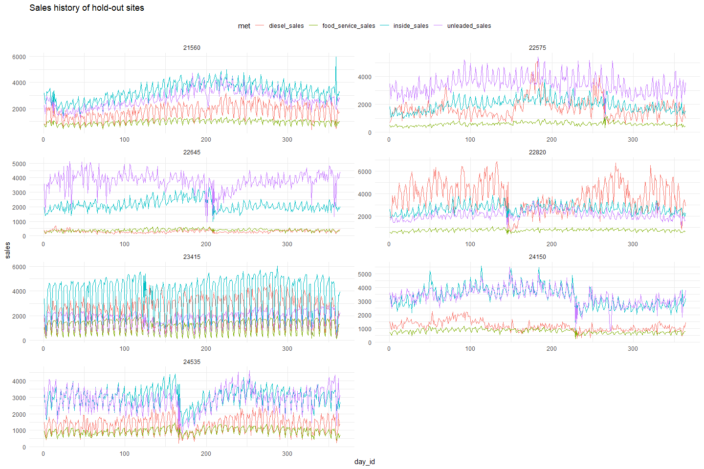

# Extreme Gradient Boosting (XGBoost)


## Data Preparation


```r
# get desired column names from EDA
fixed_cnames <- colnames(read_csv(paste0("../../../mdata/q_data.csv")) %>%
                           mutate(men_toilet_count = NA,
                                  .after = self_check_out) %>%
                           select(-rv_fueling_positions))[c(1:39, 41, 42, 40, 43:52)]


q_data <- read_csv(paste0("../../../mdata/qualitative_data_msba.csv")) %>%
  # Remove row index and duplicated columns
  select(-c(1, `RV Lanes Fueling Positions`, `Hi-Flow Lanes Fueling Positions`)) %>%
  # properly encode "None"
  mutate(
    across(
      where(~any(grepl("^N/?A$", ., ignore.case = TRUE))),
      ~replace(., grepl("^N/?A$", ., ignore.case = TRUE), "None")
    )
  ) %>%
  rename_with(~fixed_cnames) %>%
  relocate(site_id) %>%
  # omitting zero-variance variables
  select(-c(fDoor_count, godfathers_pizza, diesel, car_wash, 
            ev_charging, non_24_hour, self_check_out))

# Calculate standardized day id
day_id_df <- tibble(date = seq(as_date("2021-01-01"), as_date("2023-12-31"), "1 day")) %>%
  # Calculate week_id
  mutate(week_id = yearweek(date, week_start = 5) %>% format("%V") %>% as.numeric(),
         # since the first day of fiscal year 2022 is actually in 2021, special logic must be 
         # applied to identify the beginning of the year
         x = case_when(lag(week_id, default = 52) == 52 & week_id == 1 ~ 1),
         year = 2020 + rollapplyr(x, width = n(), FUN = sum, na.rm = TRUE, partial = TRUE)) %>%
  group_by(year) %>%
  mutate(day_id = row_number()) %>%
  select(-x) %>%
  ungroup()

t_series <- read_csv(paste0("../../../mdata/t_series.csv")) %>%
  # remove missing store
  filter(site_id != 23065) %>%
  relocate(site_id, date) %>%
  arrange(site_id, date) %>%
  mutate(id = row_number(),
         .before = 1) %>%
  left_join(day_id_df %>%
              select(date, day_id), "date") %>%
  group_by(site_id) %>%
  mutate(first_day_id = first(day_id)) %>%
  ungroup() %>%
  arrange(first_day_id, site_id) %>%
  group_by(site_id) %>%
  # Encode an alternative day_id which can exist in 2 years
  mutate(day_id2 = purrr::accumulate(day_id, ~ifelse(.x < .y, .y, .y + 364)),
         date2 = as_date(as.numeric(as_date("2021-01-01")) + (day_id2 - 1))) %>%
  ungroup() %>%
  select(-c(first_day_id))

merged_data <- t_series %>%
  left_join(q_data,
            "site_id") %>%
  arrange(site_id, date)
```

Maverik expressed the importance of aligning days in a standardized manner, which is why `week_id` is included and why I created a `day_id`.

XGBoost can only handle numeric data. I use dummy variables to handle this.


```r
dummy_targ <- merged_data %>%
  # get character columns
  select(where(is.character)) %>%
  colnames()

# create dummy variables
dummy_df <- dummyVars(~.,
                      merged_data %>%
                        select(all_of(dummy_targ))) %>%
  predict(merged_data %>%
            select(all_of(dummy_targ))) %>%
  as_tibble() %>%
  # Ensure one level for each column is left out
  select(!matches("no(ne)?$"), day_of_weekSunday, day_typeWEEKEND, `traditional_forecourt_layoutIn-Line`)
```


Including features derived from an ARIMA model may prove to be helpful in an XGBoost regressor. The innovation residuals and fitted values are calculated for each sales metric for each site.


```r
mts <- merged_data %>%
  # Convert to wide form
  pivot_longer(inside_sales:unleaded_sales,
               names_to = "met",
               values_to = "sales") %>%
  # create tsibble grouped on site and sales metric
  as_tsibble(index = date, key = c(site_id, met))
```


```r
# fit arima model
mts_fit <- mts %>%
  model(
    arima = ARIMA(sales, stepwise = FALSE)
  )
```


```r
# get desired metrics
mts_aug <- mts_fit %>%
  augment() %>%
  as_tibble() %>%
  pivot_wider(id_cols = c(site_id, date),
              names_from = met,
              values_from = c(.fitted, .innov)) %>%
  # rename output
  rename_with(~gsub("(\\..*?)_(.*)", "\\2\\1", .),
              contains("."))
```

The dummy variables and ARIMA features are incorporated into the model data. Other features were experimented with and omitted in final iterations. XGBoost doesn't handle dates very well so their components need to be split into separate columns.


```r
mdf <- merged_data %>% 
  arrange(site_id, date) %>%
  relocate(id, site_id, day_id) %>%
  relocate(open_year, .after = day_id) %>%
  # Split dates 
  mutate(open_month = month(open_date),
         open_day = day(open_date),
         .after = open_year) %>% 
  # join ARIMA features
  left_join(mts_aug, c("site_id", "date")) %>%
  mutate(year = year(date),
         month = month(date),
         day = day(date),
         .after = date) %>%
  group_by(site_id) %>%
  # include lagged values of the sales features
  mutate(across(contains("sales"),
                list(l1 = ~. - lag(.),
                     l7 = ~. - lag(., 7)))) %>%
  ungroup() %>%
  # remove undesired columns
  select(-c(date, open_date, day_id2, date2, all_of(dummy_targ))) %>%
  bind_cols(dummy_df)
```

I decided to hold out entire sites when creating the train test splits so that I can plot entire sales history later on as opposed to random, disjoint dates.


```r
set.seed(1234) 
train_sites <- sample(unique(mdf$site_id), 30)


mdf %>%
  filter(!site_id %in% train_sites) %>%
  pivot_longer(inside_sales:unleaded_sales,
               names_to = "met",
               values_to = "sales") %>%
  relocate(met, sales, .after = open_year) %>%
  ggplot() +
  geom_line(aes(day_id, sales, color = met)) +
  facet_rep_wrap(~site_id, repeat.tick.labels = TRUE, scales = "free_y", ncol = 2) +
  theme_minimal() +
  theme(legend.position = "top") +
  labs(title = "Sales history of hold-out sites")
```

<!-- -->

Since predictions need to be made for four separate targets, the appropriates sets have to be defined. XGBoost requires a special class to include in `watchlist` so a separate DMatrix is made for each target variable.


```r
# Train
train_all <- mdf %>%
  filter(site_id %in% train_sites)

train_is <- train_all %>%
  select(-c(id, site_id, inside_sales, open_year:day, matches("\\.(fitted|innov)$")))
train_fs <- train_all %>%
  select(-c(id, site_id, food_service_sales, open_year:day, matches("\\.(fitted|innov)$")))
train_d <- train_all %>%
  select(-c(id, site_id, diesel_sales, open_year:day, matches("\\.(fitted|innov)$")))
train_u <- train_all %>%
  select(-c(id, site_id, unleaded_sales, open_year:day, matches("\\.(fitted|innov)$")))

train_df <- train_all %>%
  select(-c(id, site_id, inside_sales:unleaded_sales, open_year:day, matches("\\.(fitted|innov)$")))

# Test
test_all <- mdf %>%
  filter(!site_id %in% train_sites)

test_is <- test_all %>%
  select(-c(id, site_id, inside_sales, open_year:day, matches("\\.(fitted|innov)$")))
test_fs <- test_all %>%
  select(-c(id, site_id, food_service_sales, open_year:day, matches("\\.(fitted|innov)$")))
test_d <- test_all %>%
  select(-c(id, site_id, diesel_sales, open_year:day, matches("\\.(fitted|innov)$")))
test_u <- test_all %>%
  select(-c(id, site_id, unleaded_sales, open_year:day, matches("\\.(fitted|innov)$")))

test_df <- test_all  %>%
  select(-c(id, site_id, inside_sales:unleaded_sales, open_year:day, matches("\\.(fitted|innov)$")))

# Prepare modeling data
train_dmat_is <- xgb.DMatrix(data = as.matrix(train_df), label = train_all$inside_sales)
train_dmat_fs <- xgb.DMatrix(data = as.matrix(train_df), label = train_all$food_service_sales)
train_dmat_d <- xgb.DMatrix(data = as.matrix(train_df), label = train_all$diesel_sales)
train_dmat_u <- xgb.DMatrix(data = as.matrix(train_df), label = train_all$unleaded_sales)

test_dmat_is <- xgb.DMatrix(data = as.matrix(test_df), label = test_all$inside_sales)
test_dmat_fs <- xgb.DMatrix(data = as.matrix(test_df), label = test_all$food_service_sales)
test_dmat_d <- xgb.DMatrix(data = as.matrix(test_df), label = test_all$diesel_sales)
test_dmat_u <- xgb.DMatrix(data = as.matrix(test_df), label = test_all$unleaded_sales)
```

## Modeling

To decide on a final model, I'll define a tuning grid of 144 hyperparameters to use in 3-fold cross validation. I will implement this first on `inside_sales` and use the best paramters on the other targets.


```r
# Train control
tc <- trainControl(method = "cv",
                   # 3-fold cv
                   number = 3,
                   allowParallel = FALSE,
                   returnResamp = "all",
                   returnData = TRUE,
                   savePredictions = TRUE)

# Hyperparameters ----
params <- expand.grid(eta = c(0.05, 0.01),
                      subsample = c(0.5, 0.8, 1),
                      gamma = c(2, 5, 7),
                      max_depth = c(3, 12),
                      min_child_weight = c(2, 5),
                      colsample_bytree = c(0.5, 0.9),
                      nrounds = 1000)
```

Parallel processing was utilized to save time. Strangely, I repeatedly encountered an error stating "Inconsistent values between `best_tune` and xgb.attr", but only when running on a Mac. This error never occurred when running on a Windows machine. Given the stochastic nature of XGBoost training, the error didn't always occur, and thus in part depended on the random seed. This means that if training was attempted after an error, a valid result may be obtained. I used `tryCatch` in the `foreach` loop to keep trying until a model was trained.


```r
# set seed
set.seed(123)
# use 9 cores
cl <- makeForkCluster(8)
registerDoParallel(cl)
# record start time
(xtime1 <- Sys.time())

# Initiate loop
xgb_par <- foreach(i = 1:nrow(params),
                   .packages = c("xgboost", "caret", "tidyverse"),
                   .verbose = TRUE#, .errorhandling = "pass"
) %dopar% {
  
  # foreach doesn't import xgb.DMatrix objects so they must be defined again here
  train_dmat_is <- xgb.DMatrix(data = as.matrix(train_df), label = train_all$inside_sales)
  test_dmat_is <- xgb.DMatrix(data = as.matrix(test_df), label = test_all$inside_sales)
  set.seed(123)  
  
  # Initialize failed state
  xgb_model <- "failed"
  
  # keep trying until success
  while(class(xgb_model) == "character"){
    xgb_model <- tryCatch({
      train(
        x = as.data.frame(train_is),
        y = train_all$inside_sales,
        method = "xgbTree",
        watchlist = list(train = train_dmat_is, test = test_dmat_is),
        tuneGrid = params[i,],
        trControl = tc,
        early_stopping_rounds = 20,
        verbose = 0
      )
    }, error = function(e) {
      "failed"
    })
  }
  gc()
  
  xgb_model
  
}

# stop cluster
stopCluster(cl)
stopImplicitCluster()
# record run-time
xtime2 <- Sys.time()
xtime2 - xtime1
gc()
```

## CV Evaluation


For each model, I make predictions on the test and train set, obtain performance metrics, combine them all into a dataframe, and take the best results based on each metric.


```r
# Evaluate results ----
tune_res <- lapply(xgb_par,
                   \(x){
                     
                     if("error" %in% class(x)){
                       tibble()
                     } else {
                       train_preds <- predict(x, train_is)
                       train_res <- postResample(train_preds, train_all$inside_sales) %>%
                         as.list() %>%
                         as_tibble() %>%
                         rename_with(~paste0("train_", .))
                       
                       test_preds <- predict(x, test_is)
                       test_res <- postResample(test_preds, test_all$inside_sales) %>%
                         as.list() %>%
                         as_tibble() %>%
                         rename_with(~paste0("test_", .))
                       
                       x$results %>%
                         as_tibble() %>%
                         mutate(train_res,
                                test_res,
                                train_preds = list(train_preds),
                                test_preds = list(test_preds))
                     }
                     
                     
                   }) %>%
  list_rbind() %>%
  relocate(eta:nrounds, .after = test_MAE) %>%
  # determine severity of overfitting by calculating difference between test and train metrics
  mutate(id = row_number(),
         rmse_diff = test_RMSE - train_RMSE,
         rsq_diff = train_Rsquared - test_Rsquared,
         .before = 1)

head(tune_res)
```

<div data-pagedtable="false">
  <script data-pagedtable-source type="application/json">
{"columns":[{"label":["id"],"name":[1],"type":["int"],"align":["right"]},{"label":["rmse_diff"],"name":[2],"type":["dbl"],"align":["right"]},{"label":["rsq_diff"],"name":[3],"type":["dbl"],"align":["right"]},{"label":["RMSE"],"name":[4],"type":["dbl"],"align":["right"]},{"label":["Rsquared"],"name":[5],"type":["dbl"],"align":["right"]},{"label":["MAE"],"name":[6],"type":["dbl"],"align":["right"]},{"label":["RMSESD"],"name":[7],"type":["dbl"],"align":["right"]},{"label":["RsquaredSD"],"name":[8],"type":["dbl"],"align":["right"]},{"label":["MAESD"],"name":[9],"type":["dbl"],"align":["right"]},{"label":["train_RMSE"],"name":[10],"type":["dbl"],"align":["right"]},{"label":["train_Rsquared"],"name":[11],"type":["dbl"],"align":["right"]},{"label":["train_MAE"],"name":[12],"type":["dbl"],"align":["right"]},{"label":["test_RMSE"],"name":[13],"type":["dbl"],"align":["right"]},{"label":["test_Rsquared"],"name":[14],"type":["dbl"],"align":["right"]},{"label":["test_MAE"],"name":[15],"type":["dbl"],"align":["right"]},{"label":["eta"],"name":[16],"type":["dbl"],"align":["right"]},{"label":["subsample"],"name":[17],"type":["dbl"],"align":["right"]},{"label":["gamma"],"name":[18],"type":["dbl"],"align":["right"]},{"label":["max_depth"],"name":[19],"type":["dbl"],"align":["right"]},{"label":["min_child_weight"],"name":[20],"type":["dbl"],"align":["right"]},{"label":["colsample_bytree"],"name":[21],"type":["dbl"],"align":["right"]},{"label":["nrounds"],"name":[22],"type":["dbl"],"align":["right"]},{"label":["train_preds"],"name":[23],"type":["list"],"align":["right"]},{"label":["test_preds"],"name":[24],"type":["list"],"align":["right"]}],"data":[{"1":"1","2":"-13.644524","3":"0.11719006","4":"595.0344","5":"0.8624582","6":"467.1713","7":"91.98972","8":"0.009916700","9":"84.07556","10":"623.5697","11":"0.8631814","12":"489.1008","13":"609.9252","14":"0.7459914","15":"470.5109","16":"0.05","17":"0.5","18":"2","19":"3","20":"2","21":"0.5","22":"1000","23":"<dbl [10,980]>","24":"<dbl [2,562]>"},{"1":"2","2":"-17.509056","3":"0.06811957","4":"573.0269","5":"0.8689881","6":"446.6724","7":"63.51960","8":"0.003911861","9":"54.59276","10":"565.3765","11":"0.8713218","12":"441.0388","13":"547.8675","14":"0.8032022","15":"418.3361","16":"0.01","17":"0.5","18":"2","19":"3","20":"2","21":"0.5","22":"1000","23":"<dbl [10,980]>","24":"<dbl [2,562]>"},{"1":"3","2":"-13.939187","3":"0.11636745","4":"584.5055","5":"0.8639698","6":"456.8237","7":"67.38772","8":"0.011500650","9":"59.78070","10":"620.8552","11":"0.8623513","12":"486.9251","13":"606.9160","14":"0.7459838","15":"470.1434","16":"0.05","17":"0.8","18":"2","19":"3","20":"2","21":"0.5","22":"1000","23":"<dbl [10,980]>","24":"<dbl [2,562]>"},{"1":"4","2":"-12.146028","3":"0.06983314","4":"568.0822","5":"0.8676920","6":"443.1125","7":"14.34880","8":"0.001289609","9":"12.64900","10":"542.5523","11":"0.8737508","12":"420.5978","13":"530.4063","14":"0.8039177","15":"402.8799","16":"0.01","17":"0.8","18":"2","19":"3","20":"2","21":"0.5","22":"1000","23":"<dbl [10,980]>","24":"<dbl [2,562]>"},{"1":"5","2":"-5.494334","3":"0.06147893","4":"547.1350","5":"0.8695237","6":"423.4393","7":"108.77281","8":"0.007761120","9":"92.57816","10":"547.2342","11":"0.8750678","12":"424.4717","13":"541.7398","14":"0.8135889","15":"411.7971","16":"0.05","17":"1.0","18":"2","19":"3","20":"2","21":"0.5","22":"1000","23":"<dbl [10,980]>","24":"<dbl [2,562]>"},{"1":"6","2":"-8.499114","3":"0.07692308","4":"643.6255","5":"0.8638292","6":"513.2591","7":"102.20291","8":"0.006553518","9":"94.63245","10":"595.2438","11":"0.8720587","12":"468.3816","13":"586.7447","14":"0.7951356","15":"451.3046","16":"0.01","17":"1.0","18":"2","19":"3","20":"2","21":"0.5","22":"1000","23":"<dbl [10,980]>","24":"<dbl [2,562]>"}],"options":{"columns":{"min":{},"max":[10]},"rows":{"min":[10],"max":[10]},"pages":{}}}
  </script>
</div>

```r
# Get hyperparameters of best 3 RMSE (cv, train, and test) & Rsquared (cv, train, and test), 

bind_rows(
  tune_res %>%
    select(id:Rsquared, train_RMSE, train_Rsquared, test_RMSE, test_Rsquared,
           eta:colsample_bytree) %>%
    arrange(RMSE) %>%
    slice_head(n = 3) %>%
    mutate(tvar = "RMSE", .before = 1),
  
  tune_res %>%
    select(id:Rsquared, train_RMSE, train_Rsquared, test_RMSE, test_Rsquared,
           eta:colsample_bytree) %>%
    arrange(-Rsquared) %>%
    slice_head(n = 3) %>%
    mutate(tvar = "Rsqaured", .before = 1),
  
  tune_res %>%
    select(id:Rsquared, train_RMSE, train_Rsquared, test_RMSE, test_Rsquared,
           eta:colsample_bytree) %>%
    arrange(test_RMSE) %>%
    slice_head(n = 3) %>%
    mutate(tvar = "test_RMSE", .before = 1),
  
  tune_res %>%
    select(id:Rsquared, train_RMSE, train_Rsquared, test_RMSE, test_Rsquared,
           eta:colsample_bytree) %>%
    arrange(-test_Rsquared) %>%
    slice_head(n = 3) %>%
    mutate(tvar = "test_Rsquared", .before = 1),
  
  tune_res %>%
    select(id:Rsquared, train_RMSE, train_Rsquared, test_RMSE, test_Rsquared,
           eta:colsample_bytree) %>%
    arrange(rmse_diff) %>%
    slice_head(n = 3) %>%
    mutate(tvar = "rmse_diff", .before = 1),
  
  tune_res %>%
    select(id:Rsquared, train_RMSE, train_Rsquared, test_RMSE, test_Rsquared,
           eta:colsample_bytree) %>%
    arrange(rsq_diff) %>%
    slice_head(n = 3) %>%
    mutate(tvar = "rsq_diff", .before = 1)
) 
```

<div data-pagedtable="false">
  <script data-pagedtable-source type="application/json">
{"columns":[{"label":["tvar"],"name":[1],"type":["chr"],"align":["left"]},{"label":["id"],"name":[2],"type":["int"],"align":["right"]},{"label":["rmse_diff"],"name":[3],"type":["dbl"],"align":["right"]},{"label":["rsq_diff"],"name":[4],"type":["dbl"],"align":["right"]},{"label":["RMSE"],"name":[5],"type":["dbl"],"align":["right"]},{"label":["Rsquared"],"name":[6],"type":["dbl"],"align":["right"]},{"label":["train_RMSE"],"name":[7],"type":["dbl"],"align":["right"]},{"label":["train_Rsquared"],"name":[8],"type":["dbl"],"align":["right"]},{"label":["test_RMSE"],"name":[9],"type":["dbl"],"align":["right"]},{"label":["test_Rsquared"],"name":[10],"type":["dbl"],"align":["right"]},{"label":["eta"],"name":[11],"type":["dbl"],"align":["right"]},{"label":["subsample"],"name":[12],"type":["dbl"],"align":["right"]},{"label":["gamma"],"name":[13],"type":["dbl"],"align":["right"]},{"label":["max_depth"],"name":[14],"type":["dbl"],"align":["right"]},{"label":["min_child_weight"],"name":[15],"type":["dbl"],"align":["right"]},{"label":["colsample_bytree"],"name":[16],"type":["dbl"],"align":["right"]}],"data":[{"1":"RMSE","2":"22","3":"295.67087","4":"0.10093340","5":"159.5731","6":"0.9749142","7":"65.98469","8":"0.9962882","9":"361.6556","10":"0.8953548","11":"0.01","12":"0.8","13":"2","14":"12","15":"2","16":"0.5"},{"1":"RMSE","2":"130","3":"277.39138","4":"0.09172814","5":"163.3757","6":"0.9724189","7":"53.21361","8":"0.9974006","9":"330.6050","10":"0.9056725","11":"0.01","12":"0.8","13":"2","14":"12","15":"5","16":"0.9"},{"1":"RMSE","2":"36","3":"328.40281","4":"0.11682709","5":"165.3198","6":"0.9731699","7":"57.29052","8":"0.9973106","9":"385.6933","10":"0.8804835","11":"0.01","12":"1.0","13":"7","14":"12","15":"2","16":"0.5"},{"1":"Rsqaured","2":"22","3":"295.67087","4":"0.10093340","5":"159.5731","6":"0.9749142","7":"65.98469","8":"0.9962882","9":"361.6556","10":"0.8953548","11":"0.01","12":"0.8","13":"2","14":"12","15":"2","16":"0.5"},{"1":"Rsqaured","2":"34","3":"295.82301","4":"0.10078508","5":"167.5365","6":"0.9735924","7":"65.91015","8":"0.9962963","9":"361.7332","10":"0.8955112","11":"0.01","12":"0.8","13":"7","14":"12","15":"2","16":"0.5"},{"1":"Rsqaured","2":"36","3":"328.40281","4":"0.11682709","5":"165.3198","6":"0.9731699","7":"57.29052","8":"0.9973106","9":"385.6933","10":"0.8804835","11":"0.01","12":"1.0","13":"7","14":"12","15":"2","16":"0.5"},{"1":"test_RMSE","2":"98","3":"243.40131","4":"0.08130800","5":"171.1531","6":"0.9717035","7":"77.55131","8":"0.9947856","9":"320.9526","10":"0.9134776","11":"0.01","12":"0.5","13":"5","14":"12","15":"2","16":"0.9"},{"1":"test_RMSE","2":"104","3":"239.97763","4":"0.08454211","5":"178.0318","6":"0.9704968","7":"82.59805","8":"0.9942893","9":"322.5757","10":"0.9097472","11":"0.01","12":"0.5","13":"7","14":"12","15":"2","16":"0.9"},{"1":"test_RMSE","2":"92","3":"253.96801","4":"0.08471759","5":"174.2672","6":"0.9710825","7":"68.71296","8":"0.9956484","9":"322.6810","10":"0.9109308","11":"0.01","12":"0.5","13":"2","14":"12","15":"2","16":"0.9"},{"1":"test_Rsquared","2":"98","3":"243.40131","4":"0.08130800","5":"171.1531","6":"0.9717035","7":"77.55131","8":"0.9947856","9":"320.9526","10":"0.9134776","11":"0.01","12":"0.5","13":"5","14":"12","15":"2","16":"0.9"},{"1":"test_Rsquared","2":"61","3":"257.39836","4":"0.08195020","5":"538.5649","6":"0.9476537","7":"74.73987","8":"0.9946085","9":"332.1382","10":"0.9126583","11":"0.05","12":"0.5","13":"5","14":"12","15":"5","16":"0.5"},{"1":"test_Rsquared","2":"67","3":"257.39836","4":"0.08195020","5":"538.5649","6":"0.9476537","7":"74.73987","8":"0.9946085","9":"332.1382","10":"0.9126583","11":"0.05","12":"0.5","13":"7","14":"12","15":"5","16":"0.5"},{"1":"rmse_diff","2":"75","3":"-48.89595","4":"0.04342677","5":"652.8025","6":"0.8578452","7":"762.33687","8":"0.8533456","9":"713.4409","10":"0.8099189","11":"0.05","12":"0.8","13":"2","14":"3","15":"2","16":"0.9"},{"1":"rmse_diff","2":"81","3":"-48.89595","4":"0.04342677","5":"652.8025","6":"0.8578452","7":"762.33687","8":"0.8533456","9":"713.4409","10":"0.8099189","11":"0.05","12":"0.8","13":"5","14":"3","15":"2","16":"0.9"},{"1":"rmse_diff","2":"87","3":"-48.89595","4":"0.04342677","5":"652.8025","6":"0.8578452","7":"762.33687","8":"0.8533456","9":"713.4409","10":"0.8099189","11":"0.05","12":"0.8","13":"7","14":"3","15":"2","16":"0.9"},{"1":"rsq_diff","2":"110","3":"-40.78180","4":"0.04108813","5":"642.7891","6":"0.8573194","7":"729.02003","8":"0.8570489","9":"688.2382","10":"0.8159608","11":"0.01","12":"0.5","13":"2","14":"3","15":"5","16":"0.9"},{"1":"rsq_diff","2":"116","3":"-40.78180","4":"0.04108813","5":"642.7891","6":"0.8573194","7":"729.02003","8":"0.8570489","9":"688.2382","10":"0.8159608","11":"0.01","12":"0.5","13":"5","14":"3","15":"5","16":"0.9"},{"1":"rsq_diff","2":"122","3":"-40.78180","4":"0.04108813","5":"642.7891","6":"0.8573194","7":"729.02003","8":"0.8570489","9":"688.2382","10":"0.8159608","11":"0.01","12":"0.5","13":"7","14":"3","15":"5","16":"0.9"}],"options":{"columns":{"min":{},"max":[10]},"rows":{"min":[10],"max":[10]},"pages":{}}}
  </script>
</div>

```r
# Feature importance
varImp(xgb_par[[22]])
```

```
## xgbTree variable importance
## 
##   only 20 most important variables shown (out of 124)
## 
##                           Overall
## food_service_sales        100.000
## food_service_sales.fitted  77.725
## unleaded_sales             11.188
## x1_mile_pop                10.804
## pizzaYes                   10.769
## x5_min_pop                  8.152
## unleaded_sales.fitted       7.830
## x1_mile_income              5.163
## open_month                  3.846
## day_id                      3.768
## diesel_sales.fitted         3.610
## parking_spaces              3.429
## inside_sales_l1             3.384
## diesel_sales                3.330
## inside_sales_l7             3.081
## x7_min_pop                  2.899
## square_feet                 2.756
## x1_2_mile_pop               2.393
## open_day                    2.054
## day_typeWEEKDAY             1.905
```

Model 22 yielded the best RMSE and Rsquared in CV, so its hyperparamters will be used to predict the remaining sales metrics.


```r
# Food service
set.seed(123)
xgb_fs <- "failed"

while(class(xgb_fs) == "character"){
  xgb_fs <- tryCatch({
    train(
      x = as.data.frame(train_fs),
      y = train_all$inside_sales,
      method = "xgbTree",
      watchlist = list(train = train_dmat_fs, test = test_dmat_fs),
      tuneGrid = params[22,],
      trControl = tc,
      early_stopping_rounds = 20,
      verbose = 0
    )
  }, error = function(e) {
    "failed"
  })
}

xgb_fs$results

# Diesel
xgb_d <- "failed"

while(class(xgb_d) == "character"){
  xgb_d <- tryCatch({
    train(
      x = as.data.frame(train_d),
      y = train_all$inside_sales,
      method = "xgbTree",
      watchlist = list(train = train_dmat_d, test = test_dmat_d),
      tuneGrid = params[22,],
      trControl = tc,
      early_stopping_rounds = 20,
      verbose = 0
    )
  }, error = function(e) {
    "failed"
  })
}

# Unleaded
xgb_u <- "failed"

while(class(xgb_u) == "character"){
  xgb_u <- tryCatch({
    train(
      x = as.data.frame(train_u),
      y = train_all$inside_sales,
      method = "xgbTree",
      watchlist = list(train = train_dmat_u, test = test_dmat_u),
      tuneGrid = params[22,],
      trControl = tc,
      early_stopping_rounds = 20,
      verbose = 0
    )
  }, error = function(e) {
    "failed"
  })
}
```


```r
# Food service
train_pred_fs <- predict(xgb_fs, train_fs)
test_pred_fs <- predict(xgb_fs, test_fs)
postResample(train_pred_fs, train_all$food_service_sales)
```

```
##       RMSE   Rsquared        MAE 
## 33.9781412  0.9956942 24.4870098
```

```r
postResample(test_pred_fs, test_all$food_service_sales)
```

```
##        RMSE    Rsquared         MAE 
## 136.1773057   0.8471135 115.7774812
```

```r
varImp(xgb_fs)
```

```
## xgbTree variable importance
## 
##   only 20 most important variables shown (out of 112)
## 
##                            Overall
## inside_sales               100.000
## diesel_sales                27.762
## x1_mile_pop                 18.108
## x1_2_mile_pop               17.663
## day_typeWEEKDAY              9.309
## x5_min_pop                   8.728
## rv_lanes_fueling_positions   7.136
## unleaded_sales               6.593
## parking_spaces               5.903
## x1_mile_income               3.915
## hi_flow_fueling_positions    3.799
## rv_lanesYes                  3.585
## day_typeWEEKEND              2.771
## x1_2_mile_income             2.758
## inside_sales.fitted_l1       2.693
## day_id                       2.662
## food_service_sales_l1        2.432
## x7_min_pop                   2.407
## food_service_sales_l7        2.144
## x1_2_mile_emp                2.067
```

```r
# Diesel
train_pred_d <- predict(xgb_d, train_d)
test_pred_d <- predict(xgb_d, test_d)
postResample(train_pred_d, train_all$diesel_sales)
```

```
##        RMSE    Rsquared         MAE 
## 737.3965079   0.9864328 401.7019454
```

```r
postResample(test_pred_d, test_all$diesel_sales)
```

```
##         RMSE     Rsquared          MAE 
## 1313.6496612    0.1816536  991.0482281
```

```r
varImp(xgb_d)
```

```
## xgbTree variable importance
## 
##   only 20 most important variables shown (out of 112)
## 
##                               Overall
## hi_flow_fueling_positions     100.000
## men_toilet_count               46.937
## men_urinal_count               46.313
## inside_sales                   20.086
## women_toilet_count             16.409
## food_service_sales             11.805
## rv_lanes_fueling_positions      8.109
## parking_spaces                  6.129
## day_typeWEEKDAY                 5.394
## unleaded_sales                  4.223
## women_sink_count                4.117
## day_id                          3.398
## day_typeWEEKEND                 3.394
## x1_mile_pop                     3.256
## traditional_fueling_positions   2.918
## x1_mile_emp                     2.727
## x1_2_mile_emp                   2.725
## hi_flow_rv_lanesYes             2.238
## x5_min_emp                      2.082
## diesel_sales_l7                 1.827
```

```r
# Unleaded
train_pred_u <- predict(xgb_u, train_u)
test_pred_u <- predict(xgb_u, test_u)
postResample(train_pred_d, train_all$unleaded_sales)
```

```
##         RMSE     Rsquared          MAE 
## 2.095876e+03 3.681041e-02 1.562379e+03
```

```r
postResample(test_pred_d, test_all$unleaded_sales)
```

```
##         RMSE     Rsquared          MAE 
## 1.984768e+03 5.617575e-04 1.641709e+03
```

```r
varImp(xgb_u)
```

```
## xgbTree variable importance
## 
##   only 20 most important variables shown (out of 112)
## 
##                    Overall
## diesel_sales        100.00
## men_toilet_count     92.84
## parking_spaces       87.53
## inside_sales         83.51
## x5_min_emp           67.27
## x1_mile_pop          61.21
## x5_min_pop           40.68
## x7_min_emp           39.29
## unleaded_sales_l7    35.06
## x1_mile_emp          28.66
## food_service_sales   28.39
## women_sink_count     25.79
## day_id               24.65
## x5_min_inc           23.39
## x1_mile_income       21.24
## unleaded_sales_l1    21.13
## x7_min_inc           20.50
## x1_2_mile_emp        14.88
## bonfire_grillYes     13.28
## x7_min_pop           11.66
```


## XGBoost Results
What works for one sales metric does not necessarily work for the others. While it's very computationally expensive, parameter tuning for each sales metric would likely yield the best results. Not surpisingly, each sales metric is fairly predictive of the others. `men_toilet_count` offered an unexpected contribution which may indicate existence of some other confounding explanatory variable.

# ARIMA/ETS Ensemble


```r
# Load packages 
library(tidyverse)
library(lubridate)
library(zoo)
library(fpp3)
library(doParallel)
library(caret)
library(xgboost)
```

## Data preparation


```r
# get desired column names from EDA
fixed_cnames <- colnames(read_csv(paste0("../../../mdata/q_data.csv")) %>%
                           mutate(men_toilet_count = NA,
                                  .after = self_check_out) %>%
                           select(-rv_fueling_positions))[c(1:39, 41, 42, 40, 43:52)]


q_data <- read_csv(paste0("../../../mdata/qualitative_data_msba.csv")) %>%
  # Remove row index and duplicated columns
  select(-c(1, `RV Lanes Fueling Positions`, `Hi-Flow Lanes Fueling Positions`)) %>%
  # properly encode "None"
  mutate(
    across(
      where(~any(grepl("^N/?A$", ., ignore.case = TRUE))),
      ~replace(., grepl("^N/?A$", ., ignore.case = TRUE), "None")
    )
  ) %>%
  rename_with(~fixed_cnames) %>%
  relocate(site_id) %>%
  # omitting zero-variance variables
  select(-c(fDoor_count, godfathers_pizza, diesel, car_wash, 
            ev_charging, non_24_hour, self_check_out))

# Calculate standardized day id
day_id_df <- tibble(date = seq(as_date("2021-01-01"), as_date("2023-12-31"), "1 day")) %>%
  # Calculate week_id
  mutate(week_id = yearweek(date, week_start = 5) %>% format("%V") %>% as.numeric(),
         # since the first day of fiscal year 2022 is actually in 2021, special logic must be 
         # applied to identify the beginning of the year
         x = case_when(lag(week_id, default = 52) == 52 & week_id == 1 ~ 1),
         year = 2020 + rollapplyr(x, width = n(), FUN = sum, na.rm = TRUE, partial = TRUE)) %>%
  group_by(year) %>%
  mutate(day_id = row_number()) %>%
  select(-x) %>%
  ungroup()

t_series <- read_csv(paste0("../../../mdata/t_series.csv")) %>%
  # remove missing store
  filter(site_id != 23065) %>%
  relocate(site_id, date) %>%
  arrange(site_id, date) %>%
  mutate(id = row_number(),
         .before = 1) %>%
  left_join(day_id_df %>%
              select(date, day_id), "date") %>%
  group_by(site_id) %>%
  mutate(first_day_id = first(day_id)) %>%
  ungroup() %>%
  arrange(first_day_id, site_id) %>%
  group_by(site_id) %>%
  # Encode an alternative day_id which can exist in 2 years
  mutate(day_id2 = purrr::accumulate(day_id, ~ifelse(.x < .y, .y, .y + 364)),
         date2 = as_date(as.numeric(as_date("2021-01-01")) + (day_id2 - 1))) %>%
  ungroup() %>%
  select(-c(first_day_id))

merged_data <- t_series %>%
  # Join time series and qualitative data
  left_join(q_data,
            "site_id") %>%
  arrange(site_id, date) %>%
  # create observation index variable
  group_by(site_id) %>%
  mutate(start_id = row_number(),
         .before = 2) %>%
  ungroup()
```

Maverik expressed the importance of aligning days in a standardized manner. `day_id` represents the nth day of a given year. One limitation with `day_id` is that it does not preserve order. For example, if a site opened in the last month of the year, `day_id` 200 actually occurred before `day_id` 20. `day_id2` solves this by allowing the index to span two calendar years.\

I struggled to get the models available in the `fpp3` package to behave as expected when the "index" of a created tsibble was not a native date object, so instead of using `day_id2` as the index in the tsibble, I created `date2` which corresponds directly to `day_id2` but forces the assumption that every site opened in the same year.

## Modeling

The following takes 5 random stores and fits 3 models using data starting from day 1 to day 366. In total, 5,490 models are fitted. The three model types are:\

-   ARIMA\
-   Regression with ARIMA regressors\
-   ETS\

This implementation from the `fpp3` package allows for automatic selection of each model's component parts that provide the best fit. While this is a very computationally expensive approach, it is still practical for business implementation. To speed up the process, I've elected to compute in parallel using the `doParallel` package.


```r
# choose 5 random sites
set.seed(123)
fe_sites2 <- sample(unique(merged_data$site_id), 5)

# establish 10-core cluster
cl <- makeCluster(10)
registerDoParallel(cl)
(xtime1 <- Sys.time())

# loop over each day
fit_all <- foreach(i = 1:366,
                   .packages = c("tidyverse", "fpp3"),
                   .combine = "bind_rows") %:% 
  # loop over each sample site
  foreach(j = fe_sites2,
          .packages = c("tidyverse", "fpp3"),
          .combine = "bind_rows")  %dopar%{
            
            # subset site and training days
            ox <- merged_data %>%
              filter(site_id == j,
                     start_id <= i) %>%
              distinct(site_id, day_id, day_id2, .keep_all = TRUE) %>%
              select(start_id, site_id, day_id, day_id2, date, date2, 
                     holiday, day_of_week, day_type, ends_with("sales")) %>%
              # convert to long form
              pivot_longer(inside_sales:unleaded_sales,
                           names_to = "tvar",
                           values_to = "sales") %>%
              arrange(site_id, tvar, start_id) %>%
              # create tsibble with appropriate key and index
              as_tsibble(index = date2, key = c(site_id, tvar)) %>%
              # define models
              model(arima1 = ARIMA(sales), # ARIMA
                    arima2 = ARIMA(sales ~ season("week")), # Regression with ARIAM regressors
                    ets = ETS(sales)) %>% # ETS
              # log iteration information
              mutate(site_id = j,
                     start_init = i,
                     .before = 1) %>%
              mable(key = c(site_id, start_init, tvar), model = c(arima1, arima2, ets))
            
            
            gc()
            
            ox
          }

stopCluster(cl)
xtime2 <- Sys.time()
xtime2 - xtime1

# create tsibble of sampled sites in format compatible with fitted models
base_all <- merged_data %>%
  filter(site_id %in% fe_sites2) %>%
  distinct(site_id, day_id, day_id2, .keep_all = TRUE) %>%
  select(start_id, site_id, day_id, day_id2, date, date2, 
         holiday, day_of_week, day_type, ends_with("sales")) %>%
  pivot_longer(inside_sales:unleaded_sales,
               names_to = "tvar",
               values_to = "sales") %>%
  arrange(site_id, tvar, start_id) %>%
  as_tsibble(index = date2, key = c(site_id, tvar))

# for each site, sales metric, and day, calculate cumulative sales and remaining sales
ppdf_all <- base_all %>%
  as_tibble() %>%
  group_by(site_id, tvar) %>%
  group_modify(~{
    lapply(.x$start_id,
           \(xx){
             .x %>%
               group_by(prd = ifelse(start_id <= xx, "pre", "post")) %>%
               summarise(sales = sum(sales)) %>%
               mutate(start_id = xx,
                      .before = 1)
           }) %>%
      list_rbind()
  }) %>%
  ungroup() %>%
  pivot_wider(names_from = prd,
              values_from = sales) %>%
  mutate(sales = pre + post)

# Make daily forecasts for each site and training start day
fc_all <- fit_all %>%
  filter(start_init <= 365) %>%
  rowwise() %>%
  group_map(~{
    si <- .x$start_init
    
    .x %>%
      mable(key = c(site_id, tvar), model = c(arima1, arima2, ets)) %>%
      forecast(base_all %>%
                 filter(start_id > si)) %>%
      left_join(base_all %>%
                  filter(start_id > si) %>%
                  select(site_id, date2, sales_obs = sales), c("site_id", "tvar", "date2")) %>%
      group_by(site_id, .model) %>% 
      # calculate performance metrics for each site/training start
      mutate(start_init = si,
             er = sales_obs - .mean,
             rmse = RMSE(sales_obs, .mean),
             mape = MAPE(er, sales_obs)) %>%
      relocate(start_init, .after = site_id) %>%
      ungroup()
    
  }) %>%
  list_rbind()

# get total year performance metrics
fc_all2 <- fc_all %>%
  filter(!is.na(.mean)) %>% 
  as_tibble() %>%
  group_by(tvar, .model, site_id, start_init) %>%
  # get annual for each sales metric, model, site, training start combination
  summarise(fc = sum(.mean)) %>%
  # join cumulative/remaning truth data
  left_join(ppdf_all %>%
              select(site_id, tvar, start_init = start_id, 
                     pre, post, sales),
            c("site_id", "start_init", "tvar")) %>%
  mutate(tpred = fc + pre,
         er = sales - tpred,
         .after = post) %>%
  relocate(er, .after = last_col()) %>%
  group_by(tvar, .model) %>%
  # aggregate metric for each sales metric and model
  arrange(tvar, start_init) %>% 
  mutate(er = sales - tpred,
         rmse = RMSE(tpred, sales),
         mae = MAE(tpred, sales),
         mape = MAPE(er, sales),
         mape_step = (abs(tpred - sales)/sales) * 100,
         # get "rolling" RMSE
         rmse_roll = sapply(start_init,
                            \(xx){RMSE(tpred[start_init >= xx], sales[start_init >= xx])}),
         # get "rolling" MAPE
         mape_roll = sapply(start_init,
                            \(xx){mean(mape_step[start_init >= xx])}),
         # get "rolling" MAE
         mae_roll = sapply(start_init,
                           \(xx){MAE(tpred[start_init >= xx], sales[start_init >= xx])})
         
  ) 
```


```r
fc_all2 %>% 
  # Select training start day that match Maverik's benchmarks
  filter(start_init %in% c(14, 21, 183, 300)) %>%
  ungroup() %>%
  distinct(tvar, start_init, .model, .keep_all = TRUE) %>%
  arrange(match(tvar, c("inside_sales", "food_service", "diesel", "unleaded")), start_init, rmse) %>% 
  select(tvar, start_init, .model, rmse_roll, mape_roll, mae_roll, rmse, mape, mae) %>% 
  group_by(tvar, start_init) %>%
  # subset best performing instances
  filter(rmse_roll == min(rmse_roll) | mape_roll == min(mape_roll)) %>%
  ungroup() %>%
  arrange(match(tvar, c("inside_sales", "food_service_sales", "diesel_sales", "unleaded_sales")),
          start_init) %>%
  # make output more readable
  mutate(start_init = case_match(start_init,
                                 14 ~ "2 weeks",
                                 21 ~ "3 weeks",
                                 183 ~ "6 months",
                                 300 ~ "300 days"),
         tvar = paste(tvar, start_init)) %>%
  select(tvar, rmse_roll, mape_roll) %>%
  # prevent scientific notation output
  mutate(across(c(rmse_roll, mape_roll), ~as.character(round(., 2)))) %>%
  filter(!grepl("300", tvar))
```

<div data-pagedtable="false">
  <script data-pagedtable-source type="application/json">
{"columns":[{"label":["tvar"],"name":[1],"type":["chr"],"align":["left"]},{"label":["rmse_roll"],"name":[2],"type":["chr"],"align":["left"]},{"label":["mape_roll"],"name":[3],"type":["chr"],"align":["left"]}],"data":[{"1":"inside_sales 2 weeks","2":"252118.87","3":"7.66"},{"1":"inside_sales 3 weeks","2":"251231.92","3":"7.4"},{"1":"inside_sales 6 months","2":"49936.63","3":"3.23"},{"1":"food_service_sales 2 weeks","2":"50574.18","3":"5.49"},{"1":"food_service_sales 3 weeks","2":"50294.34","3":"5.27"},{"1":"food_service_sales 3 weeks","2":"34362.14","3":"5.79"},{"1":"food_service_sales 6 months","2":"11035.42","3":"2.8"},{"1":"diesel_sales 2 weeks","2":"223947.08","3":"11.52"},{"1":"diesel_sales 3 weeks","2":"220710.58","3":"11.28"},{"1":"diesel_sales 6 months","2":"35884.66","3":"3.51"},{"1":"unleaded_sales 2 weeks","2":"357496.22","3":"8.54"},{"1":"unleaded_sales 2 weeks","2":"179010.8","3":"10.15"},{"1":"unleaded_sales 3 weeks","2":"220612.1","3":"6.76"},{"1":"unleaded_sales 3 weeks","2":"178349.32","3":"9.96"},{"1":"unleaded_sales 6 months","2":"26237.81","3":"2.41"}],"options":{"columns":{"min":{},"max":[10]},"rows":{"min":[10],"max":[10]},"pages":{}}}
  </script>
</div>


# Results

We have taken the RMSE value of all the models to compare the model performance. 
Looking at all the values, we observed that the SVR model performs the best with the given dataset across the different target variables based on final RMSE:\
-   inside_sales = 0.3448517 \
-   food_service = 0.2782577\
-   diesel = 0.567455\
-   unleaded = 0.8332988\

We have only used the time series data for this model because the qualitative data was not highly co-related while the target variables were co-related within themselves. 

Although SVR yielded the best RMSE, the ARIMA/ETS ensemble outperformed Maverik's benchmarks and possesses much greater versatility and the ability to update models as new data is observed to produce daily forecasts. For these reasons, we recommend Maverik move forward with the ensemble model.
 
While we were able to devise these models,  more data and time would have resulted in better results. There is likely untapped potential in the other models that could be unleashed with more time and experimentation. Some models require massive computational resources to be sure the best parameters are utilised. 
